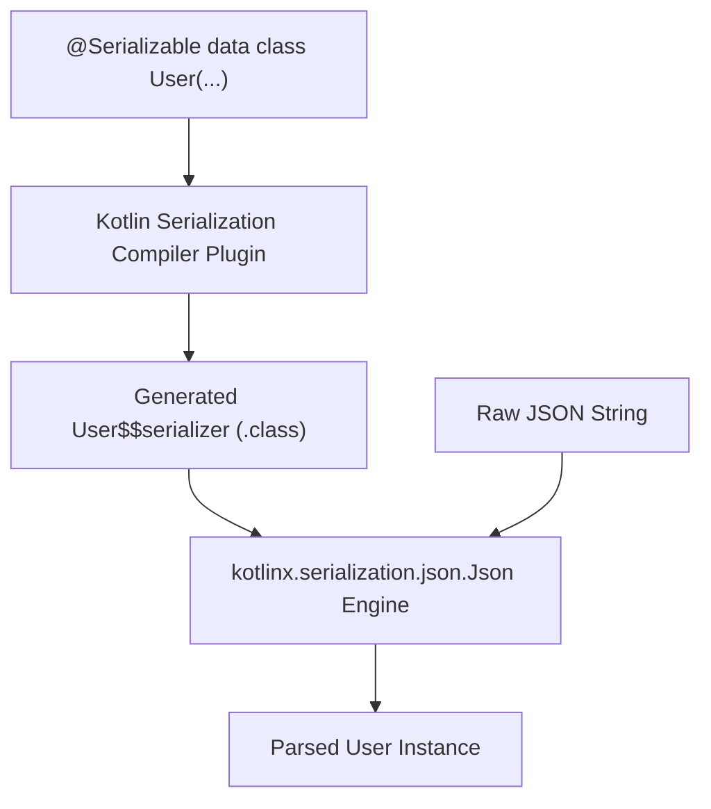

## kotlinx.serialization은 컴파일러 플러그인과 런타임 포맷이 모두 필요하다

상위 문서: [의존성 및 CI 계약](dependency-ci-contracts.md)

### 개념 및 필요성 (What & Why)
`kotlinx.serialization`은 Kotlin 객체를 JSON, Protocol Buffers, CBOR 등의 직렬화 데이터 포맷으로 변환하는 순수 Kotlin 직렬화 프레임워크이다.
Gson이나 Jackson 같은 묵직한 Java 리플렉션(Reflection) 기반 라이브러리와 달리, `kotlinx.serialization`은 **컴파일 타임(Compile-Time) 직렬화 코드 생성**을 채택한다.
이를 위해 빌드 시점에 코드를 생성하는 **컴파일러 플러그인(`org.jetbrains.kotlin.plugin.serialization`)** 과 런타임에 JSON 파싱을 수행하는 **런타임 라이브러리(`kotlinx-serialization-json`)** 가 반드시 한 쌍으로 프로젝트에 적용되어야 한다.

### 내부 메커니즘 (Internal Mechanism)
1. **`@Serializable` AST 변환**: 컴파일러 플러그인이 `@Serializable` 어노테이션이 지정된 클래스에 `KSerializer` 합성 인스턴스 및 `.serializer()` 정적 메서드를 자동 주입한다.
2. **리플렉션 Zero(0)**: 컴파일러가 직접 필드 이터레이션 바이트코드를 합성하므로 R8 난독화 시 규칙이 없어도 런타임 crash가 발생하지 않으며, 성능 및 메모리 효율성이 월등히 뛰어나다.
3. **두 축의 필수 결합**:
   - Compiler Plugin: `@Serializable` 바이트코드/Serializer 생성.
   - Runtime Format Library: `Json.decodeFromString()`, `Json.encodeToString()` 실재 연산 제공.



### 코드 예시 (build.gradle.kts & Kotlin Code)
```kotlin
// app/build.gradle.kts
plugins {
    alias(libs.plugins.kotlin.android)
    alias(libs.plugins.kotlin.serialization) // 1. 컴파일러 플러그인
}

dependencies {
    implementation(libs.kotlinx.serialization.json) // 2. 런타임 JSON 포맷
}
```

```kotlin
// User.kt
import kotlinx.serialization.Serializable
import kotlinx.serialization.json.Json

@Serializable
data class User(val id: Long, val name: String)

fun parseUserJson(jsonStr: String): User {
    return Json.decodeFromString<User>(jsonStr)
}
```

### 관측 가능 증거 (Observable Evidence)
컴파일러 플러그인에 의해 생성된 Serializer 바이트코드 유무는 `javap` 또는 APK 덱스 분석 도구로 파악할 수 있다:
```bash
./gradlew app:compileDebugKotlin
```

관련 노트: [KSP는 Kotlin 퍼스트 코드 생성이며 KAPT는 유지보수 모드다](ksp-is-kotlin-first-code-generation-and-kapt-is-maintenance-mode.md), [의존성 및 CI 계약](dependency-ci-contracts.md)
