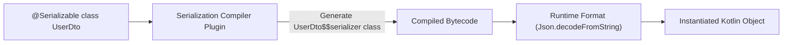

## kotlinx serialization은 컴파일러 플러그인과 런타임 포맷을 함께 요구한다

상위 문서: [의존성, 버전, CI 계약](dependency-ci-contracts.md)

### 내부 메커니즘 (Internal Mechanism)
`kotlinx.serialization`은 **리플렉션**(Reflection: 런타임 동적 객체 구조 분석)을 사용하는 Gson/Jackson과 달리, 두 가지 구성요소의 결합으로 동작한다:
1. **Kotlin Compiler Plugin (`org.jetbrains.kotlin.plugin.serialization`)**: 컴파일 타임에 `@Serializable` 이 붙은 데이터 클래스를 분석하여 `$serializer` 내부 객체와 직렬화/역직렬화 전용 메서드를 바이트코드로 직접 생성한다.
2. **Runtime Format Library (`kotlinx-serialization-json`, `protobuf`, `cbor`)**: 컴파일러 플러그인이 생성한 `$serializer` 메서드를 호출하여 JSON 문자열이나 바이너리 스트림으로 실제 변환을 수행한다.

컴파일러 플러그인 없이 런타임 라이브러리만 추가하면 `@Serializable` 클래스의 `$serializer` 가 생성되지 않아 런타임에 `SerializationException` 이 발생한다.



### 코드 예시 (build.gradle.kts & Kotlin Code)
```kotlin
// build.gradle.kts
plugins {
    alias(libs.plugins.kotlin.serialization)
}

dependencies {
    implementation(libs.kotlinx.serialization.json)
}

// Kotlin Code
import kotlinx.serialization.Serializable
import kotlinx.serialization.json.Json

@Serializable
data class UserDto(val id: Long, val name: String)

fun parseUser(jsonStr: String): UserDto {
    return Json.decodeFromString<UserDto>(jsonStr)
}
```

### 관측 가능 증거 (Observable Evidence)
컴파일 후 생성된 바이트코드를 디컴파일하거나 DEX 클래스 목록을 확인하면 `$serializer` 클래스가 생성되었음을 증명할 수 있다:

```bash
# 생성된 DEX 클래스 구조 확인
javap -c build/tmp/kotlin-classes/release/com/example/dto/UserDto\$\$serializer.class

# Output Example:
# public final class com.example.dto.UserDto$$serializer implements kotlinx.serialization.KSerializer {
#   public static final com.example.dto.UserDto$$serializer INSTANCE;
#   public com.example.dto.UserDto deserialize(kotlinx.serialization.encoding.Decoder);
# }
```

관련 노트: [KSP는 Kotlin-first 코드 생성이고 kapt는 유지보수 모드다](ksp-is-kotlin-first-code-generation-and-kapt-is-maintenance-mode.md), [의존성, 버전, CI 계약](dependency-ci-contracts.md)
