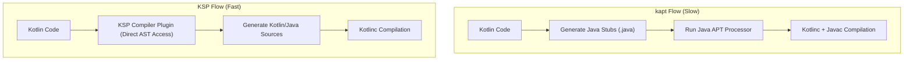

## KSP는 Kotlin-first 코드 생성이고 kapt는 유지보수 모드다

상위 문서: [의존성, 버전, CI 계약](dependency-ci-contracts.md)

### 내부 메커니즘 (Internal Mechanism)
- **kapt (Kotlin Annotation Processing Tool)**: 기존 Java `javax.annotation.processing` (APT) 생태계와의 호환성을 위해 Kotlin 코드 전체를 Stub Java 파일(`.java`)로 생성하는 단계(`kaptGenerateStubs`)를 거친다. 이 Stub 생성 과정이 심각한 빌드 오버헤드(전체 빌드 시간의 20~30% 차지)를 야기한다.
- **KSP (Kotlin Symbol Processing)**: Kotlin Compiler Plugin API 기반으로 동작하며 Java Stub을 일체 생성하지 않는다. Kotlin AST (**AST**: Abstract Syntax Tree - 구문 분석 구조 트리) 및 Symbol Model(`KSClassDeclaration`, `KSPropertyDeclaration`)에 직접 접근하여 코드를 생성하므로, kapt 대비 **2배~5배 빠른 코드 생성 성능**을 제공한다.



### 코드 예시 (build.gradle.kts)
```kotlin
// build.gradle.kts
plugins {
    alias(libs.plugins.ksp) // com.google.devtools.ksp
}

dependencies {
    // kapt(libs.room.compiler) -> Legacy
    ksp(libs.room.compiler) // KSP
    ksp(libs.hilt.compiler)
}
```

### 관측 가능 증거 (Observable Evidence)
kapt와 KSP 태스크의 빌드 타임 차이를 Gradle 프로파일러 또는 커맨드로 즉시 관측할 수 있다:

```bash
# kapt 수행 태스크 측정 (Slow)
./gradlew :app:kaptGenerateStubsDebugKotlin --profile

# KSP 수행 태스크 측정 (Fast)
./gradlew :app:kspDebugKotlin --profile

# Build Scan Metric Output:
# :app:kaptGenerateStubsDebugKotlin -> 14.821s
# :app:kspDebugKotlin -> 2.910s (80% 빌드 시간 감소!)
```

관련 노트: [kotlinx serialization은 컴파일러 플러그인과 런타임 포맷을 함께 요구한다](kotlinx-serialization-requires-compiler-plugin-and-runtime-format.md), [Gradle 빌드 성능은 앱 런타임 성능과 다르다](../../../optimization/build-optimization-contracts/gradle-build-performance-is-not-app-runtime-performance.md)
