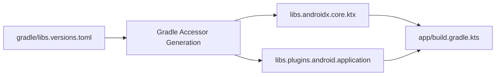

## Version catalog는 의존성과 플러그인 좌표를 명명한다

상위 문서: [의존성 및 CI 계약](dependency-ci-contracts.md)

### 개념 및 필요성 (What & Why)
**Version Catalog(버전 카탈로그 - `gradle/libs.versions.toml`)** 는 Gradle 7.0+ 이상에서 도입된 표준 의존성 중앙 관리 시스템이다.
프로젝트의 수많은 서브모듈에 하드코딩되어 파편화되던 의존성 좌표(`group:artifact:version`)와 플러그인 정보를 단일 위치에 정돈하여 선언한다.
이를 통해 모듈 간 버전 불일치를 방지하고, IDE의 자동완성 지원 및 타입 세이프한 Kotlin DSL 접근자(`libs.retrofit`, `libs.plugins.kotlin.android`)를 통해 안전한 의존성 주입을 달성한다.

### 내부 메커니즘 (Internal Mechanism)
TOML 규격 파일은 4가지 핵심 섹션으로 구성된다:
1. `[versions]`: 서드파티 라이브러리 및 플러그인의 버전 번호 정의.
2. `[libraries]`: `group`, `name`, `version.ref`를 결합하여 라이브러리 접근자 생성.
3. `[plugins]`: `id` 및 `version.ref`를 통해 Gradle 플러그인 좌표 선언.
4. `[bundles]`: 연관된 복수의 라이브러리(예: Ktor 모듈 세트)를 하나로 묶어 `implementation(libs.bundles.ktor)` 형태로 한 번에 추가 가능.



### 코드 예시 (gradle/libs.versions.toml & build.gradle.kts)
```toml
# gradle/libs.versions.toml
[versions]
agp = "8.4.0"
kotlin = "2.0.0"
coreKtx = "1.13.1"

[libraries]
androidx-core-ktx = { group = "androidx.core", name = "core-ktx", version.ref = "coreKtx" }

[plugins]
android-application = { id = "com.android.application", version.ref = "agp" }
kotlin-android = { id = "org.jetbrains.kotlin.android", version.ref = "kotlin" }
```

```kotlin
// app/build.gradle.kts
plugins {
    alias(libs.plugins.android.application)
    alias(libs.plugins.kotlin.android)
}

dependencies {
    implementation(libs.androidx.core.ktx)
}
```

### 관측 가능 증거 (Observable Evidence)
버전 카탈로그가 정상 인식되었는지는 생성된 accessors 태스크 검증으로 관측할 수 있다:
```bash
./gradlew generateCatalogAsKotlinDsl
```

관련 노트: [Convention plugin은 build-logic 모듈에서 공통 Gradle 설정을 한 곳에서 관리한다](../../gradle/gradle-build-contracts/convention-plugins-centralize-shared-gradle-configuration-in-build-logic.md), [의존성 및 CI 계약](dependency-ci-contracts.md)
