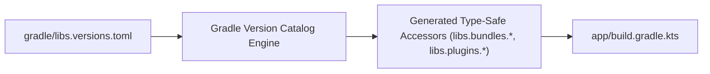

## Version Catalog는 의존성 좌표와 플러그인 좌표의 이름표다

상위 문서: [의존성, 버전, CI 계약](dependency-ci-contracts.md)

### 내부 메커니즘 (Internal Mechanism)
Gradle **Version Catalog**(`gradle/libs.versions.toml`)는 멀티모듈 프로젝트 전체에서 사용되는 라이브러리 좌표(`group:artifact:version`), 플러그인 ID, 버전 번호, 그리고 묶음 패키지(`bundle`)를 중앙 단일 출처(SSOT)로 정의한다.
Gradle은 TOML 파일에 정의된 Key 이름을 기반으로 타입 세이프한 Kotlin DSL Accessor (`libs.androidx.core.ktx`, `libs.plugins.android.application`)를 컴파일 시점에 빌드 스크립트 클래스로 자동 생성한다. 이를 통해 하드코딩된 버전 문자열 오타를 방지하고 자동완성 지원 및 빌드 캐시 안정성을 보장한다.



### 코드 예시 (libs.versions.toml & build.gradle.kts)
```toml
# gradle/libs.versions.toml
[versions]
agp = "8.3.0"
kotlin = "1.9.22"
retrofit = "2.9.0"

[libraries]
squareup-retrofit = { group = "com.squareup.retrofit2", name = "retrofit", version.ref = "retrofit" }
squareup-converter-json = { group = "com.squareup.retrofit2", name = "converter-kotlinx-serialization", version.ref = "retrofit" }

[bundles]
network = ["squareup-retrofit", "squareup-converter-json"]

[plugins]
android-application = { id = "com.android.application", version.ref = "agp" }
kotlin-android = { id = "org.jetbrains.kotlin.android", version.ref = "kotlin" }
```

```kotlin
// app/build.gradle.kts
plugins {
    alias(libs.plugins.android.application)
    alias(libs.plugins.kotlin.android)
}

dependencies {
    implementation(libs.bundles.network)
}
```

### 관측 가능 증거 (Observable Evidence)
Version Catalog가 올바르게 로드되고 등록되었는지 Gradle 카탈로그 태스크로 관측할 수 있다:

```bash
./gradlew help --climb

# Version catalog verification output in Gradle:
# Catalog 'libs' contains:
#   - 12 libraries
#   - 3 bundles
#   - 4 plugins
# Type-safe accessors successfully generated in build/generated-sources/kotlin-dsl-accessors
```

관련 노트: [Gradle 의존성 관리는 요청 버전이 아니라 해석 그래프를 관리한다](gradle-dependency-management-controls-resolution-graph-not-requested-versions.md), [Gradle 프로젝트와 모듈 DSL은 서로 다른 책임을 가진다](../../gradle/gradle-build-contracts/gradle-project-and-module-dsl-have-different-responsibilities.md)
