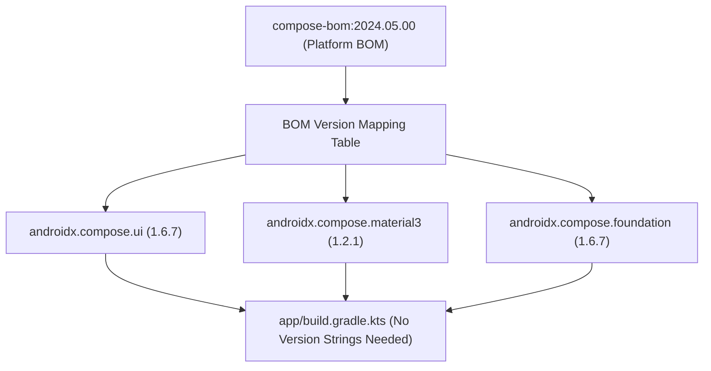

## Compose BOM은 Compose 라이브러리 버전 세트를 관리한다

상위 문서: [의존성 및 CI 계약](dependency-ci.md)

### 개념 및 필요성 (What & Why)
**Compose BOM(Bill of Materials - `androidx.compose:compose-bom`)** 은 Jetpack Compose의 개별 라이브러리들(`compose.ui`, `compose.material3`, `compose.foundation`, `compose.animation` 등)의 상호 호환되는 버전 집합을 단일 선언으로 정렬해주는 버전 맵이다.
Compose 구성 요소들은 활발하게 진화하며 개별 라이브러리마다 버전 번호가 다르게 릴리스된다. 개별 모듈의 버전을 수동으로 명시할 경우, 라이브러리 간 버전 불일치로 인한 런타임 바이너리 비호환성이나 렌더링 에러가 유발된다.
BOM을 적용하면 개별 모듈 선언 시 버전 번호를 생략하고 검증된 세트 버전을 일관되게 주입할 수 있다.

### 내부 메커니즘 (Internal Mechanism)
1. **Platform Dependency Mapping**: `implementation(platform(libs.androidx.compose.bom))` 구문을 통해 BOM을 Gradle 플랫폼 의존성으로 등록한다.
2. **Version Resolution Override**: BOM에 정의된 맵 명세가 `compose.ui`나 `compose.material3` 선언 시 개별 버전을 자동으로 덮어써서 동일 라인업 호환성을 보장한다.
3. **특정 버전 개별 오버라이드 지원**: 알파/베타 기능을 테스트하기 위해 특정 Compose 모듈만 독립 버전을 써야 하는 경우, 해당 모듈 선언에만 명시적 버전을 적어주면 BOM 설정을 부분 오버라이드할 수 있다.



### 코드 예시 (build.gradle.kts)
```kotlin
// app/build.gradle.kts
dependencies {
    // 1. Compose BOM 플랫폼 선언 (버전 지정)
    val composeBom = platform(libs.androidx.compose.bom)
    implementation(composeBom)
    androidTestImplementation(composeBom)

    // 2. 개별 Compose 라이브러리 선언 (버전 번호 완전 생략)
    implementation(libs.androidx.compose.ui)
    implementation(libs.androidx.compose.material3)
    implementation(libs.androidx.compose.ui.tooling.preview)
}
```

### 관측 가능 증거 (Observable Evidence)
Compose BOM에 의해 해소된 최종 모듈 버전 세트는 다음 명령어로 확인할 수 있다:
```bash
./gradlew app:dependencies | grep "androidx.compose"
```

관련 노트: [Compose compiler는 BOM이 아니라 Kotlin 컴파일러 흐름에 속한다](compose-compiler-belongs-to-kotlin-compiler-flow-not-bom.md), [Android 빌드 파이프라인과 핵심 빌드 용어 해설](../../gradle/gradle-build/android-build-pipeline.md), [의존성 및 CI 계약](dependency-ci.md)
