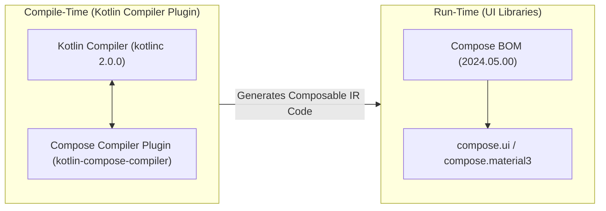

## Compose compiler는 BOM이 아니라 Kotlin 컴파일러 흐름에 속한다

상위 문서: [의존성 및 CI 계약](dependency-ci.md)

### 개념 및 필요성 (What & Why)
**Compose Compiler(컴포즈 컴파일러)** 는 Kotlin IR(Intermediate Representation) 단계를 확장하여 `@Composable` 함수를 추적하고, 상태 변경 시 리컴포지션([recomposition](../../../../02_app_framework/jetpack-compose/runtime/recomposition.md)) 트리 및 가변 상태 주입 코드를 바이트코드로 변환하는 **Kotlin 컴파일러 플러그인**이다.
흔히 하는 오해 중 하나는 Compose Compiler가 Compose BOM에 포함되어 제어된다고 생각하는 것이다. 그러나 Compose Compiler는 UI 런타임 라이브러리가 아니라 컴파일러 코드 생성 도구이므로, **Kotlin 컴파일러 버전과 1:1로 엄격하게 매핑**되어 작동한다. (Kotlin 2.0.0부터는 Compose Compiler가 Kotlin 저장소로 전격 이관되어 `org.jetbrains.kotlin.plugin.compose` 플러그인으로 관리됨).

### 내부 메커니즘 (Internal Mechanism)
1. **Kotlin IR Transformation**: `@Composable` 어노테이션이 붙은 함수 매개변수에 `Composer` 및 `$changed` 비트마스크를 주입하는 IR 바이트코드 갱신을 담당한다.
2. **Kotlin Compiler Version Lock**: Kotlin 버전을 업그레이드할 때는 반드시 호환되는 Compose Compiler 버전을 맞추거나, Kotlin 2.0+ 내장 Compose Compiler Gradle Plugin을 채택해야 한다.
3. **BOM과의 책임 분리**:
   - Compose BOM: `compose.ui`, `compose.material3` 등 **런타임 UI 라이브러리** 버전 관리.
   - Compose Compiler Plugin: `@Composable` AST/IR 변환 및 코드 생성을 담당하는 **컴파일 타임 도구**.



### 코드 예시 (build.gradle.kts - Kotlin 2.0+ 방식)
```kotlin
// app/build.gradle.kts (Kotlin 2.0+ 메인 프로젝트 방식)
plugins {
    alias(libs.plugins.kotlin.android)
    alias(libs.plugins.kotlin.compose.compiler) // Compose Compiler Gradle Plugin
}

android {
    buildFeatures {
        compose = true
    }
}
```

### 관측 가능 증거 (Observable Evidence)
적용된 Compose 컴파일러 호환성 플러그인 상태 및 파라미터는 다음 태스크 검증으로 관측할 수 있다:
```bash
./gradlew app:compileDebugKotlin --info | grep "compose"
```

관련 노트: [Compose BOM은 Compose 라이브러리 버전 세트를 관리한다](compose-bom-manages-compose-library-version-set.md), [의존성 및 CI 계약](dependency-ci.md)
