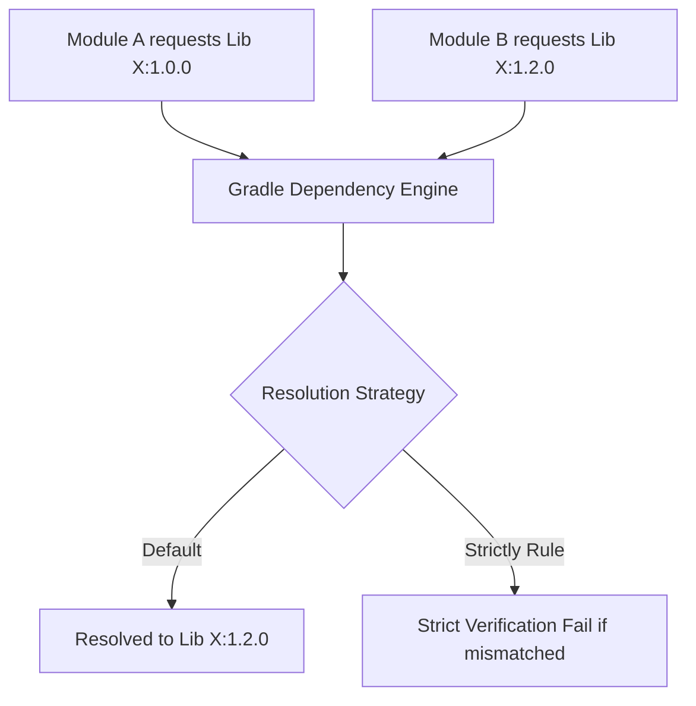

## Gradle 의존성 관리는 요청된 버전이 아니라 해소 그래프를 제어한다

상위 문서: [의존성 및 CI 계약](dependency-ci.md)

### 개념 및 필요성 (What & Why)
Gradle 의존성 관리의 본질은 개발자가 `build.gradle.kts`에 작성한 **요청 버전(Requested Version)** 을 단순히 가져오는 데 있지 않고, 전이적 의존성(Transitive Dependencies) 간의 버전을 조정하여 단일한 **해소 그래프(Resolution Graph)** 를 결정하는 데 있다.
여러 라이브러리가 동일한 서드파티 모듈의 각기 다른 버전을 요구하는 전이적 버그가 발생하면 런타임에 `NoSuchMethodError`나 `ClassNotFoundException`이 유발된다.
Gradle 의 해소 전략(Resolution Strategy)을 통해 버전 충돌을 결정론적으로 통제해야 한다.

### 내부 메커니즘 (Internal Mechanism)
1. **기본 충돌 해결 알고리즘**: Gradle은 충돌 발생 시 기본적으로 **최상위 버전(Highest Version)** 을 자동으로 승격 선택한다 (예: 1.0.0과 1.2.0이 부딪히면 1.2.0 해소).
2. **`strictly` 및 `force` 제어**:
   - `version { strictly("1.1.0") }`: 강제 버전을 지정하여 이 버전을 벗어나는 요청 시 빌드 실패를 유발한다.
   - `resolutionStrategy.force(...)`: 지정된 버전으로 강제 치환한다.
3. **Dependency Constraint (`constraints {}`)**: 해당 라이브러리를 직접 의존성에 추가하지 않고도, 전이적으로 들어올 때의 버전 상한/하한 조건을 선언한다.



### 코드 예시 (build.gradle.kts)
```kotlin
// app/build.gradle.kts
dependencies {
    implementation("com.example:library-a:1.0.0")
    
    // 특정 전이적 의존성의 제약 조건 선언
    constraints {
        implementation("org.jetbrains.kotlinx:kotlinx-coroutines-core:1.8.0") {
            because("Avoid runtime crash caused by corrupt 1.7.x bytecode")
        }
    }
}

configurations.all {
    resolutionStrategy {
        failOnVersionConflict() // 버전 충돌 시 오토 승격하지 않고 즉시 빌드 에러 유발
    }
}
```

### 관측 가능 증거 (Observable Evidence)
최종 해소된 의존성 그래프와 충돌 해결 로그는 다음 명령어로 관측 가능하다:
```bash
./gradlew app:dependencies --configuration runtimeClasspath
```

관련 노트: [Version catalog는 의존성과 플러그인 좌표를 명명한다](version-catalog-names-dependency-and-plugin-coordinates.md), [의존성 및 CI 계약](dependency-ci.md)
