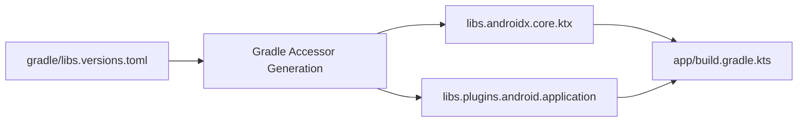

## Version catalog는 의존성과 플러그인 좌표를 명명한다

상위 문서: [의존성 및 CI 계약](dependency-ci.md)

### 개념 및 필요성 (What & Why)
**Version Catalog(버전 카탈로그 - `gradle/libs.versions.toml`)** 는 Gradle 빌드에서 의존성과 플러그인의 좌표에 이름을 부여해 중앙에서 관리하는 표준 기능이다.
프로젝트의 수많은 서브모듈에 하드코딩되어 파편화되던 의존성 좌표(`group:artifact:version`)와 플러그인 정보를 단일 위치에 정돈하여 선언한다.
이를 통해 요청 버전을 일관되게 선언하고 IDE 자동완성과 타입 세이프 Kotlin DSL 접근자(`libs.retrofit`, `libs.plugins.android.application`)를 얻는다. 다만 version catalog는 최종 dependency graph의 버전을 강제하지 않는다. 충돌 해결, constraint, platform/BOM에 의해 실제 선택 버전이 달라질 수 있다.

### 내부 메커니즘 (Internal Mechanism)
TOML 규격 파일은 4가지 핵심 섹션으로 구성된다:
1. `[versions]`: 서드파티 라이브러리 및 플러그인의 버전 번호 정의.
2. `[libraries]`: `group`, `name`, `version.ref`를 결합하여 라이브러리 접근자 생성.
3. `[plugins]`: `id` 및 `version.ref`를 통해 Gradle 플러그인 좌표 선언.
4. `[bundles]`: 연관된 복수의 라이브러리(예: Ktor 모듈 세트)를 하나로 묶어 `implementation(libs.bundles.ktor)` 형태로 한 번에 추가 가능.



### 코드 예시 (gradle/libs.versions.toml & build.gradle.kts)
```toml
# gradle/libs.versions.toml
[versions]
agp = "9.3.0"
coreKtx = "1.13.1"

[libraries]
androidx-core-ktx = { group = "androidx.core", name = "core-ktx", version.ref = "coreKtx" }

[plugins]
android-application = { id = "com.android.application", version.ref = "agp" }
```

```kotlin
// app/build.gradle.kts
plugins {
    alias(libs.plugins.android.application)
    // AGP 9.0+에서는 Kotlin 지원이 내장되므로
    // org.jetbrains.kotlin.android alias를 적용하지 않는다.
}

dependencies {
    implementation(libs.androidx.core.ktx)
}
```

### 관측 가능 증거 (Observable Evidence)
버전 카탈로그가 정상 인식되고 plugin alias가 해석되는지는 Gradle 구성 단계에서 확인할 수 있다:
```bash
./gradlew :app:tasks
```

AGP 8 이하를 유지하는 빌드에서는 `org.jetbrains.kotlin.android` 플러그인과 그 버전 alias가 여전히 필요할 수 있다. 반대로 AGP 9 built-in Kotlin을 사용하는 Android 모듈에 해당 플러그인을 함께 적용하면 충돌하므로, AGP major 전환과 catalog 정리를 같은 마이그레이션으로 다룬다. Kotlin/JVM, Kotlin Multiplatform 또는 Kotlin compiler plugin은 별도 계약이며 필요한 플러그인을 그대로 선언한다.

관련 노트: [Gradle 플러그인 및 모듈화 아키텍처](../../gradle/gradle-build/gradle-plugins.md), [의존성 및 CI 계약](dependency-ci.md)

공식 문서: [Gradle Version Catalogs](https://docs.gradle.org/current/userguide/version_catalogs.html), [Migrate to built-in Kotlin](https://developer.android.com/build/migrate-to-built-in-kotlin)

검증일: 2026-08-06. Version catalog가 좌표를 명명하지만 해석 결과를 강제하지 않는다는 경계와 AGP 9 built-in Kotlin 구성을 반영했다.
