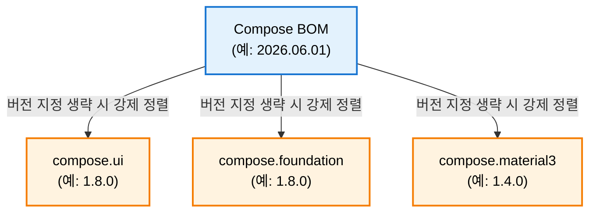

# Jetpack Compose BOM (Bill of Materials) 의존성 관리 가이드

이 문서는 Jetpack Compose 라이브러리들의 버전 호환성을 보장하고 Gradle 의존성을 단순화하기 위해 사용하는 **Compose BOM(Bill of Materials)**의 개념, 동작 방식, 선언 규칙 및 예외 처리 기법을 정리합니다.

---

## 1. Compose BOM이란 무엇인가?

Jetpack Compose는 느슨하게 결합된 모듈식 아키텍처를 가지고 있어 `ui`, `foundation`, `animation`, `material3` 등 여러 개의 독립된 라이브러리 모듈(Artifact)로 나뉩니다.
* **문제점**: 각 모듈의 릴리즈 주기가 다르고 버전 번호도 제각각이라, 버전을 개별 지정하면 서로 호환되지 않아 런타임 크래시가 발생하기 쉽습니다.
* **해결책 (BOM)**: Compose BOM은 구글이 내부 테스트를 거쳐 **완벽하게 상호 호환되는 Compose 라이브러리 버전 세트**를 날짜 형식(`YYYY.MM.DD`)의 단일 버전으로 묶어서 제공하는 배포판입니다.



---

## 2. BOM을 사용한 의존성 설정 방법

Version Catalog(`libs.versions.toml`)와 Gradle 스크립트를 사용하여 BOM을 설정하면 개별 Compose 라이브러리의 버전 선언을 모두 생략할 수 있습니다.

### 2-1. `libs.versions.toml` 등록
BOM 버전을 관리할 뼈대를 추가합니다.
```toml
[versions]
composeBom = "2026.06.01"

[libraries]
androidx-compose-bom = { group = "androidx.compose", name = "compose-bom", version.ref = "composeBom" }
androidx-compose-ui = { group = "androidx.compose.ui", name = "ui" } # 버전 생략
androidx-compose-material3 = { group = "androidx.compose.material3", name = "material3" } # 버전 생략
```

### 2-2. `build.gradle.kts` 반영
의존성 블록 내에 `platform(...)` 키워드를 사용해 BOM 라이브러리를 가져온 후, 나머지 라이브러리들은 별칭(alias)으로 버전 없이 선언합니다.
```kotlin
dependencies {
    // 1. BOM 플랫폼 선언 (이 시점에 호환 버전 목록이 내부 로드됨)
    implementation(platform(libs.androidx.compose.bom))

    // 2. 하위 라이브러리 선언 (버전 번호 기입 불필요)
    implementation(libs.androidx.compose.ui)
    implementation(libs.androidx.compose.material3)
}
```

---

## 3. BOM 버전 덮어쓰기 (Overriding BOM version)

앱 개발 중 특정 기능 사용이나 긴급 버그 픽스를 위해 **특정 컴포즈 라이브러리 하나만 최신 알파/베타 버전**으로 올려야 할 때가 있습니다. 이때는 BOM 설정을 유지한 채 원하는 라이브러리에 명시적으로 버전을 입력하면 됩니다.

```kotlin
dependencies {
    implementation(platform(libs.androidx.compose.bom)) // 기본 2026.06.01 (예: ui 1.8.0)

    // UI 모듈만 최신 1.9.0-alpha01 버전을 강제 사용하도록 재정의
    implementation("androidx.compose.ui:ui:1.9.0-alpha01")
    
    // 나머지 foundation, material3 등은 여전히 BOM에 정의된 안정 버전을 따름
    implementation(libs.androidx.compose.foundation)
}
```

---

## 4. BOM 매핑 및 릴리즈 규칙

* **BOM 버전 표기**: 연도, 월, 일 단위의 날짜(`YYYY.MM.DD`) 형식으로 정의됩니다.
* **매핑 목록 확인**: 각 BOM 날짜 버전이 구체적으로 어떤 하위 Compose 라이브러리 버전을 들고 있는지 확인하려면 [Compose BOM-to-library mapping table](https://developer.android.com/develop/ui/compose/bom/bom-mapping) 공식 페이지를 참조해야 합니다.
* **릴리즈 반영**: 새 BOM 버전이 출시된다고 해서 모든 Compose 라이브러리의 버전이 다 오르는 것은 아닙니다. 업데이트가 없는 모듈은 이전 버전으로 매핑이 그대로 유지됩니다.

---

## 5. 중요: Compose Compiler는 BOM 관리 대상이 아님

> [!IMPORTANT]
> **Compose BOM은 Compose Compiler의 버전을 제어하지 않습니다.**

* **이유**: Compose Compiler는 빌드 시점에 Kotlin 코드를 트랜스파일하는 특수한 컴파일러 플러그인이기 때문에, 화면 렌더링용 Compose 라이브러리가 아닌 Kotlin 컴파일러 버전에 긴밀하게 종속됩니다.
* **해결**: Kotlin 2.0 이상부터는 Compose Compiler Gradle Plugin(`org.jetbrains.kotlin.plugin.compose`)을 통해 Kotlin 버전과 통합하여 따로 관리해야 합니다.
