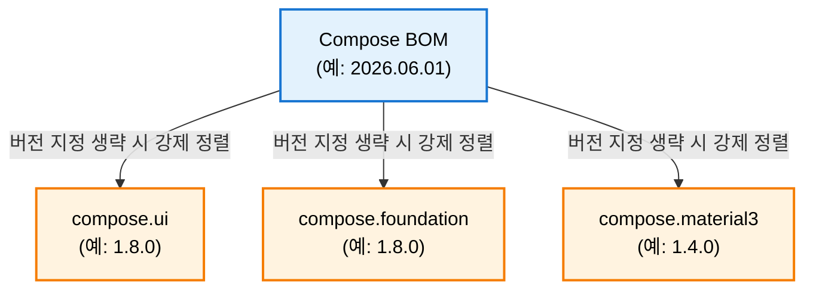

# Compose BOM이란 무엇인가?

Jetpack Compose는 느슨하게 결합된 모듈식 아키텍처를 가지고 있어 `ui`, `foundation`, `animation`, `material3` 등 여러 개의 독립된 라이브러리 모듈(Artifact)로 나뉩니다.
* **문제점**: 각 모듈의 릴리즈 주기가 다르고 버전 번호도 제각각이라, 버전을 개별 지정하면 서로 호환되지 않아 런타임 크래시가 발생하기 쉽습니다.
* **해결책 (BOM)**: Compose BOM은 구글이 내부 테스트를 거쳐 **완벽하게 상호 호환되는 Compose 라이브러리 버전 세트**를 날짜 형식(`YYYY.MM.DD`)의 단일 버전으로 묶어서 제공하는 배포판입니다.

---
