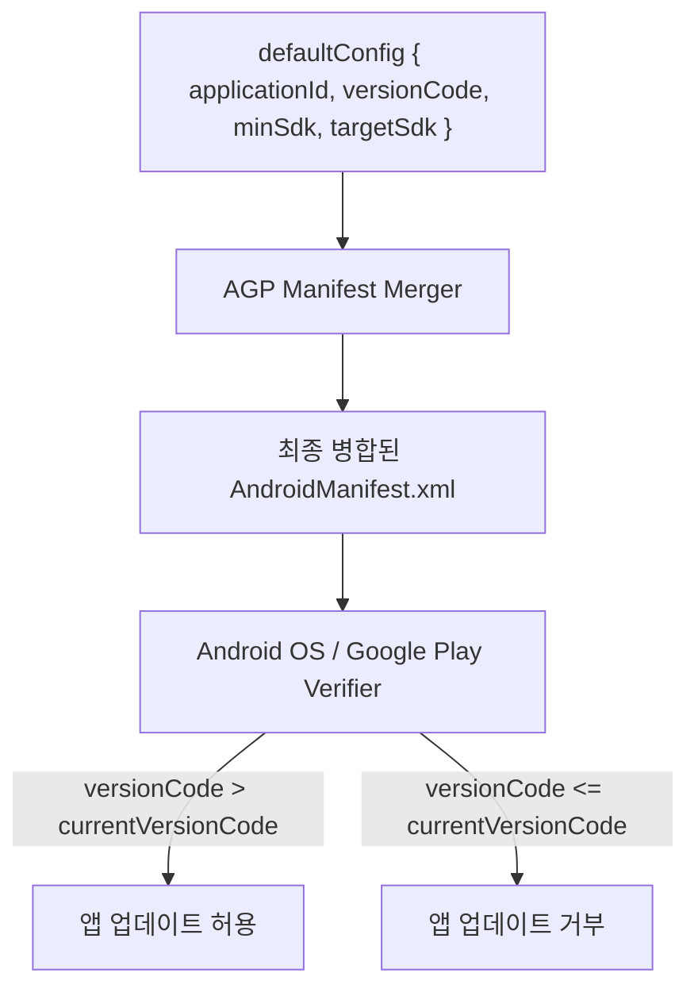

## AGP defaultConfig 및 앱 식별자·버전 명세 (DefaultConfig & Versioning)

### 개요

**`defaultConfig`** 블록은 AGP(Android Gradle Plugin) 빌드 시스템에서 모든 빌드 변형(Build Variant)에 기본 공통으로 적용되는 **애플리케이션 식별자(`applicationId`)**, **소스 네임스페이스(`namespace`)**, **API 타깃 버전 레벨(`compileSdk`, `minSdk`, `targetSdk`)**, 그리고 **앱 버저닝 명세(`versionCode`, `versionName`)** 를 정의하는 핵심 DSL 블록이다.

Google Play 스토어와 Android OS 패키지 관리자(`PackageManager`)는 앱을 고유하게 식별하고 업데이트 상향 호환성(Upgrade Compatibility)을 검증하기 위해 `applicationId` 와 단조 증가하는 `versionCode` 정수값을 필수 조건으로 요구한다.



---

### 1. `defaultConfig` 핵심 명세와 내부 메커니즘

#### 1) `applicationId` vs `namespace` (식별자와 소스 패키지 분리)

- **`namespace`**: 생성되는 `R.java`, `BuildConfig` 클래스의 패키지 경로이자 Kotlin/Java 소스 코드의 기본 패키지를 지정한다.
- **`applicationId`**: Google Play 스토어 및 Android OS 단에서 앱을 구별하는 **고유 패키지 식별자**이다.
- 과거에는 매니페스트의 `package` 속성이 두 역할을 모두 수행했으나, 최신 AGP 는 소스 패키지 구조(`namespace`)와 배포 식별자(`applicationId`)를 명확히 분리하여 `build.gradle.kts` 에서 관리한다.

#### 2) 3 대 SDK 레벨의 동작 및 차이점

- **`compileSdk`**: 소스 코드를 컴파일할 때 바인딩할 Android API 버전. (예: `compileSdk = 35` 이면 Android 15 신규 API 클래스와 메서드를 컴파일 시점에 호출 가능).
- **`minSdk`**: 이 앱을 설치하고 실행할 수 있는 **최소 Android OS API 버전**. (예: `minSdk = 26` 이면 Android 8.0 이상 기기에서만 설치 허용. 하위 버전 미지원 API 호출 시 런타임 OS 버전 분기 `Build.VERSION.SDK_INT` 필요).
- **`targetSdk`**: 앱이 검증되고 호환 동작을 보장하는 **Android OS 보안/동작 정책 기준점**. (예: 신규 백그라운드 서비스 제한, 런타임 권한 요구 정책의 기준).

#### 3) 호스트 JVM Toolchain (Java 21) vs 기기 런타임 (`minSdk 26`)의 층위 분리

- `java { toolchain { languageVersion = JavaLanguageVersion.of(21) } }`: 개발자 PC 및 CI 러너에서 **Gradle 데몬과 컴파일러 도구를 구동하는 호스트 JVM 버전**이다. 최신 플러그인(AGP 9+, Kotlin Compose 플러그인)이 Java 21 바이트코드로 배포되므로 빌드 도구 런타임은 JDK 21 이상이어야 한다.
- 반면 기기에서 실행되는 앱 런타임은 `minSdk = 26` (Android 8.0+)이므로, 호스트 빌드 도구의 Java 버전과 기기 안드로이드 OS 버전은 완전히 독립된 별개의 층위이다.

#### 4) 앱 버저닝 규칙

- **`versionCode`**: 내부적 업그레이드 판별용 단조 증가 정수 (예: `100200`). 버전 업데이트 시 기존 설치된 버전보다 항상 큰 정수여야 한다.
- **`versionName`**: 사용자에게 노출되는 표기용 버전 문자열 (예: `"1.2.0"`).

#### 5) 매니페스트 주입 (Manifest Injection)

- `defaultConfig` 에 선언된 값들은 AGP 빌드 시 `AndroidManifest.xml` 의 `<manifest package="…">`, `android:versionCode`, `android:versionName` 속성에 자동 주입(Merge)된다.

---

### 2. 코드 예시 (build.gradle.kts)

```kotlin
// app/build.gradle.kts
android {
    namespace = "com.example.myapp"
    compileSdk = 35

    defaultConfig {
        applicationId = "com.example.myapp"
        minSdk = 26
        targetSdk = 35
        versionCode = 10001
        versionName = "1.0.1"

        testInstrumentationRunner = "androidx.test.runner.AndroidJUnitRunner"
        vectorDrawables {
            useSupportLibrary = true
        }
    }
}
```

---

### 3. 관측 가능 증거 (Observable Evidence)

빌드 산출물의 최종 매니페스트에 주입된 식별자와 버전 정보를 `apkanalyzer` 도구로 확인할 수 있다:

```bash
apkanalyzer manifest print build/outputs/apk/release/app-release.apk | grep -E "package|versionCode|versionName"

# Output Example:
# package="com.example.myapp"
# android:versionCode="10001"
# android:versionName="1.0.1"
```

---

### 상위 및 연관 문서

- [Gradle 빌드 시스템](gradle-build.md)
- [Android Gradle Plugin (AGP) 아키텍처 및 확장 모델](android-gradle-plugin.md)
- [AGP Build Variant 매트릭스](agp-build-variants.md)
- [AGP 릴리스 체크리스트](agp-release-checklist.md)
- [App 업데이트는 application id, version code, 그리고 서명 호환성을 요구한다](../../distribution/release/app-update-compatibility.md)
