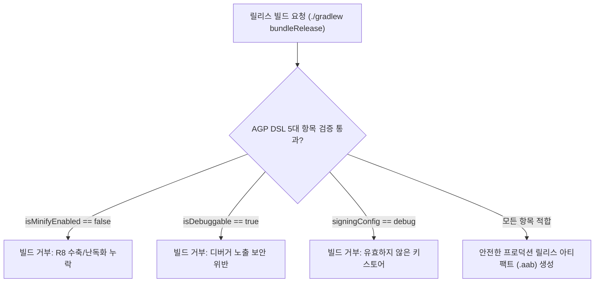

## AGP 릴리스 빌드 점검 체크리스트 (Release Variant Checklist)

### 개요

상용 프로덕션 앱을 빌드하여 Google Play 또는 배포 채널에 출시할 때 `build.gradle.kts` 의 `release` 빌드 타입에 설정된 AGP DSL 플래그들의 **실효값(Effective Values)**을 반드시 정밀 검증해야 한다.

개발 편의를 위해 사용되던 디버그 설정(디버거 부착 허용, R8 코드 수축 비활성화, 디버그 키스토어 서명 등)이 실수로 릴리스 아티팩트에 잔존(Leak)하는 경우, 앱 용량 증가, 리버스 엔지니어링 노출, 심각한 보안 취약점이 유발될 수 있다.



---

### 1. 릴리스 변형 파이프라인 5 대 필수 점검 항목

| 점검 항목 | 권장 설정값 | 미준수 시 발생하는 리스크 |
|---|---|---|
| **1. R8 코드 수축** | `isMinifyEnabled = true` | 미사용 클래스/메서드가 잔존하여 DEX 크기 증가 및 난독화 미적용으로 인한 역공학 취약 |
| **2. 리소스 수축** | `isShrinkResources = true` | 미사용 이미지, 레이아웃 등 XML 리소스가 번들에 포함되어 앱 다운로드 크기 증가 |
| **3. 디버깅 비활성화** | `isDebuggable = false` | 외부 프로세스가 디버거(`jdwp`)를 부착하여 런타임 메모리와 로직을 변조할 수 있는 치명적 보안 결함 |
| **4. 서명 키 연결** | 프로덕션 릴리스 서명 키 | 기본 개발용 `debug.keystore` 서명 상태로 빌드되어 Play Console 업로드 실패 |
| **5. ProGuard 룰** | 최적화 규칙 파일 지정 | 최적화 누락 또는 서드파티 라이브러리 리플렉션 오류로 인한 런타임 크래시 |

---

### 2. 표준 릴리스 설정 코드 예시 (build.gradle.kts)

```kotlin
// app/build.gradle.kts
android {
    buildTypes {
        getByName("release") {
            // 1. R8 바이트코드 수축 및 난독화 활성화
            isMinifyEnabled = true
            
            // 2. 미사용 리소스 자동 제거 (isMinifyEnabled 가 true여야 동작)
            isShrinkResources = true
            
            // 3. 디버거 부착 차단 (기본값 false이지만 명시적 선언 권장)
            isDebuggable = false
            
            // 4. 프로덕션 릴리스 서명 키 연결
            signingConfig = signingConfigs.getByName("release")
            
            // 5. AGP 기본 최적화 룰 및 프로젝트 커스텀 룰 지정
            proguardFiles(
                getDefaultProguardFile("proguard-android-optimize.txt"),
                "proguard-rules.pro"
            )
        }
    }
}
```

---

### 3. 관측 가능 증거 (Observable Evidence)

생성된 릴리스 아티팩트에 디버그 플래그가 잔존하는지 `apkanalyzer` 도구로 즉시 검증할 수 있다:

```bash
# debuggable 플래그가 false인지 확인 (출력이 false이거나 비어 있어야 함)
apkanalyzer manifest print build/outputs/apk/release/app-release.apk | grep "android:debuggable"

# Output Example:
# android:debuggable="false"
```

---

### 상위 및 연관 문서

- [Gradle 빌드 시스템](gradle-build.md)
- [AGP 서명 설정 및 키 관리](agp-signing-config.md)
- [AGP Build Variant 아키텍처 및 변형 매트릭스](agp-build-variants.md)
- [AGP defaultConfig 및 앱 식별자·버전 명세](agp-default-config.md)
- [D8과 R8 컴파일러 및 덱싱(Dexing) 메커니즘](../../optimization/d8-and-r8.md)
