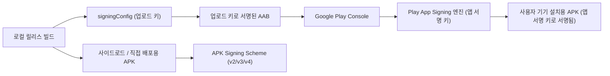

## AGP 서명 설정 및 키 관리 (SigningConfig & Play App Signing)

### 개요

Android OS 가 기기에 설치하고 업데이트할 수 있는 최소 단위는 **서명된 APK**이다. 반면 배포 형식인 AAB(Android App Bundle)는 기기에 직접 설치되는 파일이 아니라, Google Play 가 기기별 최적화 APK 를 생성 및 전달하기 위한 게시(Publishing) 아티팩트이다.

AGP 의 **`signingConfigs`** DSL 블록은 빌드 시 사용할 키스토어(Keystore)와 자격증명을 특정 빌드 타입(BuildType)에 연결한다. **Play App Signing**을 사용하는 현대 배포 환경에서는 로컬 빌드 단계의 **업로드 키(Upload Key)** 서명과 Google Play 가 최종 사용자 기기로 배포할 때 수행하는 **앱 서명 키(App Signing Key)** 서명의 층위를 명확히 분리하여 관리해야 한다.



---

### 1. 내부 동작 메커니즘과 서명 층위 분리

1. **Keystore 자격증명 주입 및 보안**:
   - `storeFile`, `storePassword`, `keyAlias`, `keyPassword` 값은 소스 코드에 절대 하드코딩하지 않고, CI 환경변수(`System.getenv()`) 또는 로컬 비밀 파일(`local.properties`)에서 안전하게 주입한다.
2. **산출물별 서명 방식의 차이**:
   - **직접 설치용 APK**: v1(JAR), v2(APK Signature Scheme), v3(키 순환 지원), v4(Streaming) 서명을 적용하며 `apksigner verify` 로 검증한다.
   - **Google Play 업로드용 AAB**: 개발자의 신원을 확인하는 **업로드 키(Upload Key)**로 서명된다. Google Play 는 이 서명을 확인한 후 안전한 클라우드 HSM 에 보관된 **앱 서명 키(App Signing Key)**로 최종 delivery APK 를 재서명한다.
3. **Debug vs Release Keystore**:
   - Debug 빌드는 AGP 가 기본 생성하는 `~/.android/debug.keystore` 를 자동 사용한다.
   - Release 빌드는 보안 키스토어가 명시적으로 결합되지 않으면 서명되지 않은(`unsigned`) 상태로 출력된다.

---

### 2. 코드 예시 (build.gradle.kts)

```kotlin
// app/build.gradle.kts
android {
    signingConfigs {
        create("release") {
            storeFile = file(System.getenv("KEYSTORE_PATH") ?: "release.keystore")
            storePassword = System.getenv("KEYSTORE_PASSWORD") ?: ""
            keyAlias = System.getenv("KEY_ALIAS") ?: ""
            keyPassword = System.getenv("KEY_PASSWORD") ?: ""
            enableV2Signing = true
            enableV3Signing = true
            enableV4Signing = true
        }
    }

    buildTypes {
        getByName("release") {
            signingConfig = signingConfigs.getByName("release")
        }
    }
}
```

---

### 3. 관측 가능 증거 (Observable Evidence)

적용된 서명 설정 및 키 SHA-256 핑거프린트를 Gradle 태스크로 관측할 수 있다:

```bash
./gradlew app:signingReport
```

---

### 상위 및 연관 문서

- [Gradle 빌드 시스템](gradle-build.md)
- [AGP 릴리스 체크리스트](agp-release-checklist.md)
- [AGP Build Variant 아키텍처 및 변형 매트릭스](agp-build-variants.md)
- [Play app signing은 업로드 키와 앱 서명 키를 분리한다](../../distribution/release/play-app-signing.md)
