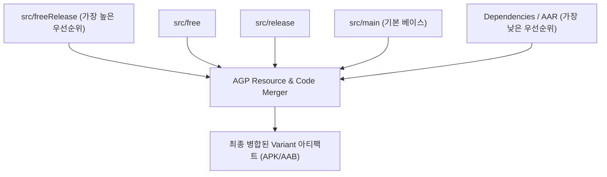

## AGP SourceSet 우선순위 및 리소스·코드 병합 규칙 (SourceSets & Merge Priority)

### 개요

**SourceSet(소스 세트)**은 특정한 [빌드 변형(Build Variant)](agp-build-variants.md) 이나 환경을 위해 결합되는 소스 코드, 리소스, 매니페스트 파일의 디렉터리 모음이다 (예: `src/main`, `src/debug`, `src/free`, `src/freeRelease`).

다양한 빌드 변형을 동시에 지원할 때 동일한 리소스 이름(예: `strings.xml` 내의 `app_name`)이나 코드가 여러 소스 세트에 중복 존재할 수 있다. AGP(Android Gradle Plugin)는 명확하게 정의된 **SourceSet 우선순위 계층구조(Priority Cascade)**를 따라 리소스를 덮어쓰고(Override) 병합함으로써 충돌을 결정론적으로 해결한다.



---

### 1. SourceSet 우선순위 계층구조 (Priority Cascade)

AGP 가 리소스와 매니페스트를 병합할 때 적용하는 엄격한 우선순위 순서는 다음과 같다:

$$\text{Build Variant} (\text{freeRelease}) > \text{Product Flavor} (\text{free}) > \text{Build Type} (\text{release}) > \text{Main} (\text{main}) > \text{Dependencies (AAR / Library)}$$

---

### 2. 리소스 병합 vs 소스 코드 병합의 본질적 차이

| 구분 | 리소스 (XML, Drawable, Asset) | 소스 코드 (Kotlin, Java) |
|---|---|---|
| **중복 허용 여부** | ⭕ **허용됨 (Override)** | ❌ **절대 불가 (Duplicate Class Error)** |
| **동작 메커니즘** | 높은 우선순위 SourceSet 의 리소스가 낮은 우선순위의 동일 리소스 키를 완전 대체(덮어쓰기)함 | 동일한 패키지 및 클래스명(`com.example.Util`)이 `main`과 `flavor` 에 동시에 존재하면 **컴파일 에러 발생** |
| **올바른 설계 패턴** | `main/res/values/strings.xml`에 기본값을 두고, `free/res/values/strings.xml`에서 오버라이드 | 변형별 코드가 필요하다면 `main`에서 해당 파일을 제거하고, 각 `free/` 및 `paid/` 소스 세트에 각각 배치 |

---

### 3. 디렉터리 구조 및 커스텀 SourceSet 매핑

```text
app/src/
├── main/
│   ├── kotlin/com/example/myapp/MainActivity.kt
│   └── res/values/strings.xml       # app_name = "My App"
├── free/
│   ├── kotlin/com/example/myapp/AdHelper.kt  # 무료 버전 전용 광고 코드
│   └── res/values/strings.xml       # app_name = "My App Free" (main 덮어쓰기)
└── paid/
    ├── kotlin/com/example/myapp/AdHelper.kt  # 유료 버전 전용 더미 코드
    └── res/values/strings.xml       # app_name = "My App Pro" (main 덮어쓰기)
```

```kotlin
// app/build.gradle.kts (Custom SourceSet 경로 매핑 예시)
android {
    sourceSets {
        getByName("main") {
            java.srcDirs("src/main/kotlin")
            res.srcDirs("src/main/res-core", "src/main/res-ui")
        }
    }
}
```

---

### 4. 관측 가능 증거 (Observable Evidence)

특정 빌드 변형에 최종 반영된 리소스 병합 결과를 `processReleaseResources` 태스크 출력으로 관측할 수 있다:

```bash
./gradlew app:processFreeReleaseResources
```

---

### 상위 및 연관 문서

- [Gradle 빌드 시스템](gradle-build.md)
- [AGP Build Variant 아키텍처 및 변형 매트릭스](agp-build-variants.md)
- [AGP defaultConfig 및 앱 식별자·버전 명세](agp-default-config.md)
- [Android Gradle Plugin (AGP) 아키텍처 및 확장 모델](android-gradle-plugin.md)
