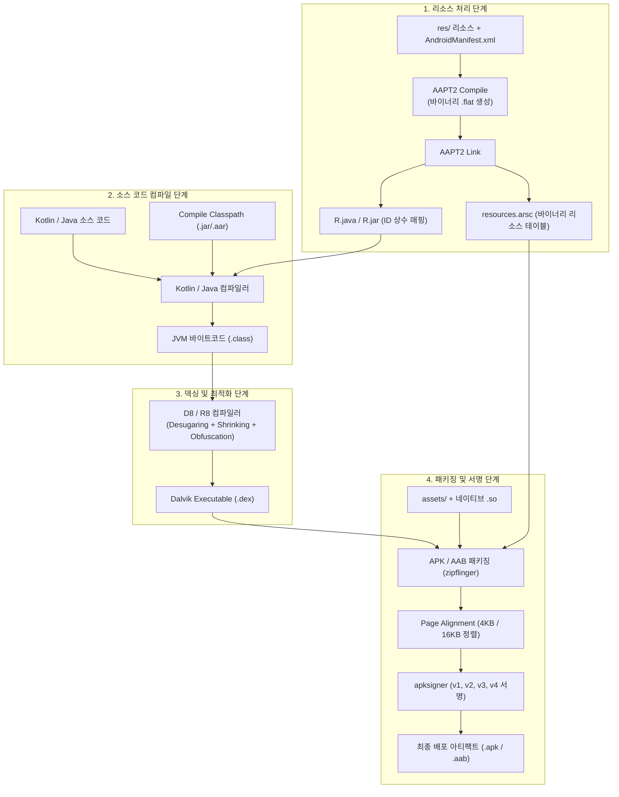

## Android 빌드 파이프라인과 핵심 빌드 용어 해설 (Build Pipeline & Terminology)

### 개요

Android 애플리케이션의 빌드 과정은 단순히 소스 코드를 컴파일하는 것에 그치지 않고, **Java/Kotlin 소스 컴파일**, **XML 리소스 컴파일 및 링크(AAPT2)**, **바이트코드 최적화 및 덱싱(D8/R8)**, **네이티브 라이브러리 및 에셋 병합**, **정렬 및 암호학적 서명(apksigner)**이 결합된 복합 파이프라인이다.

---

### 1. 단계별 빌드 엔진 메커니즘

#### 1) 리소스 컴파일 및 링크 (`AAPT2: Android Asset Packaging Tool 2`)
- **Compile 단계**: `res/values/strings.xml`, 레이아웃 XML, 이미지 등을 개별 중간 바이너리 파일(`.flat`)로 증분 변환한다.
- **Link 단계**: 모든 `.flat` 파일과 `AndroidManifest.xml` 을 병합하여 앱에서 참조할 수 있는 정수형 리소스 ID 모음(`R.java`)과 컴파일된 리소스 테이블(`resources.arsc`)을 생성한다.

#### 2) 소스 컴파일 및 JVM 바이트코드 생성
- Kotlin 컴파일러(`kotlinc` / K2)와 Java 컴파일러(`javac`)가 `src/` 코드와 `R.java`, [Compile Classpath](../../../../../computer-science/jvm-classpath.md) 라이브러리들을 읽어 JVM 바이트코드(`.class`)를 생성한다.

#### 3) 덱싱 및 최적화 (`D8` vs `R8`)
- Android 런타임(ART)은 JVM 바이트코드(`.class`)를 직접 실행할 수 없으며, 레지스터 기반의 **DEX(Dalvik Executable) 바이트코드**를 요구한다.
- **D8 (DEX Compiler)**: `.class` 바이트코드를 고속으로 `.dex` 파일로 변환한다.
- **R8 (Shrinker & Optimizer)**: D8 기능에 더해 ProGuard 의 기능(미사용 코드 제거 `Tree Shaking`, 최적화 `Inlining`, 클래스/메서드 난독화 `Obfuscation`)을 한 번의 패스로 통합 수행한다.

#### 4) 정렬(Alignment) 및 암호학적 서명(`apksigner`)
- **16KB / 4KB Page Alignment (`zipalign`)**: 압축되지 않은 네이티브 `.so` 라이브러리와 에셋의 시작 오프셋을 메모리 페이지 경계에 맞추어 OS 의 `mmap` 적재 성능을 극대화한다. (Android 15+ 16KB 페이지 필수 지원).
- **`apksigner`**: APK 전체 바이너리의 해시 트리와 인증서 서명 블록(v2/v3/v4)을 주입하여 변조를 방지한다.

---

### 2. 핵심 빌드 용어 해설 (Terminology)

#### 1) 좌표 (Maven Coordinates - GAV)
- 라이브러리를 고유하게 식별하기 위한 3 요소 표준 체계: **`Group:Artifact:Version`** (예: `io.ktor:ktor-client-core:3.5.2`).
  - **Group**: 조직 또는 도메인 역순 네임스페이스 (`io.ktor`, `androidx.compose.ui`).
  - **Artifact**: 해당 그룹 내 모듈의 고유 이름 (`ktor-client-core`).
  - **Version**: 시맨틱 버저닝 또는 배포 식별자 (`3.5.2`).

#### 2) BOM (Bill of Materials)
- 자체적으로는 단 한 줄의 실행 코드나 바이너리도 포함하지 않고, **상호 호환성이 검증된 수십 개의 라이브러리 버전 매핑 정보만 제공하는 특수 POM 아티팩트**이다.
- Gradle 에서 `implementation(platform(libs.androidx.compose.bom))` 형태로 적용하면, 개별 Compose 라이브러리의 버전을 생략해도 BOM 에 정의된 안정적인 버전으로 자동 정렬된다.

#### 3) 전이적 의존성 (Transitive Dependency)
- 내가 직접 선언한 라이브러리 A 가 내부적으로 라이브러리 B 와 C 를 필요로 할 때, 빌드 시스템이 B 와 C 까지 의존성 그래프로 탐색하여 자동으로 내려받는 메커니즘이다.
- 버전 충돌 시 Gradle 은 의존성 그래프 전체에서 가장 높은 호환 버전을 선택(Conflict Resolution)한다.

#### 4) AAR vs JAR
- **JAR (Java Archive)**: 순수한 Java/Kotlin 컴파일 바이트코드(`.class`)와 메타데이터만 압축한 파일.
- **AAR (Android Archive)**: Android 전용 라이브러리 포맷으로, `classes.jar` 뿐만 아니라 `AndroidManifest.xml`, `res/` 리소스, `assets/`, JNI 네이티브 라이브러리(`.so`), ProGuard 룰(`proguard.txt`)을 모두 포함한다.

#### 5) 디슈가링 (Desugaring)
- 최신 Java/Kotlin 문법(Java 8+ `java.time`, 람다식, 스트림 API, 인터페이스 default 메서드)을 하위 버전 Android OS (`minSdk = 24` 등)에서도 크래시 없이 실행될 수 있도록, D8/R8 컴파일러가 바이트코드를 하위 호환 구조로 재작성(Backporting)해 주는 기술이다.

---

### 상위 및 연관 문서

- [JVM 클래스패스와 클래스 로딩 메커니즘](../../../../../computer-science/jvm-classpath.md)
- [API vs ABI](../../../../../computer-science/api-vs-abi.md)
- [Gradle 코어 엔진 및 아키텍처](gradle-core.md)
- [Gradle 의존성 구성 및 클래스패스 격리](gradle-dependency-configurations.md)
- [Android Gradle Plugin (AGP) 아키텍처 및 확장 모델](android-gradle-plugin.md)
