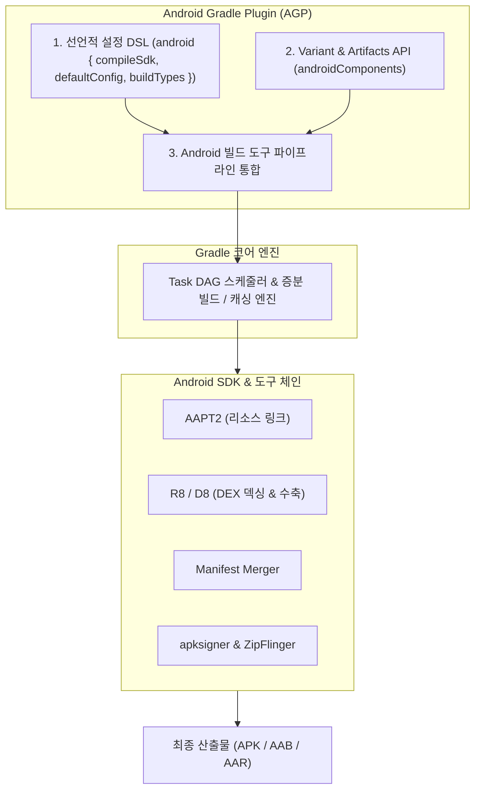
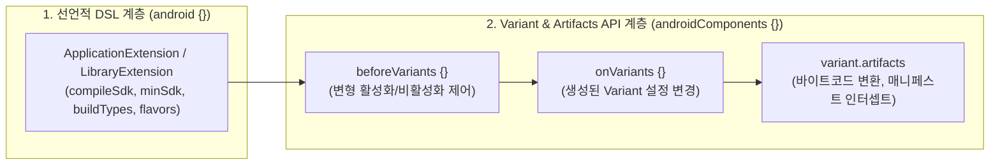

## Android Gradle Plugin (AGP) 아키텍처 및 확장 모델

### 개요

**AGP(Android Gradle Plugin)** 는 범용 빌드 도구인 Gradle 에 Android 애플리케이션 및 라이브러리 빌드를 위한 도메인 특화 태스크 파이프라인, Android SDK 도구 체인, 그리고 빌드 변형(Variant) 모델을 주입하는 Google 공식 핵심 빌드 플러그인(`com.android.application`, `com.android.library`)이다.

Gradle 코어 엔진 자체는 Java/Kotlin 소스 컴파일과 태스크 그래프 스케줄링만을 담당하며, Android 전용 리소스 컴파일러(AAPT2), 바이트코드 덱싱/수축 엔진(D8/R8), 매니페스트 병합기(Manifest Merger), APK/AAB 패키징 메커니즘을 알지 못한다. AGP 는 이러한 Android 전용 도구 체인을 Gradle 의 태스크 시스템으로 추상화하여, 개발자가 선언적 Kotlin DSL(`android {}`)을 통해 복잡한 빌드 환경을 일관되게 제어할 수 있도록 돕는다.



---

### 1. AGP 2 계층 API 아키텍처: DSL vs Variant API

현대 AGP 는 **빌드 설정(Configuration) 계층**과 **빌드 변형 확장(Variant & Artifacts API) 계층**의 2 계층 구조로 명확히 분리되어 설계되어 있다.



#### 1) 선언적 설정 DSL (`android {}`)

- `ApplicationExtension`, `LibraryExtension`, `CommonExtension` 을 통해 빌드에 필요한 정적 입력값을 선언한다.
- **주요 설정 항목**:
  - `compileSdk`, `minSdk`, `targetSdk`
  - `namespace`, `applicationId`
  - `buildTypes` (debug, release), `productFlavors`
  - `buildFeatures` (compose, viewBinding, buildConfig)
  - `compileOptions` (Java 21 toolchain 호환성)

#### 2) 차세대 확장 API (`androidComponents { … }` - Variant API)

과거의 절차적 스크립트 방식(`applicationVariants.all { … }`)은 태스크 그래프 생성 이후에 프로퍼티를 강제로 변조하여 Gradle 의 **Configuration Cache**와 **증분 빌드**를 파괴하는 주원인이었다. modern AGP 는 타입 세이프한 **Variant API**를 표준으로 제공한다:

- **`beforeVariants`**: 특정 조건(예: 디버그 빌드에서는 특정 Flavor 조합 제외)에 따라 빌드 변형의 생성을 조기에 차단하여 빌드 속도를 최적화한다.
- **`onVariants`**: 확정된 `Variant` 객체에 접근하여 빌드 속성을 읽거나 수정한다.
- **`artifacts` API**: 태스크 이름을 하드코딩하지 않고도, 매니페스트 파일(`SingleArtifact.MERGED_MANIFEST`)이나 컴파일된 클래스 바이트코드를 안전하게 가로채어 ASM 바이트코드 변환(Bytecode Transformation) 태스크를 주입할 수 있다.

```kotlin
// app/build.gradle.kts - Variant API 및 Artifacts 확장 예시
androidComponents {
    // 1. 불필요한 변형 빌드 비활성화
    beforeVariants(selector().withBuildType("release")) { variantBuilder ->
        if (variantBuilder.flavorName == "dev") {
            variantBuilder.enable = false // devRelease 빌드 생성 차단
        }
    }

    // 2. 확정된 변형의 아티팩트 파이프라인 관측
    onVariants(selector().all()) { variant ->
        println("AGP 활성화 변형: ${variant.name}")
    }
}
```

---

### 2. AGP 의 태스크 DAG 구성 및 도구 오케스트레이션

Gradle 의 프로젝트 평가(Evaluation) 단계가 완료되면, AGP 는 `BuildType`과 `ProductFlavor` 의 카테시안 곱으로 계산된 각 Variant 별로 독립된 태스크 파이프라인을 Gradle DAG 에 구성한다.

| 빌드 단계 | AGP 담당 태스크 | 실행 엔진 및 동작 |
|---|---|---|
| **리소스 처리** | `process[Variant]Resources` | **AAPT2**: XML 파싱, 리소스 바이너리화, `R.jar`/`R.txt` 생성 |
| **매니페스트 병합** | `process[Variant]MainManifest` | **Manifest Merger**: 모듈 및 라이브러리(AAR)의 `AndroidManifest.xml` 병합 |
| **소스 컴파일** | `compile[Variant]Kotlin` / `JavaWithJavac` | **Kotlinc / Javac**: 소스 코드를 자바 바이트코드(`.class`)로 컴파일 |
| **DEX 변환 & 최적화** | `minify[Variant]WithR8` / `dexBuilder` | **R8 / D8**: 바이트코드를 Android 런타임용 `.dex` 로 변환 및 난독화/최적화 |
| **패키징** | `package[Variant]` | **ZipFlinger**: DEX, 리소스(`resources.arsc`), SO 라이브러리를 APK/AAB 로 압축 |
| **서명 및 검증** | `sign[Variant]` | **apksigner**: APK 에 v1~v4 서명 스키마 적용 및 정렬(zipalign 16KB) |

---

### 3. 모던 AGP 발전 흐름과 표준 권장 사항

1. **AGP 9.0+ Kotlin 내장 지원 (Built-in Kotlin)**:
   - 과거에는 `com.android.application`과 `org.jetbrains.kotlin.android` 두 플러그인을 각각 선언해야 했으나, 최신 AGP 는 Kotlin 지원이 내장되어 AGP 적용만으로 Kotlin 컴파일이 자동으로 활성화된다.
2. **Configuration Cache 100% 호환**:
   - 모든 빌드 입력과 출력은 `Property<T>`와 `Provider<T>`를 통해 지연 평가(Lazy Evaluation)되며, 빌드 스크립트 실행 중 `Project` 인스턴스를 태스크 실행부로 캡처하는 안티패턴을 철저히 금지한다.
3. **[Convention Plugin](gradle-plugins.md) 기반 중앙 집중화**:
   - 개별 모듈마다 반복되는 `android {}` 공통 설정을 복사 - 붙여넣기하지 않고, `build-logic` 모듈의 커스텀 플러그인에서 `ApplicationExtension` 및 `LibraryExtension` 을 타입 세이프하게 구성한다.

---

### 4. 관측 가능한 빌드 명령

AGP 가 등록한 태스크 목록과 서명 상태는 다음 CLI 명령으로 확인할 수 있다:

```bash
# AGP가 등록한 Android 전용 빌드 태스크 확인
./gradlew :app:tasks --group="android"

# 빌드 변형별 서명 키스토어 및 SHA 지문 확인
./gradlew :app:signingReport
```

---

### 상위 및 연관 문서

- [Android 빌드 파이프라인과 핵심 빌드 용어 해설](android-build-pipeline.md)
- [Gradle 코어 엔진 및 아키텍처](gradle-core.md)
- [Gradle 의존성 구성 및 클래스패스 격리](gradle-dependency-configurations.md)
- [Gradle 플러그인 및 모듈화 아키텍처](gradle-plugins.md)
- [Gradle Task 모델 및 Provider API](gradle-task-api.md)
- [AGP Build Variant 아키텍처 및 변형 매트릭스](agp-build-variants.md)
- [AGP 릴리스 빌드 점검 체크리스트](agp-release-checklist.md)
