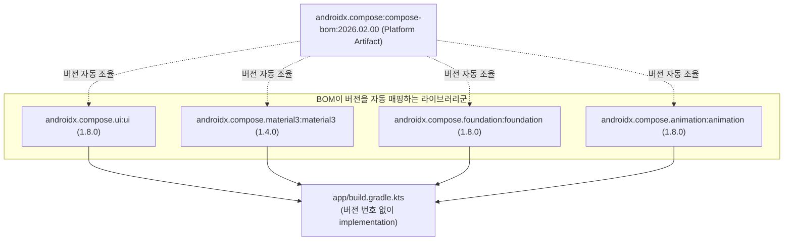

## Jetpack Compose BOM 기반 라이브러리 버전 관리 (Compose BOM Versioning)

### 개요

**Compose BOM(Bill of Materials - `androidx.compose:compose-bom`)** 은 Jetpack Compose 의 수많은 UI 라이브러리 모듈들(`ui`, `material3`, `foundation`, `animation` 등)이 상호 완벽하게 호환되는 버전 세트를 단일 기준으로 제공하는 플랫폼 메타 아티팩트이다.

과거에는 각 Compose 라이브러리마다 버전 번호를 따로 기재하다가 버전 불일치로 인한 런타임 크래시(`NoSuchMethodError`)가 빈번했다. BOM 을 `platform()` 으로 선언하면 개별 Compose 라이브러리의 버전 번호를 생략할 수 있어 버전 충돌을 원천 차단한다.



---

### 1. Compose BOM 도입의 핵심 이점

| 비교 항목 | 개별 라이브러리 버전 직접 명시 | Compose BOM 플랫폼 적용 |
|---|---|---|
| **버전 선언 방식** | `implementation("androidx.compose.ui:ui:1.7.0")`<br/>`implementation("androidx.compose.material3:1.3.0")` | `implementation(platform(libs.androidx.compose.bom))`<br/>`implementation(libs.androidx.compose.ui)` (버전 생략) |
| **버전 충돌 위험** | 모듈 간 버전 불일치로 인한 런타임 크래시 위험 높음 | Google 이 사전 검증한 호환성 세트 보장 |
| **업그레이드 비용** | 수십 개 Compose 라이브러리 버전을 일일이 검색 후 수정 | **BOM 버전 하나만 변경하면 전체 Compose 모듈 일괄 업그레이드** |

---

### 2. 코드 예시: libs.versions.toml 및 build.gradle.kts

```toml
# gradle/libs.versions.toml
[versions]
composeBom = "2026.02.00"

[libraries]
androidx-compose-bom = { group = "androidx.compose", name = "compose-bom", version.ref = "composeBom" }
androidx-compose-ui = { group = "androidx.compose.ui", name = "ui" } # 버전 명시 불필요!
androidx-compose-material3 = { group = "androidx.compose.material3", name = "material3" }
androidx-compose-ui-tooling-preview = { group = "androidx.compose.ui", name = "ui-tooling-preview" }
```

```kotlin
// app/build.gradle.kts
dependencies {
    // 1. Compose BOM 플랫폼 의존성 선언
    val composeBom = platform(libs.androidx.compose.bom)
    implementation(composeBom)
    androidTestImplementation(composeBom)

    // 2. 개별 Compose 라이브러리는 버전 없이 선언
    implementation(libs.androidx.compose.ui)
    implementation(libs.androidx.compose.material3)
    implementation(libs.androidx.compose.ui.tooling.preview)

    // 3. 특정 라이브러리만 다른 최신 버전을 써야 할 경우 직접 버전을 주입하여 오버라이드 가능
    // implementation("androidx.compose.material3:material3:1.4.0-alpha01")
}
```

---

### 3. 주의사항: Compose BOM 과 Compose Compiler 의 관계

- **BOM 은 런타임 UI 라이브러리만 관리한다**: BOM 은 `ui`, `material3` 등의 런타임 의존성 버전을 조율할 뿐, **Compose 컴파일러(`compose-compiler`)** 는 관리하지 않는다.
- Compose 컴파일러는 Kotlin 컴파일러와 1:1 로 결합되는 컴파일러 플러그인이므로 [Compose 컴파일러 플러그인 아키텍처](compose-compiler-plugin.md) 를 통해 관리해야 한다.

---

### 4. 관측 가능 증거 (Observable Evidence)

BOM 에 의해 실제 매핑된 Compose 라이브러리들의 버전 정보는 의존성 트리 덤프로 확인할 수 있다:

```bash
./gradlew app:dependencies --configuration releaseRuntimeClasspath | grep androidx.compose
```

---

### 상위 및 연관 문서

- [Gradle 빌드 시스템 및 의존성·플러그인 아키텍처](gradle-build.md)
- [Gradle Version Catalog (libs.versions.toml) 및 중앙 의존성 관리](gradle-version-catalog.md)
- [Jetpack Compose 컴파일러 플러그인 아키텍처](compose-compiler-plugin.md)
