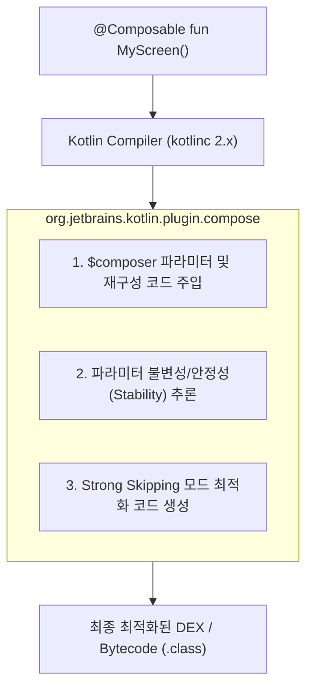

## Jetpack Compose 컴파일러 플러그인 아키텍처 (Compose Compiler Plugin)

### 개요

**Compose Compiler Plugin(`org.jetbrains.kotlin.plugin.compose`)** 은 `@Composable` 어노테이션이 붙은 함수를 가로채어 Recomposition(재구성) 상태 추적 코드, 안정성(Stability) 메타데이터, 그리고 $Composer$ 실행 컨텍스트 바이트코드를 합성하는 Kotlin 컴파일러 플러그인이다.

Compose UI 라이브러리들이 `compose-bom` 을 통해 버전이 조율되는 것과 달리, **Compose 컴파일러는 Kotlin 컴파일러 엔진(`kotlinc`)과 1:1 로 엄격하게 바인딩**된다. Kotlin 2.0+ 부터는 Compose 컴파일러가 Kotlin 저장소에 공식 통합되어 별도의 호환성 매트릭스 지옥 없이 Kotlin 버전과 함께 배포된다.



---

### 1. Kotlin 2.0+ 컴파일러 플러그인 통합의 진화

| 과거 (Kotlin 1.9 이하) | 현대 표준 (Kotlin 2.0 이상) |
|---|---|
| **배포 주체** | Google AndroidX (`androidx.compose.compiler:compiler`) | **JetBrains Kotlin 컴파일러 공식 통합 (`org.jetbrains.kotlin.plugin.compose`)** |
| **호환성 문제** | 새 Kotlin 버전이 나와도 Google 의 Compose Compiler 출시를 기다려야 했음 | **Kotlin 새 버전 출시와 동시에 Compose 컴파일러가 완벽 지원됨** |
| **Gradle 설정** | `android { composeOptions { kotlinCompilerExtensionVersion = "1.5.8" } }` | `plugins { alias(libs.plugins.kotlin.compose) }` (단 한 줄 적용) |

---

### 2. 코드 예시: build.gradle.kts 설정

```toml
# gradle/libs.versions.toml
[versions]
kotlin = "2.1.0"

[plugins]
kotlin-android = { id = "org.jetbrains.kotlin.android", version.ref = "kotlin" }
kotlin-compose = { id = "org.jetbrains.kotlin.plugin.compose", version.ref = "kotlin" }
```

```kotlin
// app/build.gradle.kts
plugins {
    alias(libs.plugins.android.application)
    alias(libs.plugins.kotlin.android)
    alias(libs.plugins.kotlin.compose) // Compose 컴파일러 플러그인 활성화
}

android {
    buildFeatures {
        compose = true // AGP Compose 활성화
    }
}

composeCompiler {
    // 안정성(Stability) 구성 파일 연동 (옵션)
    stabilityConfigurationFile = rootProject.layout.projectDirectory.file("compose-stability.conf")
    reportsDestination = layout.buildDirectory.dir("compose_compiler")
    metricsDestination = layout.buildDirectory.dir("compose_compiler")
}
```

---

### 3. 관측 가능 증거 (Observable Evidence)

Compose 컴파일러가 함수들을 어떻게 최적화(Skippable/Restartable)했는지와 파라미터 안정성 리포트는 다음 명령어로 관측할 수 있다:

```bash
# Compose 컴파일러의 Recomposition 최적화 메트릭 및 리포트 생성
./gradlew app:compileReleaseKotlin -Pandroidx.enableComposeCompilerMetrics=true -Pandroidx.enableComposeCompilerReports=true
```

생성된 리포트는 `app/build/compose_compiler/` 디렉터리에서 `app_release-classes.txt` 로 확인할 수 있다.

---

### 상위 및 연관 문서

- [Gradle 빌드 시스템 및 의존성·플러그인 아키텍처](gradle-build.md)
- [Jetpack Compose BOM 기반 라이브러리 버전 관리](compose-bom-versioning.md)
- [KSP(Kotlin Symbol Processing) 코드 생성 및 KAPT 대체 아키텍처](ksp-code-generation.md)
