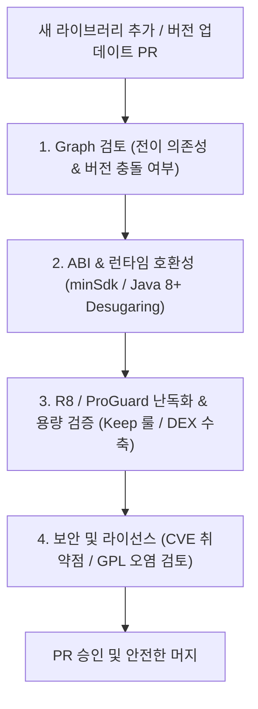

## 의존성 변경 및 서드파티 라이브러리 검토 체크리스트 (Dependency Change Checklist)

### 개요

Android 프로젝트에 새로운 서드파티 라이브러리를 추가하거나 기존 라이브러리의 버전을 업그레이드하는 작업은 단순한 문자열 변경이 아니라 **의존성 그래프, 바이너리 호환성(ABI), R8 난독화, APK 용량, 보안 취약점**에 광범위한 영향을 미친다.

프로덕션 장애를 사전에 차단하기 위해 PR(Pull Request) 리뷰 및 CI 단계에서 반드시 거쳐야 하는 체계적인 4 단계 검토 프로세스와 점검 항목을 규정한다.



---

### 1. 4단계 의존성 변경 점검 체크리스트

| 검토 영역 | 점검 항목 | 검증 방법 및 명령어 |
|---|---|---|
| **1. 의존성 그래프 (Graph)** | • 불필요한 무거운 전이적 의존성이 함께 유입되지 않는가?<br>• 기존 프로젝트의 다른 라이브러리와 버전 충돌이 발생하지 않는가? | `./gradlew app:dependencies --configuration runtimeClasspath` |
| **2. 바이너리 호환성 (ABI)** | • 라이브러리의 `minSdkVersion` 이 우리 앱의 `minSdk` 이하인가?<br>• Java 8+ 언어 기능 사용 시 Desugaring 설정이 필요한가? | `AndroidManifest.xml` 병합 결과 및 빌드 에러 확인 |
| **3. R8 난독화 & 크기** | • R8 Full Mode 에서 리플렉션 크래시가 발생하지 않는가?<br>• 라이브러리 자체 Consumer ProGuard 룰이 포함되어 있는가?<br>• 아티팩트(APK/AAB) 용량이 비정상적으로 증가하지 않았는가? | `apkanalyzer apk summary app-release.apk` |
| **4. 보안 및 라이선스** | • 알려진 CVE 보안 취약점이 없는 버전인가?<br>• 상용 배포가 금지된 라이선스(GPL v3 등)가 포함되어 있지 않은가? | OWASP Dependency-Check 또는 GitHub Dependabot |

---

### 2. CI 파이프라인 연동: 의존성 그래프 Diff 자동 추출

의존성 변경 PR 이 제출되었을 때 메인 브랜치와의 의존성 트리 차이를 자동으로 추출하여 PR 코멘트로 남기는 CI 스크립트 예시:

```bash
# 1. 현재 PR 브랜치의 의존성 트리 덤프
./gradlew app:dependencies --configuration runtimeClasspath > pr_dependencies.txt

# 2. 기준(main) 브랜치 의존성 트리 덤프
git checkout origin/main
./gradlew app:dependencies --configuration runtimeClasspath > main_dependencies.txt

# 3. Diff 추출 (새로 유입된 전이 라이브러리 확인)
diff -u main_dependencies.txt pr_dependencies.txt
```

---

### 3. 관측 가능 증거 (Observable Evidence)

의존성 변경 전후의 최종 릴리스 APK 용량 및 DEX 메서드 수 변화는 `apkanalyzer` 로 관측할 수 있다:

```bash
# 릴리스 아티팩트의 DEX 크기 및 다운로드 크기 요약 관측
apkanalyzer apk summary build/outputs/apk/release/app-release.apk
```

---

### 상위 및 연관 문서

- [Gradle 빌드 시스템 및 의존성·플러그인 아키텍처](gradle-build.md)
- [Gradle Version Catalog (libs.versions.toml) 및 중앙 의존성 관리](gradle-version-catalog.md)
- [Gradle 의존성 해소 그래프 및 버전 충돌 해결 전략](gradle-dependency-resolution.md)
- [Android CI/CD 파이프라인 단계 및 검증 게이트](../ci-cd/cicd-pipeline-stages.md)
