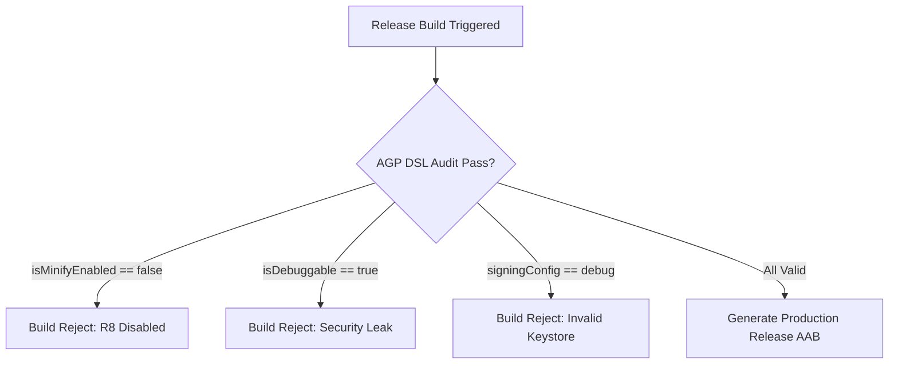

## AGP DSL 체크리스트는 릴리스 변형의 실제 값을 확인한다

### 내부 메커니즘 (Internal Mechanism)
상용 릴리스 빌드를 생성할 때 `build.gradle.kts`에 설정된 AGP DSL 플래그의 실효값(Effective Values)을 반드시 검증해야 한다.
디버그용 설정이 릴리스 빌드에 오염되는 것(Leak)을 방지하기 위해 다음 필수 체크리스트 항목을 검증한다:
1. `isMinifyEnabled = true`: R8 난독화 및 데드 코드 제거 활성화.
2. `isShrinkResources = true`: 미사용 XML/이미지 리소스 제거.
3. `isDebuggable = false`: 디버거 부착 방지 (`android:debuggable="false"` 매니페스트 확인).
4. `signingConfig`: 디버그 키스토어(`debug.keystore`)가 아닌 릴리스 서명 키 연결.
5. `proguardFiles`: default rules + custom `proguard-rules.pro` 주입 확인.



### 코드 예시 (build.gradle.kts)
```kotlin
// app/build.gradle.kts
android {
    buildTypes {
        getByName("release") {
            isMinifyEnabled = true
            isShrinkResources = true
            isDebuggable = false
            signingConfig = signingConfigs.getByName("release")
            proguardFiles(
                getDefaultProguardFile("proguard-android-optimize.txt"),
                "proguard-rules.pro"
            )
        }
    }
}
```

### 관측 가능 증거 (Observable Evidence)
빌드된 APK의 최종 Manifest 및 설정 플래그를 `apkanalyzer` 도구로 추출하여 검증할 수 있다:

```bash
# APK 매니페스트에서 debuggable 플래그 추출
apkanalyzer manifest print build/outputs/apk/release/app-release.apk | grep "android:debuggable"

# Output Example (반드시 아무것도 출력되지 않거나 false여야 함):
# android:debuggable="false"
```

관련 노트: [R8은 릴리즈 코드의 수축, 최적화, 난독화를 수행한다](../../../optimization/build-optimization-contracts/r8-shrinks-optimizes-and-obfuscates-release-builds.md), [Signing config는 로컬 서명과 Play 배포 정체성을 연결한다](signing-config-connects-local-signing-and-play-release-identity.md)
