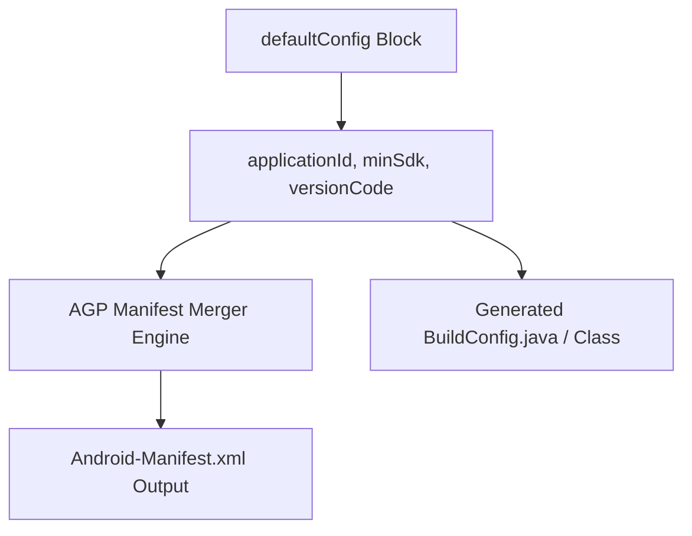

## Android 기본 설정은 식별자와 버전 계약을 만든다

### 내부 메커니즘 (Internal Mechanism)
AGP DSL의 `defaultConfig` 블록은 모든 Build Variant에 공통으로 적용되는 기본 속성 식별자를 정의한다.
- `applicationId`: Android OS 및 Google Play Store에서 앱을 식별하는 고유 패키지 네임스페이스.
- `minSdk`: 앱이 실행될 수 있는 최소 Android API 레벨 계약. (컴파일 타임에 `minSdk` 미만 API 호출 시 린트 에러 발생)
- `targetSdk`: OS의 호환성 동작(Behavior Changes)을 적용받을 하위 호환 기준점.
- `versionCode`: Play Store 업데이트 순서를 결정하는 양의 정수 (32-bit/64-bit int).
- `versionName`: 사용자에게 노출되는 세이지 버전 문자열 (Semantic Versioning: Major.Minor.Patch).



### 코드 예시 (build.gradle.kts)
```kotlin
// app/build.gradle.kts
android {
    namespace = "com.example.app"
    
    defaultConfig {
        applicationId = "com.example.app"
        minSdk = 24
        targetSdk = 34
        versionCode = 10020
        versionName = "1.2.0"
        
        testInstrumentationRunner = "androidx.test.runner.AndroidJUnitRunner"
        vectorDrawables {
            useSupportLibrary = true
        }
    }
}
```

### 관측 가능 증거 (Observable Evidence)
AGP가 매니페스트 병합(Process Manifest) 태스크 수행 후 생성한 최종 매니페스트 XML에서 `defaultConfig` 속성들이 주입된 결과를 확인할 수 있다:

```bash
cat app/build/intermediates/merged_manifests/release/AndroidManifest.xml | grep -E "package|versionCode|versionName"

# Output Example:
# package="com.example.app" android:versionCode="10020" android:versionName="1.2.0"
```

관련 노트: [앱 업데이트는 applicationId, versionCode, 서명 호환성으로 결정된다](../../../distribution/release-distribution-contracts/app-updates-require-application-id-version-code-and-signature-compatibility.md), [Gradle 프로젝트와 모듈 DSL은 서로 다른 책임을 가진다](gradle-project-and-module-dsl-have-different-responsibilities.md), [Gradle 빌드 계약](gradle-build-contracts.md)
