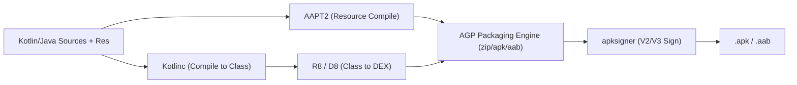

## Android Gradle Plugin은 Android 빌드 규칙을 Gradle에 추가한다

상위 문서: [Gradle 빌드 계약](gradle-build-contracts.md)

### 내부 메커니즘 (Internal Mechanism)
**AGP**(Android Gradle Plugin, `com.android.application` 또는 `com.android.library`)는 범용 빌드 도구인 Gradle에 Android 플랫폼 특화 빌드 태스크 파이프라인을 확장 주입하는 도메인 플러그인이다.
AGP는 Java/Kotlin 컴파일러 태스크 외에도 `aapt2` (**AAPT2**: Android Asset Packaging Tool 2 - 리소스 컴파일 및 패키징 엔진), `R8/D8` (**R8**: 자바 바이트코드를 DEX 코드로 변환 및 축소/난독화하는 최적화 컴파일러), `Manifest Merger`(라이브러리 매니페스트 통합), 그리고 `apksigner/zipalign`(산출물 패키징 및 서명) 태스크를 Gradle **DAG**(Directed Acyclic Graph - 비순환 방향 태스크 의존성 그래프)에 연결한다.



### 코드 예시 (build.gradle.kts & Custom Task Rule Access)
```kotlin
// build.gradle.kts (AGP AndroidComponents Extension)
plugins {
    id("com.android.application")
}

androidComponents {
    onVariants(selector().all()) { variant ->
        println("Registered AGP Variant Pipeline: ${variant.name}")
    }
}
```

### 관측 가능 증거 (Observable Evidence)
AGP가 Gradle 태스크 그래프에 등록한 Android 전용 태스크들을 터미널 명령으로 관측할 수 있다:

```bash
./gradlew app:tasks --group="android"

# Output Example:
# Android tasks
# -------------
# assembleRelease - Build all Release builds.
# bundleRelease - Builds all Release bundles.
# processReleaseResources - Processes resources with AAPT2.
# transformClassesWithAsmForRelease - AGP ASM Bytecode Transformation.
```

관련 노트: [AGP DSL 체크리스트는 릴리스 변형의 실제 값을 확인한다](agp-dsl-checklist-verifies-effective-release-variant-values.md), [Gradle 빌드 계약](gradle-build-contracts.md)
