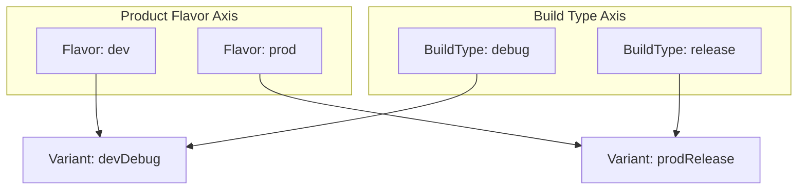

## Build type, product flavor, build variant는 서로 다른 축이다

### 내부 메커니즘 (Internal Mechanism)
AGP 빌드 아키텍처는 직교하는 두 개의 축(Orthogonal Axes)을 결합하여 최종 빌드 산출물(Build Variant)을 결정한다:
1. **Build Type (어떻게 빌드할 것인가)**: `debug`, `release` 등 컴파일 및 최적화 설정 (`isMinifyEnabled`, `isDebuggable`, 서명 설정).
2. **Product Flavor (무엇을 빌드할 것인가)**: `dev`, `staging`, `prod` 등 제품의 기능적 변종 (`applicationIdSuffix`, API 엔드포인트 BASE_URL, 고유 리소스).
3. **Build Variant (최종 산출물 조합)**: `Build Variant = Product Flavor x Build Type`. (예: `devDebug`, `prodRelease`).



### 코드 예시 (build.gradle.kts)
```kotlin
// app/build.gradle.kts
android {
    flavorDimensions += "environment"

    productFlavors {
        create("dev") {
            dimension = "environment"
            applicationIdSuffix = ".dev"
            buildConfigField("String", "BASE_URL", ""https://dev.api.example.com"")
        }
        create("prod") {
            dimension = "environment"
            buildConfigField("String", "BASE_URL", ""https://api.example.com"")
        }
    }

    buildTypes {
        getByName("debug") {
            applicationIdSuffix = ".debug"
        }
        getByName("release") {
            isMinifyEnabled = true
        }
    }
}
```

### 관측 가능 증거 (Observable Evidence)
AGP가 생성한 Build Variant 조합 태스크 목록을 관측할 수 있다:

```bash
./gradlew app:tasks --group="build" | grep "assemble"

# Output Example:
# assembleDevDebug - Assembles build for flavor dev, type debug
# assembleDevRelease - Assembles build for flavor dev, type release
# assembleProdDebug - Assembles build for flavor prod, type debug
# assembleProdRelease - Assembles build for flavor prod, type release
```

관련 노트: [Source set 우선순위는 variant별 코드와 리소스 충돌을 결정한다](source-set-priority-decides-variant-code-and-resource-conflicts.md), [Gradle 빌드 계약](gradle-build-contracts.md)
