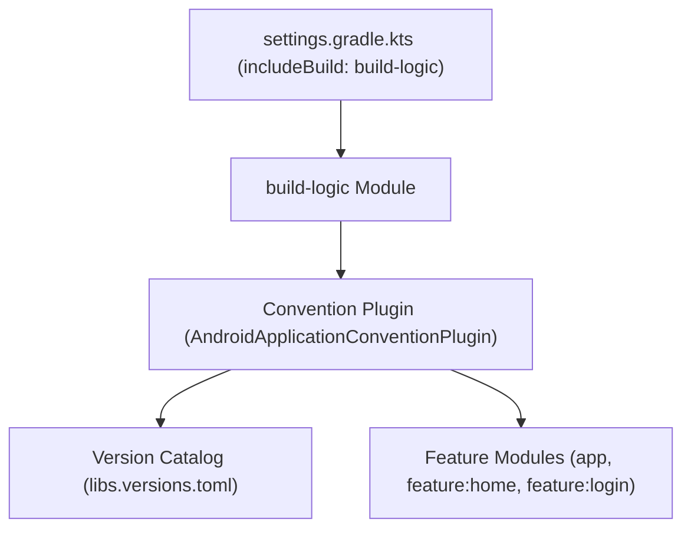

## Convention plugin은 build-logic 모듈에서 공통 Gradle 설정을 한 곳에서 관리한다

상위 문서: [Gradle 빌드 계약](gradle-build-contracts.md)

### 개념 및 필요성 (What & Why)
대규모 안드로이드 멀티 모듈 프로젝트에서 모듈별 `build.gradle.kts` 파일에 공통 AGP 설정, Kotlin 컴파일러 옵션, 의존성 설정을 반복 복사-붙여넣기하는 것은 심각한 코드 중복과 유지보수 부채를 야기한다.
과거에 사용되던 `subprojects {}`나 `allprojects {}` 방식은 모듈 간 결합도를 높이고 Gradle 캐싱 및 증분 빌드를 저해한다.
**Convention Plugin(컨벤션 플러그인)** 은 `build-logic` 복합 빌드(Composite Build) 모듈 내에 프로젝트 고유의 재사용 가능한 Gradle 플러그인(`com.example.appName.android.application`, `com.example.appName.android.feature` 등)을 타입 세이프한 Kotlin DSL로 작성하여 중앙집중 관리하는 현대적 빌드 아키텍처 패턴이다.

### 내부 메커니즘 (Internal Mechanism)
1. **Composite Build (`includeBuild`)**: `settings.gradle.kts`에서 `includeBuild("build-logic")`을 통해 빌드 로직 전용 모듈을 메인 빌드의 인클루드 빌드로 선언한다.
2. **Version Catalog 매핑**: `build-logic` 내의 컨벤션 플러그인은 `libs.versions.toml`의 의존성 및 플러그인 접근자(`libs.findLibrary(...)`, `libs.findPlugin(...)`)를 통해 타깃 의존성을 세이프하게 적용한다.
3. **타입 세이프 Extension 접근**: `Project.configureAndroid()`와 같은 확장 함수를 통해 `com.android.build.api.dsl.ApplicationExtension` 또는 `LibraryExtension`을 모듈 타입에 맞춰 안전하게 설정한다.



### 코드 예시 (build-logic / Convention Plugin)
```kotlin
// build-logic/convention/src/main/kotlin/AndroidApplicationConventionPlugin.kt
import com.android.build.api.dsl.ApplicationExtension
import org.gradle.api.Plugin
import org.gradle.api.Project
import org.gradle.kotlin.dsl.configure

class AndroidApplicationConventionPlugin : Plugin<Project> {
    override def apply(target: Project) {
        with(target) {
            with(pluginManager) {
                apply("com.android.application")
                apply("org.jetbrains.kotlin.android")
            }

            extensions.configure<ApplicationExtension> {
                compileSdk = 34
                defaultConfig {
                    minSdk = 26
                    targetSdk = 34
                }
            }
        }
    }
}
```

### 관측 가능 증거 (Observable Evidence)
`build-logic` 플러그인이 모듈에 정상적으로 등록 및 적용되었는지 확인하기 위해 린트 태스크나 프로젝트 구성을 검증할 수 있다:
```bash
./gradlew help --task :app:assembleDebug
```

관련 노트: [Version catalog는 의존성과 플러그인 좌표를 명명한다](../../dependency-versioning/dependency-ci-contracts/version-catalog-names-dependency-and-plugin-coordinates.md), [Gradle 빌드 계약](gradle-build-contracts.md)
