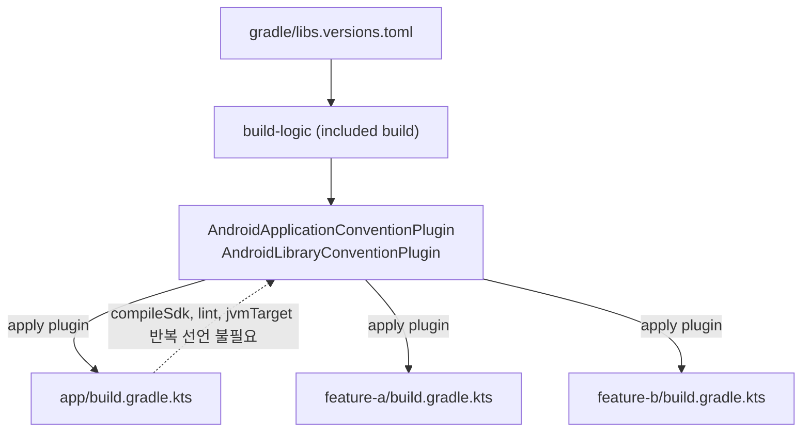

## Convention plugin은 build-logic 모듈에서 공통 Gradle 설정을 한 곳에서 관리한다

상위 문서: [Gradle 빌드 계약](gradle-build-contracts.md)

### 내부 메커니즘 (Internal Mechanism)

멀티 모듈 Android 프로젝트에서 모듈이 늘어날수록 각 모듈의 `build.gradle.kts` 에 `compileSdk`, `minSdk`, Kotlin `jvmTarget`, lint 규칙, `buildFeatures` 같은 설정이 거의 동일하게 반복된다. 이 반복을 그대로 두면 한 모듈에서만 `compileSdk` 를 올리고 다른 모듈은 잊는 식의 설정 drift가 생기고, 신규 모듈을 만들 때마다 기존 모듈의 설정을 복사-붙여넣기하게 된다.

**Convention plugin** 은 이 반복되는 설정을 하나의 Gradle plugin으로 추출해, 각 모듈은 그 plugin을 `apply` 만 하면 공통 설정을 물려받도록 만드는 패턴이다. 이 plugin들은 `buildSrc` 또는 (권장되는) 별도 **`build-logic`** 포함 빌드(included build)에 위치한다. `buildSrc` 는 프로젝트 루트에 있는 특수 디렉터리로 Gradle이 항상 먼저 빌드하지만, 프로젝트 전체가 `buildSrc` 변경 시 캐시 무효화되는 단점이 있다. `build-logic` 을 `settings.gradle.kts` 의 `includeBuild()` 로 별도 포함 빌드로 분리하면 이 무효화 범위를 줄이면서 동일한 효과를 낸다.

Convention plugin은 **version catalog(`libs.versions.toml`)** 와 함께 동작한다. `build-logic` 모듈도 하나의 Gradle 프로젝트이므로 루트 프로젝트와 동일한 version catalog를 참조할 수 있도록 `settings.gradle.kts` 에서 `dependencyResolutionManagement` 로 catalog를 공유해야 한다. 이렇게 하면 convention plugin 내부에서도 `libs.versions.agp.get()` 처럼 카탈로그의 버전 문자열을 그대로 참조할 수 있어, AGP/Kotlin 버전이 catalog와 plugin 두 곳에서 따로 관리되는 이중 관리를 피한다.



### 코드 예시 (build-logic convention plugin과 모듈 적용)

```kotlin
// build-logic/convention/build.gradle.kts
plugins {
    `kotlin-dsl`
}

dependencies {
    compileOnly(libs.android.gradlePlugin)
    compileOnly(libs.kotlin.gradlePlugin)
}

gradlePlugin {
    plugins {
        register("androidLibrary") {
            id = "myapp.android.library"
            implementationClass = "AndroidLibraryConventionPlugin"
        }
    }
}
```

```kotlin
// build-logic/convention/src/main/kotlin/AndroidLibraryConventionPlugin.kt
class AndroidLibraryConventionPlugin : Plugin<Project> {
    override fun apply(target: Project) {
        with(target) {
            pluginManager.apply("com.android.library")
            pluginManager.apply("org.jetbrains.kotlin.android")

            extensions.configure<LibraryExtension> {
                compileSdk = 35
                defaultConfig.minSdk = 24
                compileOptions {
                    sourceCompatibility = JavaVersion.VERSION_17
                    targetCompatibility = JavaVersion.VERSION_17
                }
                lint {
                    warningsAsErrors = true
                    abortOnError = true
                }
            }
        }
    }
}
```

```kotlin
// feature-a/build.gradle.kts — 반복 설정 없이 convention plugin만 적용
plugins {
    id("myapp.android.library")
}

dependencies {
    implementation(libs.bundles.network)
}
```

```kotlin
// settings.gradle.kts — build-logic을 included build로 등록하고 catalog를 공유
pluginManagement {
    includeBuild("build-logic")
}

dependencyResolutionManagement {
    versionCatalogs {
        create("libs") {
            from(files("gradle/libs.versions.toml"))
        }
    }
}
```

### 관측 가능 증거 (Observable Evidence)

```bash
# convention plugin이 실제로 적용됐는지 모듈 task 목록에서 확인
./gradlew :feature-a:tasks --group="android"

# 특정 모듈에서만 lint 규칙이 다르게 나온다면
# convention plugin 미적용 또는 개별 build.gradle.kts의 override를 의심한다
./gradlew :feature-a:lintDebug
```

### 경계

- Version catalog가 의존성/플러그인 좌표 이름표 역할을 하는 메커니즘 자체는 이 노트가 아니라 [Version Catalog는 의존성 좌표와 플러그인 좌표의 이름표다](../../dependency-versioning/dependency-ci-contracts/version-catalog-names-dependency-and-plugin-coordinates.md) 가 다룬다. 이 노트는 그 catalog를 convention plugin이 **어떻게 소비하는지**만 다룬다.
- `defaultConfig`, build type/flavor 조합 자체의 의미는 [Android 기본 설정은 식별자와 버전 계약을 만든다](android-default-config-defines-identity-and-version-contracts.md), [Build type, product flavor, build variant는 서로 다른 축이다](build-type-product-flavor-and-build-variant-are-different-axes.md) 가 다룬다. convention plugin은 그 설정을 어디서 선언하느냐(중앙 집중 vs 모듈별 반복)의 문제이지 설정 항목 자체의 의미를 바꾸지 않는다.

관련 노트: [Gradle 빌드 계약](gradle-build-contracts.md)
