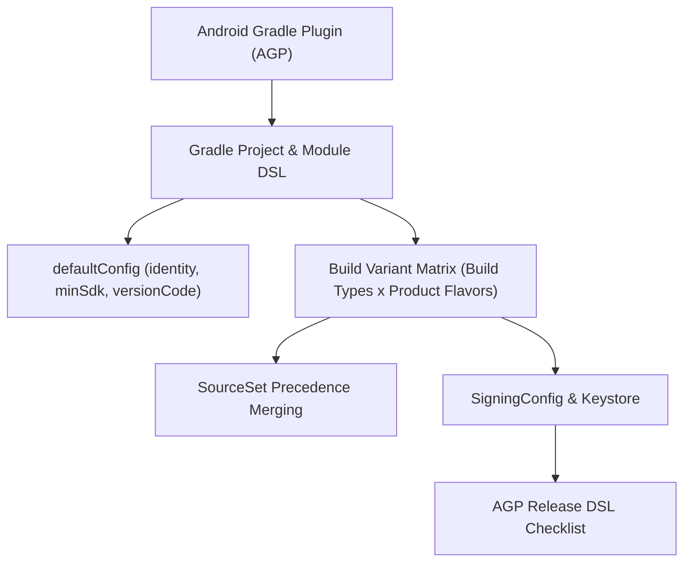

## Gradle 빌드 계약

상위 문서: [Android 패키징과 배포 지도](../../../android-packaging-deployment.md)

이 지도는 **AGP**(Android Gradle Plugin - Gradle 상의 Android 전용 빌드 규칙 엔진)의 역할, `defaultConfig`(기본 식별자 계약), Build Type(빌드 환경 축) 및 Product Flavor(제품 변종 축) 조합에 의한 **Build Variant**(최종 산출물 조합) 매트릭스, Project/Module DSL 분리, SourceSet 우선순위, Signing Configuration, 그리고 Release AGP DSL 검증을 다룬다.



### 정본 노트
- [Android Gradle Plugin은 Android 빌드 규칙을 Gradle에 추가한다](android-gradle-plugin-adds-android-build-rules-to-gradle.md)
- [Gradle 프로젝트와 모듈 DSL은 서로 다른 책임을 가진다](gradle-project-and-module-dsl-have-different-responsibilities.md)
- [Android 기본 설정은 식별자와 버전 계약을 만든다](android-default-config-defines-identity-and-version-contracts.md)
- [Build type, product flavor, build variant는 서로 다른 축이다](build-type-product-flavor-and-build-variant-are-different-axes.md)
- [Source set 우선순위는 variant별 코드와 리소스 충돌을 결정한다](source-set-priority-decides-variant-code-and-resource-conflicts.md)
- [Signing config는 로컬 서명과 Play 배포 정체성을 연결한다](signing-config-connects-local-signing-and-play-release-identity.md)
- [AGP DSL 체크리스트는 릴리스 변형의 실제 값을 확인한다](agp-dsl-checklist-verifies-effective-release-variant-values.md)
- [Convention plugin은 build-logic 모듈에서 공통 Gradle 설정을 한 곳에서 관리한다](convention-plugins-centralize-shared-gradle-configuration-in-build-logic.md)

관련 지도: [의존성, 버전, CI 계약](../../dependency-versioning/dependency-ci-contracts/dependency-ci-contracts.md), [Play 릴리스와 배포 계약](../../../distribution/release-distribution-contracts/release-distribution-contracts.md), [Android CI/CD 구현 계약](../../ci-cd-contracts/ci-cd-contracts.md)

### 관측 가능 증거 (Observable Evidence)
```bash
# 전체 Gradle 프로젝트 태스크 및 모듈 구조 확인
./gradlew projects
./gradlew app:tasks --group="build"
```
