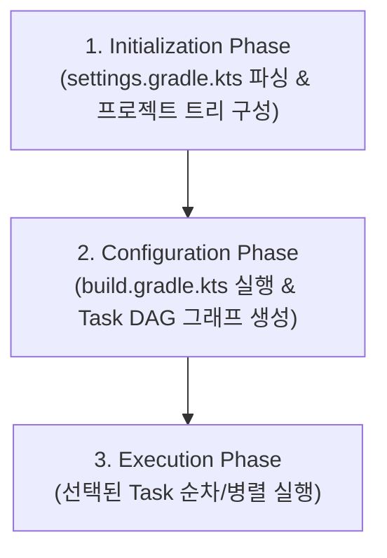

## Gradle 코어 엔진 및 아키텍처

### 개요 및 빌드 엔진 본질

**Gradle**은 범용 멀티프로젝트 빌드 자동화 엔진으로, **직향 비순환 그래프(DAG: Directed Acyclic Graph)** 를 기반으로 태스크(Task) 간의 의존관계를 파악하고 최적의 순서로 컴파일, 리소스 가공, 패키징 작업을 수행한다.

Android 환경에서 사용하는 **AGP(Android Gradle Plugin)** 는 독립적인 Gradle 코어 엔진 위에서 동작하는 도메인 전용 플러그인(Plugin)이며, 기본 빌드 오케스트레이션 및 캐싱/증분 빌드 메커니즘은 Gradle 엔진의 아키텍처를 따른다.

---

### Gradle 3 단계 실행 생명주기 (Execution Lifecycle)

Gradle 은 빌드를 실행할 때 반드시 다음 3 가지 단계를 순차적으로 거친다.



1. **초기화 단계 (Initialization Phase)**:
   - `settings.gradle.kts` 파일(및 `include(…)`)을 파싱하여 빌드에 참여할 멀티모듈 프로젝트 구조와 root/sub 프로젝트 트리를 생성한다.
2. **구성 단계 (Configuration Phase)**:
   - 각 프로젝트의 `build.gradle.kts` 스크립트를 실행(Configure)하고, 모든 Task 객체를 인스턴스화하여 Task 간 의존성 관계(`dependsOn`, `finalizedBy`)를 파악한 뒤 **Task DAG (방향성 비순환 그래프)**를 빌드한다.
   - **주의**: Configuration 단계에서는 실제 파일 컴파일이나 입출력 태스크가 실행되지 않으며, 태스크 실행 순서와 그래프만 완성된다.
3. **실행 단계 (Execution Phase)**:
   - 사용자가 CLI 에서 요청한 특정 태스크(예: `./gradlew app:assembleRelease`)와 해당 태스크가 의존하는 DAG 상의 선행 태스크들만 추출하여 `@TaskAction` 코드를 순차적/병렬적으로 실행한다.

---

### Task 아키텍처 및 Task API

Gradle 의 최소 작업 단위는 **Task**이다. 성능 최적화를 위해 Gradle 은 Task 등록 시 **지연 초기화(Lazy Task Initialization)**와 **상태 어노테이션 계약**을 강제한다.

#### Task 등록 API: `tasks.register` vs `tasks.create`

- **`tasks.register` (권장 - Lazy Task Creation)**:
  - Task 의 Configuration 람다 실행을 실제로 해당 Task 가 실행 대상에 포함될 때까지 미룬다 (Configuration Phase 오버헤드 감소).
- **`tasks.create` (지양 - Immediate Task Creation)**:
  - 사용자가 요청하지 않은 Task 라도 Configuration Phase 에서 즉시 인스턴스화하여 빌드 속도를 저하시킨다.

#### Custom Task 작성 및 상태 어노테이션 모델

Gradle 은 입력(Input) 파일/값과 출력(Output) 파일/디렉토리를 어노테이션으로 명시하여 **증분 빌드(Incremental Build)**와 **캐시 히트 여부**를 판별한다.

```kotlin
import org.gradle.api.DefaultTask
import org.gradle.api.file.RegularFileProperty
import org.gradle.api.provider.Property
import org.gradle.api.tasks.*

abstract class GenerateBuildInfoTask : DefaultTask() {

    @get:Input
    abstract val appVersion: Property<String>

    @get:OutputFile
    abstract val outputFile: RegularFileProperty

    @TaskAction
    fun generate() {
        val file = outputFile.get().asFile
        file.writeText("version=${appVersion.get()}\nbuildTime=${System.currentTimeMillis()}")
    }
}
```

---

### 캐시 및 빌드 최적화 메커니즘

Gradle 은 반복 빌드 시간을 최소화하기 위해 3 가지 레벨의 최적화를 제공한다.

1. **증분 빌드 (Incremental Task Execution - `UP-TO-DATE`)**:
   - 이전 실행 시점의 `@Input`과 `@Output` 파일 해시값을 비교하여, 변경이 없으면 태스크 실행을 스킵하고 `UP-TO-DATE` 상태로 처리한다.
2. **Configuration Cache**:
   - Configuration Phase 의 결과물인 Task DAG 그래프를 디스크에 직렬화 캡처한다.
   - 코드 변경이 없는 반복 빌드 시 Configuration Phase 전체를 건너뛰고 실행 단계로 직행한다.
3. **Build Cache (Local / Remote)**:
   - 동일한 Input 해시를 가진 태스크 결과를 로컬 디렉토리나 원격 HTTP/S3 캐시 서버에 저장한다.
   - 다른 브랜치로 이동하거나 CI 환경에서 동일 코드를 컴파일할 때 태스크를 재실행하지 않고 캐시 결과를 가져온다(`FROM-CACHE`).

---

### AGP(Android Gradle Plugin)와의 관계

- **AGP 확장 계층**: AGP 는 Android 앱/라이브러리 빌드를 위해 `com.android.application`, `com.android.library` 플러그인을 제공한다.
- **Variant & Artifact API**:
  - AGP 8.+ 부터는 `androidComponents { onVariants { … } }` 를 통해 빌드 변체(Build Variant)별 구성을 프로그래밍 방식으로 조작할 수 있다.
  - Gradle 의 `Artifacts` API 와 연결되어 APK/AAB 생성물을 다른 Custom Task 의 `@InputFile` 로 안전하게 연결한다.

---

### 상위 및 연관 문서

- [Android 패키징과 배포 지도](../../android-packaging-deployment.md)
- [Android CI/CD](../../ci-cd/ci-cd.md)
- [Fastlane Android 코어 및 Actions](../../ci-cd/fastlane-android-core-and-actions.md)
- [Gradle 과 Fastlane CI/CD 파이프라인](../../ci-cd/gradle-fastlane-ci-cd-pipeline.md)
