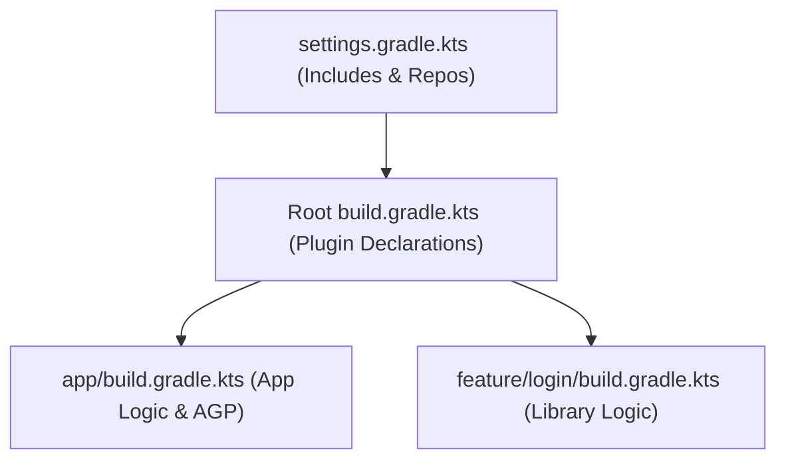

## Gradle 프로젝트와 모듈 DSL은 서로 다른 책임을 가진다

### 내부 메커니즘 (Internal Mechanism)
Gradle 멀티모듈 아키텍처는 영역별로 엄격하게 분리된 설정 파일 스코프를 유지한다:
1. **`settings.gradle.kts` (Initialization Phase)**: 전체 프로젝트의 구조(`include(":app", ":feature:login")`), 저장소 레포지토리 관리(`dependencyResolutionManagement`), 및 빌드 스코프 플러그인(`pluginManagement`)을 정의한다.
2. **Root `build.gradle.kts` (Root Project Scope)**: 전체 모듈에 공통 적용되는 플러그인 버전 선언(`apply false`) 및 루트 단독 태스크(clean, detektAll)만 담당한다. 모듈 간 강결합을 유발하는 `allprojects {}` / `subprojects {}` 사용은 금지된다.
3. **Module `build.gradle.kts` (Module Scope)**: 특정 모듈 고유의 플러그인 적용, 의존성 선언(`dependencies {}`), 및 Android 도메인 컴파일 설정(`android {}`)을 전담한다.



### 코드 예시 (settings.gradle.kts & build.gradle.kts)
```kotlin
// settings.gradle.kts
pluginManagement {
    repositories {
        google()
        mavenCentral()
    }
}
dependencyResolutionManagement {
    repositoriesMode.set(RepositoriesMode.FAIL_ON_PROJECT_REPOS)
    repositories {
        google()
        mavenCentral()
    }
}
rootProject.name = "MyAwesomeApp"
include(":app")
include(":core:designsystem")

// Root build.gradle.kts
plugins {
    alias(libs.plugins.android.application) apply false
    alias(libs.plugins.kotlin.android) apply false
}
```

### 관측 가능 증거 (Observable Evidence)
Gradle 초기화 및 프로젝트 수집 결과를 다음 CLI 명령으로 관측할 수 있다:

```bash
./gradlew projects

# Output Example:
# Root project 'MyAwesomeApp'
# +--- Project ':app'
# \--- Project ':core:designsystem'
```

관련 노트: [Version Catalog는 의존성 좌표와 플러그인 좌표의 이름표다](../../dependency-versioning/dependency-ci-contracts/version-catalog-names-dependency-and-plugin-coordinates.md), [Gradle 빌드 계약](gradle-build-contracts.md)
