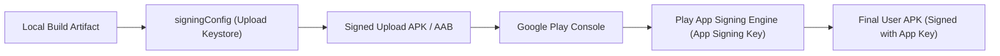

## Signing config는 로컬 서명과 Play 배포 정체성을 연결한다

상위 문서: [Gradle 빌드 계약](gradle-build-contracts.md)

### 개념 및 필요성 (What & Why)
Android OS는 모든 APK/AAB 아티팩트에 디지털 암호화 서명이 존재할 것을 필수 요건으로 요구한다.
`signingConfigs` DSL 블록은 빌드 타임에 로컬 키스토어(Keystore - `.jks` 또는 `.keystore` 파일) 및 키 비밀번호 자격증명을 지정하여 아티팩트에 **전자서명(APK Signature Scheme V2/V3/V4)** 을 부여하는 설정이다.
Play 배포 시 **Play App Signing** 과 연결되면, 개발자는 업로드 키(Upload Key)로 빌드 아티팩트를 서명하여 Google Play에 업로드하고, Google Play는 해당 서명을 검증한 후 안전하게 보관된 실제 앱 서명 키(App Signing Key)로 재서명하여 사용자에게 배포한다.

### 내부 메커니즘 (Internal Mechanism)
1. **Keystore Credentials Injection**: 보안 강화를 위해 `storeFile`, `storePassword`, `keyAlias`, `keyPassword` 값은 절대 코드에 하드코딩하지 않고 환경변수(`System.getenv()`) 또는 비밀 정보 파일(`local.properties`)에서 주입한다.
2. **apksigner 연동**: AGP 패키징 단계에서 `apksigner` 도구가 호출되어 JAR 서명(V1), APK Block 서명(V2), 키 순환 지원 서명(V3), 덤프 기반 서명(V4)을 아티팩트에 적용한다.
3. **Debug vs Release Keystore**: Debug 빌드는 AGP가 기본 생성하는 `~/.android/debug.keystore`를 자동 사용하는 반면, Release 빌드는 반드시 엄격하게 관리되는 릴리스 키스토어와 결합되어야 한다.



### 코드 예시 (build.gradle.kts)
```kotlin
// app/build.gradle.kts
android {
    signingConfigs {
        create("release") {
            storeFile = file(System.getenv("KEYSTORE_PATH") ?: "release.keystore")
            storePassword = System.getenv("KEYSTORE_PASSWORD") ?: ""
            keyAlias = System.getenv("KEY_ALIAS") ?: ""
            keyPassword = System.getenv("KEY_PASSWORD") ?: ""
            enableV2Signing = true
            enableV3Signing = true
        }
    }

    buildTypes {
        getByName("release") {
            signingConfig = signingConfigs.getByName("release")
        }
    }
}
```

### 관측 가능 증거 (Observable Evidence)
적용된 서명 설정 및 키 SHA-256 핑거프린트를 Gradle 태스크로 관측할 수 있다:
```bash
./gradlew app:signingReport
```

관련 노트: [Play app signing은 업로드 키와 앱 서명 키를 분리한다](../../distribution/release-distribution-contracts/play-app-signing-separates-upload-key-and-app-signing-key.md), [Gradle 빌드 계약](gradle-build-contracts.md)
