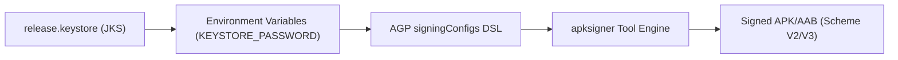

## Signing config는 로컬 서명과 Play 배포 정체성을 연결한다

상위 문서: [Gradle 빌드 계약](gradle-build-contracts.md)

### 내부 메커니즘 (Internal Mechanism)
Android 앱 서명 설정(**`signingConfigs`**: 빌드 산출물에 인증서 정체성을 부여하는 AGP DSL 블록)은 로컬 컴파일 산출물의 디지털 인증서 정체성을 부여한다.
- **Local Upload Key**: 로컬 CI/개발자 기기에서 생성된 서명 키. Play Store에 업로드하는 AAB를 인증하기 위해 서명된다.
- **APK Signature Scheme v2/v3/v4**: 바이너리 패키지 탬퍼링(변조) 방지 메커니즘. v2는 전체 APK ZIP 구조의 블록 서명을 수행하며, v3는 서명 키 교체(Key Rotation & Lineage Proof)를 지원한다.
- **보안 격리 메커니즘**: Keystore 비밀번호와 alias 정보는 코드베이스에 하드코딩되지 않고 CI 환경 변수(`System.getenv()`) 또는 암호화된 `local.properties`에서 동적 주입된다.



### 코드 예시 (build.gradle.kts)
```kotlin
// app/build.gradle.kts
android {
    signingConfigs {
        create("release") {
            storeFile = file(System.getenv("KEYSTORE_PATH") ?: "release.keystore")
            storePassword = System.getenv("KEYSTORE_PASSWORD")
            keyAlias = System.getenv("KEY_ALIAS")
            keyPassword = System.getenv("KEY_PASSWORD")
            enableV2Signing = true
            enableV3Signing = true
        }
    }

    buildTypes {
        getByName("release") {
            signingConfig = signingConfigs.getByName("release")
        }
    }
}
```

### 관측 가능 증거 (Observable Evidence)
빌드된 APK 파일의 서명 인증서 정보와 APK Signature Scheme v2/v3 지원 여부를 `apksigner` 도구로 검증할 수 있다:

```bash
apksigner verify --verbose --print-certs build/outputs/apk/release/app-release.apk

# Output Example:
# Verified using v1 scheme (JAR signing): true
# Verified using v2 scheme (APK Signature Scheme v2): true
# Verified using v3 scheme (APK Signature Scheme v3): true
# Signer #1 certificate SHA-256 digest: a1b2c3d4e5f6...
```

관련 노트: [Play App Signing은 업로드 키와 앱 서명 키를 분리한다](../../../distribution/release-distribution-contracts/play-app-signing-separates-upload-key-and-app-signing-key.md), [AGP DSL 체크리스트는 릴리스 변형의 실제 값을 확인한다](agp-dsl-checklist-verifies-effective-release-variant-values.md)
