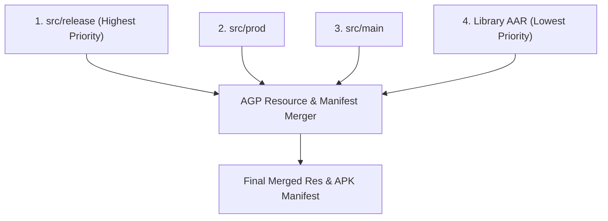

## Source set 우선순위는 variant 별 코드와 리소스 충돌을 결정한다

### 내부 메커니즘 (Internal Mechanism)

AGP 빌드 프로세스는 동일한 이름의 파일이나 리소스가 여러 소스셋에 존재하는 경우, 엄격한 소스셋 우선순위 병합 규칙(SourceSet Precedence Merging)을 통해 단일 최종 리소스를 결정한다.

우선순위 계층구조 (높은 우선순위 -> 낮은 우선순위):

1. **Build Type SourceSet** (`src/release`, `src/debug`)
2. **Product Flavor SourceSet** (`src/prod`, `src/dev`)
3. **Main SourceSet** (`src/main`)
4. **Library Dependencies** (AAR 라이브러리 리소스)

- **코드 파일 (.kt / .java)**: 동일한 클래스 네임스페이스가 2 개 이상 소스셋에 중복 정의되면 컴파일 타임 `Duplicate Class Error` 가 발생하므로 분리 관리해야 한다.
- **리소스 파일 (.xml / .png)**: 우선순위가 높은 소스셋의 리소스가 우선순위가 낮은 리소스를 완전히 덮어쓴다(Override).



### 코드 예시 (Directory Layout & build.gradle.kts)
```
app/src/
├── main/res/values/strings.xml        <-- app_name = "My App"
├── dev/res/values/strings.xml         <-- app_name = "My App (Dev)"
└── release/res/values/strings.xml     <-- app_name = "My App"
```

```kotlin
// app/build.gradle.kts (Custom SourceSet Location mapping)
android {
    sourceSets {
        getByName("main") {
            java.srcDirs("src/main/kotlin")
            res.srcDirs("src/main/res-core", "src/main/res-ui")
        }
    }
}
```

### 관측 가능 증거 (Observable Evidence)

AGP 의 리소스 병합 과정을 리소스 리포트 파일로 분석할 수 있다:

```bash
./gradlew app:mergeReleaseResources --debug

# Generated Report File: app/build/intermediates/incremental/mergeReleaseResources/merger.xml
# Log Output Example:
# Merged item: string/app_name
#   Override: src/release/res/values/strings.xml -> replaced src/main/res/values/strings.xml
```

관련 노트: [Build type, product flavor, build variant는 서로 다른 축이다](build-type-product-flavor-and-build-variant-are-different-axes.md), [Gradle 빌드 계약](gradle-build-contracts.md)
