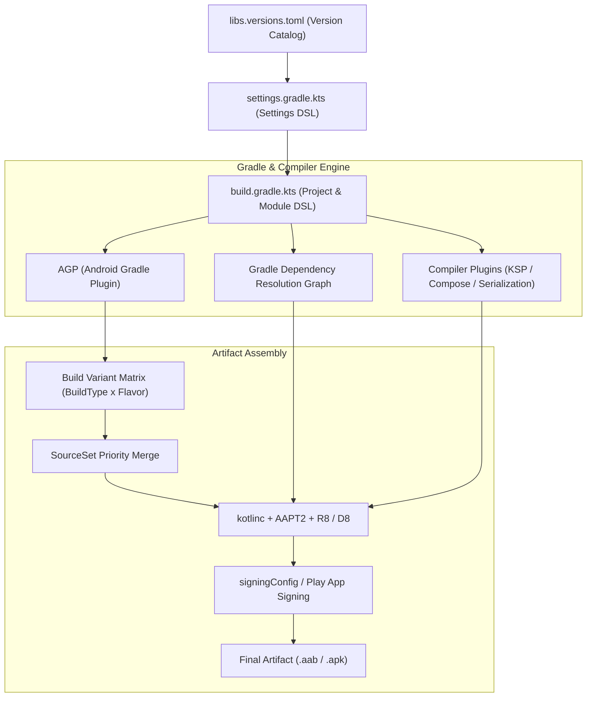

## Gradle 빌드 시스템 및 의존성·플러그인 아키텍처

상위 문서: [Android 패키징과 배포 지도](../../android-packaging-deployment.md)

### 개념 및 필요성 (What & Why)

Android 애플리케이션 개발에서 **Gradle 빌드 시스템**은 소스 코드, 리소스, 외부 라이브러리 의존성, 컴파일러 플러그인을 최종 실행 가능한 APK 또는 배포용 AAB 아티팩트로 변환하는 빌드 파이프라인의 핵심 토대이다.

Gradle 은 범용 빌드 자동화 엔진이며, Android 앱을 빌드하기 위해서는 **AGP(Android Gradle Plugin)** 가 제공하는 도메인 특화 태스크와 DSL(Domain Specific Language) 명세, **Version Catalog(`libs.versions.toml`)** 기반의 의존성 중앙 통제, **KSP** 중심의 소스 코드 생성 플러그인이 결합되어 동작한다.

정확하게 정의된 빌드 아키텍처는 다중 모듈 모듈화, 전이적 의존성 충돌 방지, Build Variant 매트릭스 관리, 서명 파일 오염 방지, 릴리스 아티팩트의 일관성 및 재현 가능성을 보장한다.

### 내부 메커니즘 (How / Internal Mechanism)

Gradle 빌드 시스템은 다음과 같은 5 대 핵심 층위와 규칙으로 작동한다:

1. **Gradle Core & 생명주기**: 초기화(Initialization) ➔ 구성(Configuration) ➔ 실행(Execution) 3 단계를 거치며 Task 의존성 DAG(Directed Acyclic Graph)를 구성하고 증분 빌드 및 빌드 캐시를 적용한다.
2. **Version Catalog & 의존성 해소**: `libs.versions.toml` 에 선언된 좌표를 바탕으로 타입 세이프 접근자를 생성하며, 전이적 충돌 발생 시 최상위 버전 자동 승격, `strictly`, `force`, `constraints` 규칙으로 해소 그래프를 결정한다.
3. **컴파일러 플러그인 & 코드 생성**: KSP, Kotlinx Serialization, Compose Compiler 등 `kotlinc` 컴파일러 파이프라인에 직접 통합되는 플러그인을 통해 Java Stub 오버헤드 없이 고속으로 코드를 생성한다.
4. **AGP 도메인 확장 DSL**: `android {}` 블록을 통해 `compileSdk`, `defaultConfig`, `buildTypes`, `productFlavors` 를 정의하고 Build Variant 매트릭스를 구성한다.
5. **SourceSet 결합 & 서명**: `variant` > `flavor` > `buildType` > `main` 순서로 리소스를 병합하며, `signingConfigs` 와 Play App Signing 을 연동하여 릴리스 아티팩트를 서명한다.



### 관련 세부 문서 (24 개 원자 노트)

#### 1. Gradle 코어 엔진 및 생명주기
1. [Gradle 코어 엔진 및 아키텍처](gradle-core.md)
2. [Android 빌드 파이프라인과 핵심 빌드 용어 해설](android-build-pipeline.md)
3. [Gradle Settings DSL 및 API (settings.gradle.kts)](gradle-settings-dsl.md)
4. [Gradle Project DSL 및 빌드 스크립트 API (build.gradle.kts)](gradle-project-dsl.md)
5. [Gradle 실행 생명주기](gradle-lifecycle.md)
6. [Gradle 작업 단위 계층 구조](gradle-work-units.md)
7. [Gradle Task 모델 및 Provider API](gradle-task-api.md)
8. [Gradle 캐싱 및 빌드 최적화](gradle-caching-and-optimization.md)

#### 2. 플러그인 및 모듈화 아키텍처
1. [Gradle 플러그인 및 모듈화 아키텍처](gradle-plugins.md)
2. [Gradle 플러그인(Plugin)과 의존성(Dependency)의 본질적 차이](gradle-plugins-vs-dependencies.md)

#### 3. Version Catalog 및 의존성 관리
1. [Version catalog는 의존성과 플러그인 좌표를 명명한다](gradle-version-catalog.md)
2. [Gradle 의존성 구성 및 클래스패스 격리](gradle-dependency-configurations.md)
3. [Gradle 의존성 관리는 요청된 버전이 아니라 해소 그래프를 제어한다](gradle-dependency-resolution.md)
4. [Compose BOM은 Compose 라이브러리 버전 세트를 관리한다](compose-bom-versioning.md)
5. [의존성 변경 체크리스트는 그래프, ABI, 테스트, 릴리스 위험을 검토한다](dependency-change-checklist.md)

#### 4. 컴파일러 플러그인 및 코드 생성
1. [KSP는 Kotlin 퍼스트 코드 생성이며 KAPT는 유지보수 모드다](ksp-code-generation.md)
2. [Compose compiler는 BOM이 아니라 Kotlin 컴파일러 흐름에 속한다](compose-compiler-plugin.md)
3. [kotlinx.serialization은 컴파일러 플러그인과 런타임 포맷이 모두 필요하다](kotlinx-serialization-plugin.md)

#### 5. AGP(Android Gradle Plugin) 및 릴리스 배포 설정
1. [Android Gradle Plugin (AGP) 아키텍처 및 확장 모델](android-gradle-plugin.md)
2. [AGP defaultConfig 및 앱 식별자·버전 명세](agp-default-config.md)
3. [AGP Build Variant 아키텍처 및 변형 매트릭스](agp-build-variants.md)
4. [AGP SourceSet 우선순위 및 리소스·코드 병합 규칙](agp-source-sets.md)
5. [AGP 서명 설정 및 키 관리](agp-signing-config.md)
6. [AGP 릴리스 빌드 점검 체크리스트](agp-release-checklist.md)

### 관측 가능 증거 (Observable Evidence)

전체 프로젝트의 빌드 변형 매트릭스, 태스크 구조, 의존성 해소 그래프는 다음 명령어로 관측할 수 있다:

```bash
./gradlew app:tasks --group="build"
./gradlew app:dependencies --configuration runtimeClasspath
./gradlew app:signingReport
```
