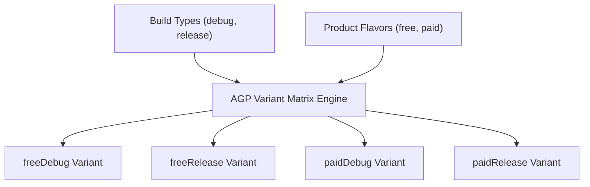

## AGP Build Variant 아키텍처 및 변형 매트릭스 (Build Variants & Flavors)

### 개요

Android AGP(Android Gradle Plugin) 빌드 시스템에서 **Build Variant(빌드 변형)**는 **Build Type(빌드 환경 축)**과 **Product Flavor(제품 변종 축)**라는 두 개의 서로 다른 직교(Orthogonal) 축의 **카테시안 곱(Cartesian Product)**으로 형성된다.

이를 통해 단일 코드베이스에서 디버그/릴리스 환경뿐만 아니라 무료/유료 버전, 개발/운영 서버 엔드포인트 등을 독립된 아티팩트로 유연하게 생성 및 배포할 수 있다.



---

### 1. Build Type, Product Flavor, Build Variant의 3대 핵심 개념

| 구분 | 주요 목적 | 주요 설정 속성 | 예시 |
|---|---|---|---|
| **Build Type**<br/>(빌드 환경 축) | 패키징 및 최적화 파이프라인 제어 (디버깅, 난독화, 서명) | `isDebuggable`, `isMinifyEnabled`, `isShrinkResources`, `signingConfig`, `proguardFiles` | `debug`, `release`, `benchmark` |
| **Product Flavor**<br/>(제품 변종 축) | 기능 집합, 서버 URL, 앱 식별자 분기 (사용자 등급 및 시장별 분기) | `dimension`, `applicationIdSuffix`, `versionNameSuffix`, `buildConfigField`, `resValue` | `free`, `paid`, `staging`, `production` |
| **Build Variant**<br/>(최종 산출물 조합) | 실제 빌드 및 배포되는 독립 아티팩트 조합 | Build Type × Product Flavor 의 카테시안 곱 | `freeDebug`, `freeRelease`, `paidDebug`, `paidRelease` |

---

### 2. 내부 동작 메커니즘

1. **Flavor Dimensions (다차원 변종 결합)**:
   - 여러 축의 Flavor를 결합해야 할 경우 `flavorDimensions`를 선언하여 차원 우선순위를 지정한다 (예: `flavorDimensions += listOf("tier", "api")`).
2. **Variant 매트릭스 계산 공식**:
   $$\text{Total Variants} = \text{Count}(\text{BuildTypes}) \times \prod_{i} \text{Count}(\text{Flavors in Dimension}_i)$$
3. **태스크 및 SourceSet 자동 생성**:
   - AGP 는 계산된 각 Variant 마다 고유한 빌드 태스크(`assembleFreeRelease`, `bundlePaidRelease` 등) 및 [SourceSet 디렉터리 구조](agp-source-sets.md)를 자동 생성한다.

---

### 3. 코드 예시 (build.gradle.kts)

```kotlin
// app/build.gradle.kts
android {
    flavorDimensions += listOf("tier")

    productFlavors {
        create("free") {
            dimension = "tier"
            applicationIdSuffix = ".free"
            versionNameSuffix = "-free"
            buildConfigField("String", "API_BASE_URL", "\"https://api.free.example.com\"")
        }
        create("paid") {
            dimension = "tier"
            applicationIdSuffix = ".paid"
            versionNameSuffix = "-paid"
            buildConfigField("String", "API_BASE_URL", "\"https://api.paid.example.com\"")
        }
    }

    buildTypes {
        getByName("debug") {
            isDebuggable = true
            applicationIdSuffix = ".debug"
        }
        getByName("release") {
            isMinifyEnabled = true
            isShrinkResources = true
            proguardFiles(
                getDefaultProguardFile("proguard-android-optimize.txt"),
                "proguard-rules.pro"
            )
        }
    }
}
```

---

### 4. 관측 가능 증거 (Observable Evidence)

결합된 빌드 변형 태스크 목록을 터미널 명령으로 확인할 수 있다:

```bash
./gradlew app:tasks --group="build" | grep "assemble"

# Output Example:
# assembleFreeDebug - Builds the FreeDebug APK.
# assembleFreeRelease - Builds the FreeRelease APK.
# assemblePaidDebug - Builds the PaidDebug APK.
# assemblePaidRelease - Builds the PaidRelease APK.
```

---

### 상위 및 연관 문서

- [Gradle 빌드 시스템](gradle-build.md)
- [Android Gradle Plugin (AGP) 아키텍처 및 확장 모델](android-gradle-plugin.md)
- [AGP SourceSet 우선순위 및 충돌 해소](agp-source-sets.md)
- [AGP defaultConfig 및 앱 식별자·버전 명세](agp-default-config.md)
- [AGP 서명 설정 및 키 관리](agp-signing-config.md)
