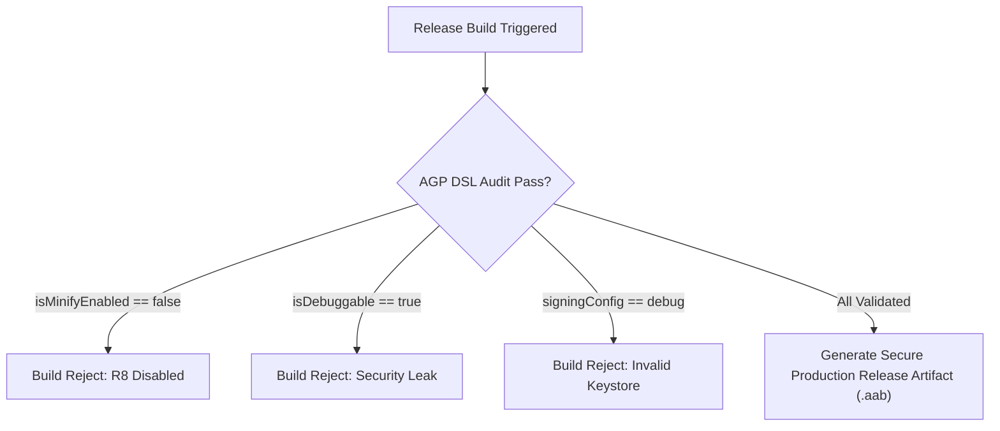

## AGP DSL 체크리스트는 릴리스 변형의 실제 값을 확인한다

상위 문서: [Gradle 빌드 시스템](gradle-build.md)

### 개념 및 필요성 (What & Why)
상용 프로덕션 앱을 빌드하여 출시할 때 `build.gradle.kts`의 `release` 빌드 타입에 설정된 AGP DSL 플래그들의 **실효값(Effective Values)** 을 반드시 정밀 검증해야 한다.
개발 단계의 편리함을 위해 사용되던 디버그 설정(디버거 부착 허용, R8 코드 수축 비활성화, 디버그 키스토어 서명 등)이 실수로 릴리스 빌드 아티팩트에 오염(Leak)되는 경우, 앱 용량 증가, 리버스 엔지니어링 노출, 심각한 보안 취약점이 유발될 수 있다.

### 내부 메커니즘 (Internal Mechanism)
릴리스 변형 파이프라인에서 반드시 통과해야 하는 **5대 필수 체크리스트 항목**:
1. **`isMinifyEnabled = true`**: R8 컴파일러를 활성화하여 미사용 바이트코드 제거(Shrinking), 최적화, 클래스/메서드 이름 난독화(Obfuscation) 수행.
2. **`isShrinkResources = true`**: AAPT2와 연동하여 미사용 XML, 이미지 등 리소스 아셋을 아티팩트에서 완전 삭제.
3. **`isDebuggable = false`**: Android OS 상에서 디버거 부착을 금지하도록 `android:debuggable="false"` 매니페스트 주입.
4. **`signingConfig`**: 개발용 `debug.keystore`가 아닌 프로덕션 release 서명 키 연결.
5. **`proguardFiles`**: AGP 기본 최적화 규칙(`proguard-android-optimize.txt`) 및 앱 커스텀 규칙(`proguard-rules.pro`) 정상 지정.



### 코드 예시 (build.gradle.kts)
```kotlin
// app/build.gradle.kts
android {
    buildTypes {
        getByName("release") {
            isMinifyEnabled = true
            isShrinkResources = true
            isDebuggable = false
            signingConfig = signingConfigs.getByName("release")
            proguardFiles(
                getDefaultProguardFile("proguard-android-optimize.txt"),
                "proguard-rules.pro"
            )
        }
    }
}
```

### 관측 가능 증거 (Observable Evidence)
릴리스 APK/AAB에 디버그 플래그가 잔존하는지 `apkanalyzer` 도구로 즉시 관측 및 검증할 수 있다:
```bash
# debuggable 플래그가 false인지 확인 (결과가 false이거나 아무것도 나오지 않아야 함)
apkanalyzer manifest print build/outputs/apk/release/app-release.apk | grep "android:debuggable"

# Output Example:
# android:debuggable="false"
```

관련 노트: [R8은 릴리즈 코드의 수축, 최적화, 난독화를 수행한다](../../../optimization/build-optimization/r8-shrinks-optimizes-and-obfuscates-release-builds.md), [Signing config는 로컬 서명과 Play 배포 정체성을 연결한다](signing-config-connects-local-signing-and-play-release-identity.md)
