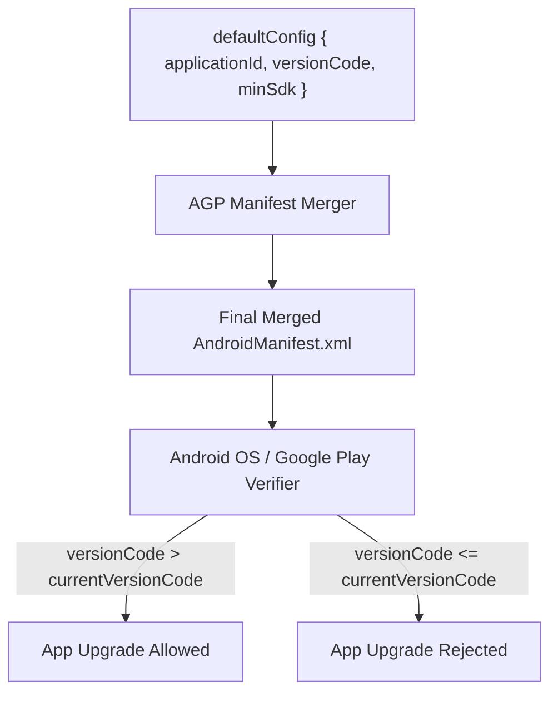

## Android 기본 설정은 식별자와 버전 계약을 만든다

상위 문서: [Gradle 빌드 계약](gradle-build.md)

### 개념 및 필요성 (What & Why)
`defaultConfig` 블록은 AGP 빌드 시스템에서 모든 빌드 변형(Build Variant)에 공통으로 적용되는 애플리케이션 식별자(Application ID), API 타깃 버전 레벨(`minSdk`, `targetSdk`), 및 앱 버저닝 명세(`versionCode`, `versionName`)를 정의하는 계약이다.
Google Play 스토어는 앱을 고유하게 식별하고 업데이트 상향 호환성(Upgrade Compatibility)을 판단하기 위해 `applicationId`와 단조 증가하는 `versionCode` 정수값을 필수 계약조건으로 요구한다.

### 내부 메커니즘 (Internal Mechanism)
1. **Application ID vs Namespace**: `namespace`는 생성되는 `R.java` 클래스 및 소스 패키지 구조를 지정하며, `applicationId`는 Play 스토어 및 OS 단에서 앱을 구별하는 고유 패키지 식별자이다.
2. **SDK 레벨 매핑 및 동작 차이**:
   - `compileSdk`: 소스 코드를 컴파일할 때 바인딩할 Android API 버전. (예: `compileSdk = 37`이면 최신 API 37 클래스와 함수를 컴파일 타임에 호출 가능).
   - `minSdk`: 이 앱을 설치하고 실행할 수 있는 최소 Android OS API 버전. (예: `minSdk = 24`이면 Android 7.0 이상 기기에서 설치 허용. 하위 버전 미지원 API 호출 시 런타임 OS 버전 분기 `Build.VERSION.SDK_INT` 필요).
   - `targetSdk`: 앱이 검증되고 동작을 보장하는 Android OS 보안/동작 정책 기준점. (예: 신규 백그라운드 제한, 런타임 권한 요구 정책의 기준).
3. **호스트 JVM Toolchain (Java 21) vs 기기 런타임 (`minSdk 24`)의 층위 분리**:
   - `java { toolchain { languageVersion = JavaLanguageVersion.of(21) } }`: 개발자 PC 및 CI 러너에서 **Gradle 데몬과 컴파일러 도구를 구동하는 호스트 JVM 버전**이다. (최신 플러그인, 예: Metro 1.4+ 및 AGP 9+ 가 Java 21 바이트코드로 배포되므로 빌드 도구 런타임은 JDK 21 이상이어야 함).
   - 반면 기기에서 실행되는 앱 런타임은 `minSdk = 24` (Android 7.0+)이므로, 호스트 빌드 도구의 Java 버전과 기기 안드로이드 OS 버전은 완전히 독립된 별개의 층위이다.
4. **버전 계약 규칙**:
   - `versionCode`: 내부적 업그레이드 판별용 단조 증가 정수 (예: `100200`). 버전 업데이트 시 기존 버전보다 항상 커야 한다.
   - `versionName`: 사용자 표기용 버전 문자열 (예: `"1.2.0"`).
5. **Manifest Injection**: `defaultConfig`에 선언된 값들은 AGP 빌드 시 `AndroidManifest.xml`의 `<manifest package="...">`, `android:versionCode`, `android:versionName` 속성에 주입된다.



### 코드 예시 (build.gradle.kts)
```kotlin
// app/build.gradle.kts
android {
    namespace = "com.example.myapp"
    compileSdk = 34

    defaultConfig {
        applicationId = "com.example.myapp"
        minSdk = 26
        targetSdk = 34
        versionCode = 10001
        versionName = "1.0.1"

        testInstrumentationRunner = "androidx.test.runner.AndroidJUnitRunner"
    }
}
```

### 관측 가능 증거 (Observable Evidence)
빌드 산출물의 최종 매니페스트에 정의된 식별자와 버전 정보를 `apkanalyzer` 도구로 확인할 수 있다:
```bash
apkanalyzer manifest print build/outputs/apk/release/app-release.apk | grep -E "package|versionCode|versionName"

# Output Example:
# package="com.example.myapp"
# android:versionCode="10001"
# android:versionName="1.0.1"
```

관련 노트: [App 업데이트는 application id, version code, 그리고 서명 호환성을 요구한다](../../../distribution/release-distribution/app-updates-require-application-id-version-code-and-signature-compatibility.md), [Gradle 빌드 계약](gradle-build.md)
