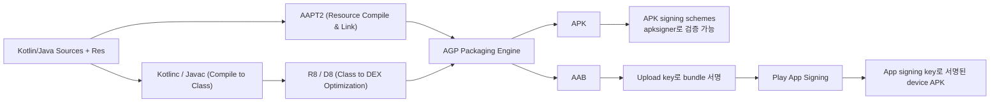

## Android Gradle Plugin은 Android 빌드 규칙을 Gradle에 추가한다

상위 문서: [Gradle 빌드 계약](gradle-build.md)

### 개념 및 필요성 (What & Why)
**AGP(Android Gradle Plugin)** 는 범용 빌드 자동화 도구인 Gradle에 Android 애플리케이션 및 라이브러리 빌드를 위한 도메인 특화 태스크 파이프라인과 규칙(Rules)을 주입하는 핵심 빌드 플러그인(`com.android.application`, `com.android.library`)이다.
Gradle 자체는 범용 태스크 실행·의존성 엔진이며, Android APK/AAB를 만드는 AAPT2, R8/D8, Manifest Merger와 패키징·서명 단계의 구체적인 연결은 알지 못한다. AGP가 이 도구와 규칙을 Gradle 태스크 그래프에 구성한다. 이때 `apksigner`는 APK 서명·검증 도구이지 AAB 서명 도구가 아니다.
AGP는 이러한 Android 전용 도구 체인을 Gradle의 태스크 시스템으로 추상화하고 연결함으로써 개발자가 `build.gradle.kts` DSL 기반의 단순화된 빌드 환경을 누릴 수 있게 만든다.

### 내부 메커니즘 (Internal Mechanism)
AGP는 Gradle 빌드 라이프사이클의 프로젝트 평가(Evaluation) 단계에서 다음과 같은 전문 빌드 엔진들을 Gradle 태스크 DAG(Directed Acyclic Graph)에 바인딩한다:
1. **AAPT2 (Android Asset Packaging Tool 2)**: XML 리소스, 이미지, 레이아웃을 컴파일(`compile`)하고 바이너리 XML 및 `R.java`/`R.jar`로 링크(`link`)한다.
2. **Kotlinc & javac 바이트코드 컴파일**: 소스 코드를 자바 바이트코드(`.class`)로 컴파일한다.
3. **R8 / D8 컴파일러 엔진**: 자바 바이트코드를 Android Dalvik/ART 가상 머신용 DEX(Dalvik Executable) 바이트코드로 변환(`D8`)하며, 릴리스 빌드에서는 코드 수축(Minification), 최적화, 난독화(`R8`)를 동시에 실행한다.
4. **Manifest Merger**: 앱 모듈의 `AndroidManifest.xml`과 종속 라이브러리(AAR)의 매니페스트를 우선순위에 따라 통합하고 플레이스홀더를 치환한다.
5. **AndroidComponents Extension (Variant API)**: 빌드 변형 생성 시점에 클래스 파일 바이트코드 변환(ASM Bytecode Transformation)이나 리소스 보강 태스크를 동적으로 주입할 수 있는 차세대 확장 API를 제공한다.



### 코드 예시 (build.gradle.kts & Variant API)
```kotlin
// app/build.gradle.kts (AGP AndroidComponents Extension 사용 예시)
plugins {
    id("com.android.application")
}

android {
    namespace = "com.example.myapp"
    compileSdk = 34

    defaultConfig {
        applicationId = "com.example.myapp"
        minSdk = 26
        targetSdk = 34
    }
}

// AGP 차세대 Variant API를 이용한 태스크 파이프라인 관측 및 확장
androidComponents {
    onVariants(selector().all()) { variant ->
        println("Registered AGP Variant Pipeline: ${variant.name}")
    }
}
```

### 관측 가능 증거 (Observable Evidence)
AGP가 Gradle 태스크 그래프에 등록한 Android 전용 태스크 목록을 터미널 명령으로 확인할 수 있다:
```bash
./gradlew app:tasks --group="android"

# Output Example:
# Android tasks
# -------------
# assembleRelease - Build all Release builds.
# bundleRelease - Builds all Release bundles.
# processReleaseResources - Processes resources with AAPT2.
# transformClassesWithAsmForRelease - AGP ASM Bytecode Transformation.
```

관련 노트: [Android 빌드 파이프라인과 핵심 빌드 용어 해설](android-build-pipeline.md), [AGP DSL 체크리스트는 릴리스 변형의 실제 값을 확인한다](agp-dsl-checklist-verifies-effective-release-variant-values.md), [Gradle 빌드 계약](gradle-build.md)

공식 문서: [apksigner](https://developer.android.com/tools/apksigner), [Sign your app](https://developer.android.com/studio/publish/app-signing), [Android App Bundle format](https://developer.android.com/guide/app-bundle/app-bundle-format)

검증일: 2026-08-06. APK의 플랫폼 서명과 AAB 업로드 서명·Play App Signing 후 device APK 서명 흐름을 분리했다.
