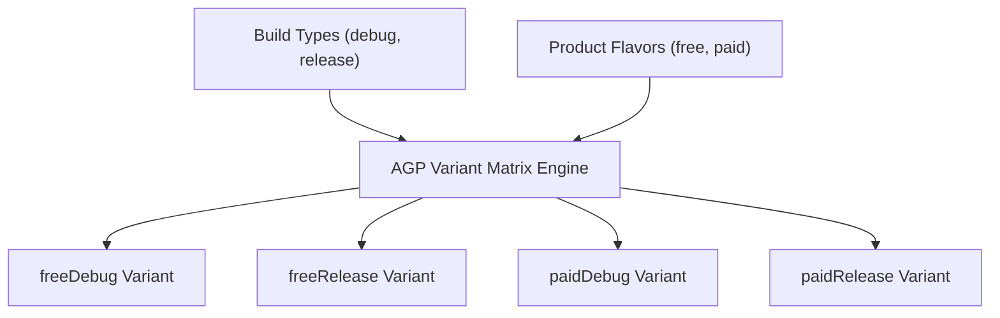

## Build type, product flavor, build variant는 서로 다른 축이다

상위 문서: [Gradle 빌드 계약](gradle-build.md)

### 개념 및 필요성 (What & Why)
Android AGP 빌드 시스템에서 **Build Type**, **Product Flavor**, **Build Variant**는 서로 다른 직교(Orthogonal) 축을 형성한다.
- **Build Type (빌드 환경 축)**: 앱의 빌드 파이프라인 패러미터(디버그 허용 여부, R8 최적화 적용 여부, 서명 설정 등 - 예: `debug`, `release`, `staging`)를 정의한다.
- **Product Flavor (제품 변종 축)**: 동일한 소스 기반에서 서버 엔드포인트, 기능 집합, 사용자 등급(예: `free`, `paid`, `demo`)을 분기할 때 사용하는 독립 축이다.
- **Build Variant (최종 산출물 조합)**: Build Type 축과 Product Flavor 축의 **카테시안 곱(Cartesian Product)** 결합 결과 생성되는 실제 빌드 아티팩트 조합이다.

### 내부 메커니즘 (Internal Mechanism)
1. **Flavor Dimensions**: 여러 차원의 Product Flavor를 조합할 때 `flavorDimensions`를 통해 구체적인 차원 순서를 지정한다 (예: `dimension("mode")`, `dimension("tier")`).
2. **Variant 매트릭스 계산 공식**:
   $$\text{Total Variants} = \text{Count}(\text{BuildTypes}) \times \prod \text{Count}(\text{Flavors in Dimension}_i)$$
3. **태스크 생성 자동화**: AGP는 형성된 각 Variant마다 고유한 빌드 태스크(`assembleFreeRelease`, `bundlePaidDebug` 등) 및 SourceSet 디렉터리 구조를 자동 생성한다.



### 코드 예시 (build.gradle.kts)
```kotlin
// app/build.gradle.kts
android {
    flavorDimensions += listOf("tier")

    productFlavors {
        create("free") {
            dimension = "tier"
            applicationIdSuffix = ".free"
            buildConfigField("String", "API_URL", ""https://api.free.example.com"")
        }
        create("paid") {
            dimension = "tier"
            applicationIdSuffix = ".paid"
            buildConfigField("String", "API_URL", ""https://api.paid.example.com"")
        }
    }

    buildTypes {
        getByName("debug") {
            isDebuggable = true
        }
        getByName("release") {
            isMinifyEnabled = true
            isShrinkResources = true
        }
    }
}
```

### 관측 가능 증거 (Observable Evidence)
결합된 빌드 변형 태스크 목록을 터미널 명령으로 확인할 수 있다:
```bash
./gradlew app:tasks --group="build" | grep "assemble"

# Output Example:
# assembleFreeDebug - Builds the FreeDebug APK.
# assembleFreeRelease - Builds the FreeRelease APK.
# assemblePaidDebug - Builds the PaidDebug APK.
# assemblePaidRelease - Builds the PaidRelease APK.
```

관련 노트: [Source set 우선순위는 variant별 코드와 리소스 충돌을 결정한다](source-set-priority-decides-variant-code-and-resource-conflicts.md), [Gradle 빌드 계약](gradle-build.md)
