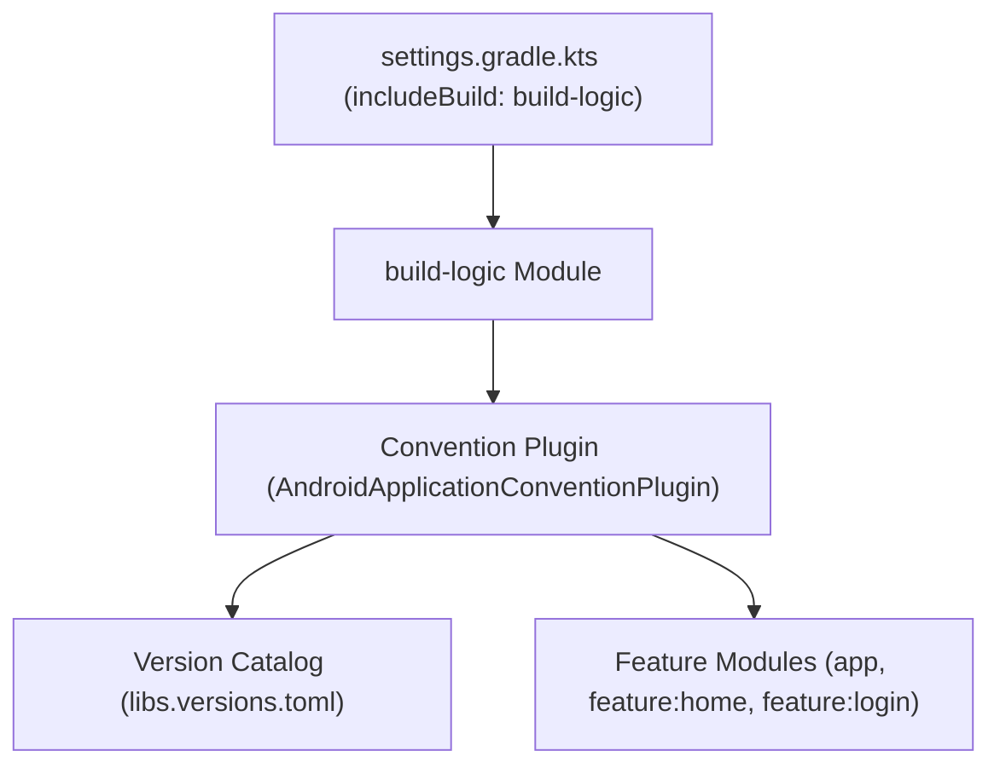

## Convention plugin은 build-logic 모듈에서 공통 Gradle 설정을 한 곳에서 관리한다

상위 문서: [Gradle 빌드 계약](gradle-build.md)

### 개념 및 필요성 (What & Why)
대규모 안드로이드 멀티 모듈 프로젝트에서 모듈별 `build.gradle.kts` 파일에 공통 AGP 설정, Kotlin 컴파일러 옵션, 의존성 설정을 반복 복사-붙여넣기하는 것은 심각한 코드 중복과 유지보수 부채를 야기한다.
과거에 사용되던 `subprojects {}`나 `allprojects {}` 방식은 모듈 간 결합도를 높이고 Gradle 캐싱 및 증분 빌드를 저해한다.
**Convention Plugin(컨벤션 플러그인)** 은 `build-logic` 복합 빌드(Composite Build) 모듈 내에 프로젝트 고유의 재사용 가능한 Gradle 플러그인(`com.example.appName.android.application`, `com.example.appName.android.feature` 등)을 타입 세이프한 Kotlin DSL로 작성하여 중앙집중 관리하는 현대적 빌드 아키텍처 패턴이다.

### 내부 메커니즘 (Internal Mechanism)
1. **Composite Build (`includeBuild`)**: `settings.gradle.kts`에서 `includeBuild("build-logic")`을 통해 빌드 로직 전용 모듈을 메인 빌드의 인클루드 빌드로 선언한다.
2. **Version Catalog 경계**: included build인 `build-logic`은 메인 빌드의 version catalog를 자동 상속하지 않는다. 필요하면 `build-logic/settings.gradle.kts`에서 루트의 `gradle/libs.versions.toml`을 명시적으로 import한다. 플러그인을 적용할 때는 catalog의 플러그인 alias를 런타임 문자열처럼 다루지 말고, 컨벤션 플러그인의 classpath에 필요한 AGP artifact를 선언한 뒤 안정적인 plugin id를 적용한다.
3. **타입 세이프 Extension 접근**: `com.android.build.api.dsl.ApplicationExtension` 또는 `LibraryExtension` 같은 AGP public DSL interface를 모듈 타입에 맞춰 설정한다. AGP 9에서는 built-in Kotlin이 기본이므로 Android 모듈에 `org.jetbrains.kotlin.android`를 다시 적용하지 않는다.



### 코드 예시 (build-logic / Convention Plugin)
```kotlin
// build-logic/settings.gradle.kts
dependencyResolutionManagement {
    versionCatalogs {
        create("libs") {
            from(files("../gradle/libs.versions.toml"))
        }
    }
}
```

```kotlin
// build-logic/convention/src/main/kotlin/AndroidApplicationConventionPlugin.kt
import com.android.build.api.dsl.ApplicationExtension
import org.gradle.api.Plugin
import org.gradle.api.Project
import org.gradle.kotlin.dsl.configure

class AndroidApplicationConventionPlugin : Plugin<Project> {
    override fun apply(target: Project) {
        with(target) {
            pluginManager.apply("com.android.application")
            // AGP 9.0+는 Kotlin 지원이 내장되어 있다.
            // org.jetbrains.kotlin.android를 추가로 적용하지 않는다.

            extensions.configure<ApplicationExtension> {
                compileSdk = 36
                defaultConfig {
                    minSdk = 26
                    targetSdk = 36
                }
            }
        }
    }
}
```

### 관측 가능 증거 (Observable Evidence)
`build-logic` 플러그인이 모듈에 정상적으로 등록 및 적용되었는지 확인하기 위해 린트 태스크나 프로젝트 구성을 검증할 수 있다:
```bash
./gradlew :app:tasks --all
```

관련 노트: [Version catalog는 의존성과 플러그인 좌표를 명명한다](../../dependency-versioning/dependency-ci/version-catalog-names-dependency-and-plugin-coordinates.md), [Gradle 빌드 계약](gradle-build.md)

공식 문서: [Migrate to built-in Kotlin](https://developer.android.com/build/migrate-to-built-in-kotlin), [AGP 9.0 release notes](https://developer.android.com/build/releases/agp-9-0-0-release-notes), [Gradle Version Catalogs](https://docs.gradle.org/current/userguide/version_catalogs.html), [Convention Plugins](https://docs.gradle.org/current/userguide/implementing_gradle_plugins_convention.html)

검증일: 2026-08-06. AGP 9 built-in Kotlin, public DSL interface와 included build의 version catalog import 경계를 반영했다.
