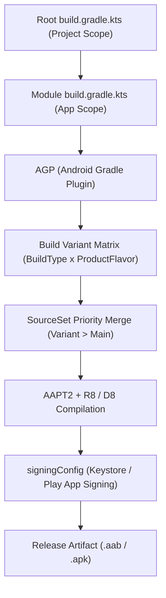

## Gradle 빌드 계약

상위 문서: [Android 패키징과 배포 지도](../../../android-packaging-deployment.md)

### 개념 및 필요성 (What & Why)
Android 애플리케이션 개발에서 **Gradle 빌드 계약(Gradle Build Contracts)** 은 소스 코드와 리소스를 최종 실행 가능한 APK 또는 배포용 AAB 아티팩트로 변환하는 빌드 파이프라인의 구조적 규칙을 의미한다.
Gradle은 범용 빌드 자동화 시스템이며, Android 앱을 빌드하기 위해서는 **AGP(Android Gradle Plugin)** 가 제공하는 다양한 태스크와 DSL(Domain Specific Language) 명세가 결합되어야 한다.
정확하고 명확하게 정의된 빌드 계약은 다중 모듈 모듈화, 멀티 디바이스 변형(Variant) 관리, 서명 파일 오염 방지, 릴리스 아티팩트의 일관성 및 보안성을 보장하는 핵심 토대이다.

### 내부 메커니즘 (How / Internal Mechanism)
Gradle 빌드 계약은 다음과 같은 핵심 층위와 규칙으로 작동한다:
1. **AGP(Android Gradle Plugin)**: Gradle DAG(Directed Acyclic Graph)에 Kotlin/Java 컴파일, 리소스 컴파일·링크(`AAPT2`), 바이트코드 최적화·덱싱(`R8/D8`), APK/AAB 패키징과 산출물별 서명 단계를 구성한다. `apksigner`는 APK용이며 AAB 업로드 서명과 Play App Signing 이후의 delivery APK 서명은 별도 흐름이다.
2. **DSL 분리 (Project vs Module)**: 루트 `build.gradle.kts`에서는 전체 프로젝트 공통 플러그인과 레포지토리를 관리하며, 모듈 `build.gradle.kts`에서는 해당 모듈의 의존성과 AGP 설정(`android {}`)을 전담한다.
3. **Build Variant 매트릭스**: 빌드 환경 축(`buildTypes`)과 기능/제품 변종 축(`productFlavors`)의 카테시안 곱(Cartesian Product)을 통해 독립된 산출물 변형(`FreeRelease`, `PaidDebug` 등)을 형성한다.
4. **SourceSet 우선순위 결합**: `variant` > `flavor` > `buildType` > `main` > `dependencies` 순서로 리소스를 병합하며 소스 코드와 리소스 충돌을 제어한다.
5. **서명 및 릴리스 계약**: `signingConfigs`를 통해 로컬 서명 키와 Play App Signing 업로드 키를 결합하고, `isMinifyEnabled`, `isDebuggable` 등의 실효값을 릴리스 전 체크리스트로 검증한다.
6. **Convention Plugin 중심 관리**: 현대적 Android 프로젝트에서는 `build-logic` 모듈의 Convention Plugin을 통해 모듈 간 공통 Gradle 설정 및 Version Catalog를 중앙집중화한다.



### 관련 세부 문서
1. [Gradle 코어 엔진 및 아키텍처](gradle-core.md)
2. [Android 빌드 파이프라인과 핵심 빌드 용어 해설](android-build-pipeline.md)
3. [Gradle 실행 생명주기](gradle-lifecycle.md)
4. [Gradle Task 모델 및 Provider API](gradle-task-api.md)
5. [Gradle 캐싱 및 빌드 최적화](gradle-caching-and-optimization.md)
6. [Gradle 플러그인 및 모듈화 아키텍처](gradle-plugins.md)
7. [Gradle 의존성 구성 및 클래스패스 격리](gradle-dependency-configurations.md)
8. [Android Gradle Plugin (AGP) 아키텍처 및 확장 모델](android-gradle-plugin.md)
9. [Android 기본 설정은 식별자와 버전 계약을 만든다](android-default-config-defines-identity-and-version.md)
10. [Build type, product flavor, build variant는 서로 다른 축이다](build-type-product-flavor-and-build-variant-are-different-axes.md)
11. [Source set 우선순위는 variant별 코드와 리소스 충돌을 결정한다](source-set-priority-decides-variant-code-and-resource-conflicts.md)
12. [Gradle 프로젝트와 모듈 DSL은 서로 다른 책임을 가진다](gradle-project-and-module-dsl-have-different-responsibilities.md)
13. [Signing config는 로컬 서명과 Play 배포 정체성을 연결한다](signing-config-connects-local-signing-and-play-release-identity.md)
14. [AGP DSL 체크리스트는 릴리스 변형의 실제 값을 확인한다](agp-dsl-checklist-verifies-effective-release-variant-values.md)
15. [Convention plugin은 build-logic 모듈에서 공통 Gradle 설정을 한 곳에서 관리한다](convention-plugins-centralize-shared-gradle-configuration-in-build-logic.md)

### 관측 가능 증거 (Observable Evidence)
전체 프로젝트의 빌드 변형 매트릭스와 등록된 태스크 구조는 다음 명령어로 관측할 수 있다:
```bash
./gradlew app:tasks --group="build"
./gradlew app:signingReport
```
