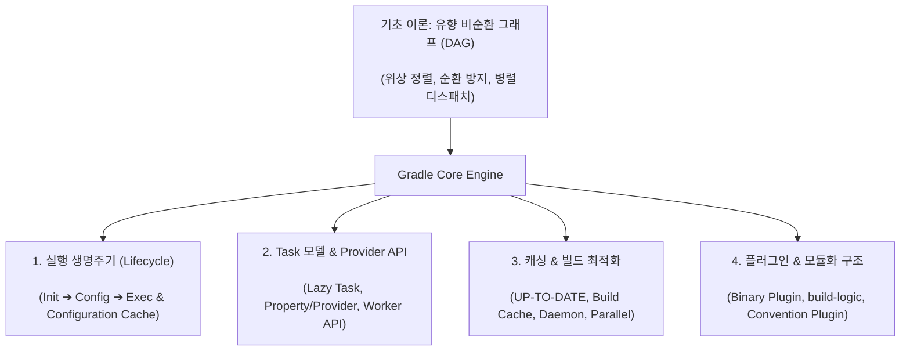

## Gradle 코어 엔진 및 아키텍처 (Gradle Core Engine)

### 개요 및 빌드 엔진의 본질

**Gradle**은 현대 소프트웨어 생태계를 위한 범용 멀티프로젝트 빌드 자동화 엔진으로, 소스 코드 컴파일, 정적 분석, 테스트 실행, 의존성 해결, 그리고 최종 아티팩트 패키징 및 배포에 이르는 소프트웨어 전달 전 과정을 프로그래밍 방식으로 조율한다.

과거의 빌드 도구인 **Apache Ant**(절차적 스크립트 기반, 재사용성과 성능 한계)와 **Apache Maven**(엄격한 XML 선언 기반, 유연성 부족 및 고정된 선형 라이프사이클)의 한계를 극복하기 위해 탄생한 Gradle 은, **선언적 Kotlin DSL 의 표현력**, **컴퓨터 과학의 [유향 비순환 그래프 (DAG)](../../../../../../computer-science/directed-acyclic-graph.md) 기반 의존성 스케줄링**, 그리고 **극대화된 다계층 증분 캐싱**을 결합한 현대적 빌드 플랫폼이다.

---

### 1. 왜 빌드 엔진의 핵심이 DAG(유향 비순환 그래프)인가?

소프트웨어 빌드는 단순히 명령어를 위에서 아래로 순차 실행하는 선형 프로세스가 아니다. 모듈과 태스크들은 복잡한 선후행 의존 관계를 가진다.

Gradle 은 빌드 구성 단계에서 모든 태스크를 **노드(Node)** 로, 태스크 간의 의존성(`dependsOn`, `mustRunAfter`, 암시적 입출력 연결)을 **방향성 있는 간선(Directed Edge)** 으로 모델링하여 메모리에 [DAG](../../../../../../computer-science/directed-acyclic-graph.md) 를 구성한다.

1. **위상 정렬 (Topological Sorting)**:
   - 태스크 간의 선행 조건이 충족된 순서대로 정확한 실행 순서(Execution Order)를 선형화한다.
2. **순환 의존성(Circular Dependency) 원천 차단**:
   - 그래프 내에 사이클(A ➔ B ➔ A)이 존재하면 위상 정렬이 불가능하므로, Gradle 은 빌드 실행 전에 즉시 `CircularDependencyException` 을 발생시켜 무한 루프를 방지한다.
3. **최대 병렬성 (Maximum Parallelism)**:
   - DAG 상에서 서로 인과관계가 없는 독립된 분기(Branch)의 태스크들을 CPU 코어 수에 맞추어 여러 워커 스레드에 동시 디스패치한다.

---

### 2. Gradle 코어 아키텍처의 4 대 핵심 기둥

#### 1) [실행 생명주기 (Execution Lifecycle)](gradle-lifecycle.md)

Gradle 은 빌드 요청 시 3 단계 생명주기를 엄격히 분리하여 실행한다.

- **Initialization**: `settings.gradle.kts` 를 파싱하여 프로젝트 계층 트리 구성 및 Included Build(`includeBuild`) 연결.
- **Configuration**: 모든 프로젝트의 `build.gradle.kts` 를 평가하여 Task DAG 그래프 구축.
- **Execution**: 요청된 태스크와 의존 태스크의 `@TaskAction` 을 선별적으로 병렬 실행.
- **Configuration Cache**: 구성 단계의 Task DAG 그래프를 디스크에 직렬화하여 반복 빌드 시 구성 단계를 100% 생략.

#### 2) [Task 모델 및 Provider API](gradle-task-api.md)

Gradle 빌드의 최소 실행 단위인 Task 는 지연 평가와 상태 모델을 기반으로 동작한다.

- **`tasks.register` (Lazy Task Creation)**: 실행 대상이 될 때까지 인스턴스화를 지연하여 구성 오버헤드 최소화.
- **Property & Provider API (`Property<T>`, `Provider<T>`)**: 태스크 간 입출력 데이터의 지연 바인딩 및 자동 암시적 의존성 수립.
- **Worker API**: 무거운 작업을 별도 스레드 풀 또는 독립 격리 프로세스에서 비동기 병렬 실행.

#### 3) [캐싱 및 빌드 최적화 (Caching & Optimization)](gradle-caching-and-optimization.md)

반복 빌드 시간을 최소화하기 위한 다계층 최적화 엔진이다.

- **증분 빌드 (Incremental Task Execution - `UP-TO-DATE`)**: 이전 빌드 스냅샷과 입력/출력 파일 해시를 비교하여 변경이 없으면 태스크 실행 스킵.
- **Build Cache (Local / Remote)**: 태스크 산출물을 키 - 값 저장소에 보관하여 다른 브랜치 및 CI 환경 간 재사용(`FROM-CACHE`).
- **데몬 및 병렬 실행 (`org.gradle.parallel=true`)**: JVM 데몬 상주 및 독립 모듈의 동시 병렬 빌드.

#### 4) [플러그인 및 모듈화 구조 (Plugins & Modularity)](gradle-plugins.md)

프로젝트 간 빌드 로직 재사용과 결합도 분리를 위한 아키텍처이다.

- **Binary Plugin (`Plugin<Project>`)**: 재사용 가능한 빌드 로직 클래스 캡슐화 및 Extension DSL 제공.
- **Convention Plugin (`build-logic`)**: 다중 모듈 간 중복 스크립트를 제거하고 공통 빌드 규칙 및 Version Catalog 를 단일 진실 공급원(SSOT)으로 관리.
- **프로젝트 격리 (Project Isolation)**: 모듈 간 직접 참조를 배제하고 산출물(Artifact) 기반 통신.

---

### 상위 및 연관 문서

- [유향 비순환 그래프 (DAG)](../../../../../../computer-science/directed-acyclic-graph.md)
- [JVM 클래스패스 (Classpath)](../../../../../../computer-science/jvm-classpath.md)
- [API vs ABI](../../../../../../computer-science/api-vs-abi.md)
- [Android 빌드 파이프라인과 핵심 빌드 용어 해설](android-build-pipeline.md)
- [Android Gradle Plugin (AGP) 아키텍처 및 확장 모델](android-gradle-plugin.md)
- [Gradle 실행 생명주기](gradle-lifecycle.md)
- [Gradle Task 모델 및 Provider API](gradle-task-api.md)
- [Gradle 의존성 구성 및 클래스패스 격리](gradle-dependency-configurations.md)
- [Gradle 캐싱 및 빌드 최적화](gradle-caching-and-optimization.md)
- [Gradle 플러그인 및 모듈화 아키텍처](gradle-plugins.md)
- [Convention Plugin과 build-logic](convention-plugins-centralize-shared-gradle-configuration-in-build-logic.md)
