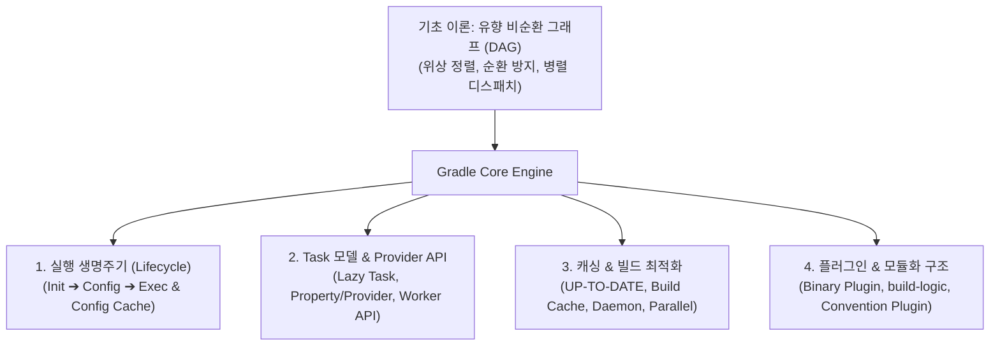

## Gradle 코어 엔진 및 아키텍처

### 개요 및 빌드 엔진 본질

**Gradle**은 범용 멀티프로젝트 빌드 자동화 엔진으로, 소프트웨어 프로젝트의 소스 코드 컴파일, 테스트 실행, 정적 분석, 아티팩트 패키징 및 배포 과정을 프로그래밍 방식으로 조율한다.

Gradle 은 특정 언어나 프레임워크(Java, Kotlin, Spring Boot, Android, C++)에 종속되지 않으며, 컴퓨터 과학의 **[유향 비순환 그래프 (DAG)](../../../../../../computer-science/directed-acyclic-graph.md)** 구조를 기반으로 태스크(Task) 간의 의존관계를 정적으로 분석하고 최적의 병렬/증분 실행 순서를 결정하는 독립적인 빌드 플랫폼이다.

---

### Gradle 코어 아키텍처의 4 대 핵심 기둥

#### 1. [실행 생명주기 (Execution Lifecycle)](gradle-lifecycle.md)

Gradle 은 빌드 요청 시 3 단계 생명주기를 엄격히 분리하여 실행한다.

- **Initialization**: `settings.gradle.kts` 를 파싱하여 프로젝트 계층 트리 구성 및 Composite Build(`includeBuild`) 연결.
- **Configuration**: 모든 프로젝트의 `build.gradle.kts` 를 평가하여 Task DAG 그래프 구축.
- **Execution**: 요청된 태스크와 의존 태스크의 `@TaskAction` 을 선별적으로 병렬 실행.
- **Configuration Cache**: 구성 단계의 Task DAG 그래프를 디스크에 직렬화하여 반복 빌드 시 구성 단계를 100% 생략.

#### 2. [Task 모델 및 Provider API](gradle-task-api.md)

Gradle 빌드의 최소 실행 단위인 Task 는 지연 평가와 상태 계약을 기반으로 동작한다.

- **`tasks.register` (Lazy Task Creation)**: 실행 대상이 될 때까지 인스턴스화를 지연하여 빌드 오버헤드 최소화.
- **Property & Provider API (`Property<T>`, `Provider<T>`)**: 태스크 간 입출력 데이터의 지연 바인딩 및 자동 암시적 의존성 수립.
- **Worker API**: 무거운 작업을 별도 스레드 풀 또는 독립 격리 프로세스에서 비동기 병렬 실행.

#### 3. [캐싱 및 빌드 최적화 (Caching & Optimization)](gradle-caching-and-optimization.md)

반복 빌드 시간을 최소화하기 위한 다계층 최적화 엔진이다.

- **증분 빌드 (Incremental Task Execution - `UP-TO-DATE`)**: 이전 빌드 스냅샷과 입력/출력 파일 해시를 비교하여 변경이 없으면 태스크 실행 스킵.
- **Build Cache (Local / Remote)**: 태스크 산출물을 키 - 값 저장소에 보관하여 다른 브랜치 및 CI 환경 간 재사용(`FROM-CACHE`).
- **데몬 및 병렬 실행 (`org.gradle.parallel=true`)**: JVM 데몬 상주 및 독립 모듈의 동시 병렬 빌드.

#### 4. [플러그인 및 모듈화 구조 (Plugins & Modularity)](gradle-plugins.md)

프로젝트 간 빌드 로직 재사용과 결합도 분리를 위한 아키텍처이다.

- **Binary Plugin (`Plugin<Project>`)**: 재사용 가능한 빌드 로직 클래스 캡슐화 및 Extension DSL 제공.
- **Convention Plugin (`build-logic`)**: 다중 모듈 간 중복 스크립트를 제거하고 공통 빌드 규칙 및 Version Catalog 를 단일 진실 공급원(SSOT)으로 관리.
- **프로젝트 격리 (Project Isolation)**: 모듈 간 직접 참조를 배제하고 산출물(Artifact) 기반 통신.

---

### 상위 및 연관 문서

- [유향 비순환 그래프 (DAG)](../../../../../../computer-science/directed-acyclic-graph.md)
- [Gradle 실행 생명주기](gradle-lifecycle.md)
- [Gradle Task 모델 및 Provider API](gradle-task-api.md)
- [Gradle 캐싱 및 빌드 최적화](gradle-caching-and-optimization.md)
- [Gradle 플러그인 및 모듈화 아키텍처](gradle-plugins.md)
- [Fastlane 코어 엔진](../../ci-cd/fastlane.md)
- [Gradle 과 Fastlane CI/CD 파이프라인](../../ci-cd/gradle-fastlane-pipeline.md)
