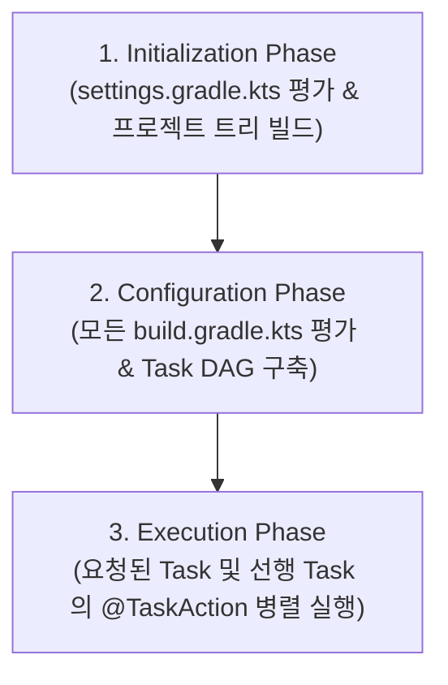
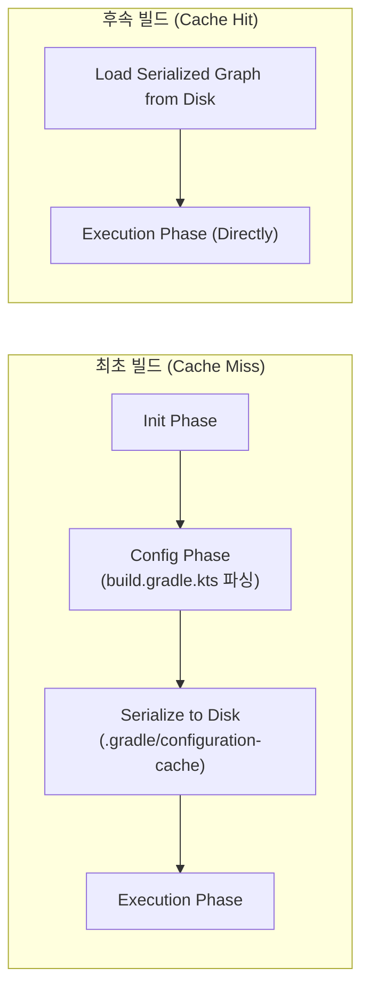

## Gradle 실행 생명주기 (Execution Lifecycle)

### 개요

Gradle 은 단순한 순차적 스크립트 실행기가 아니라, 프로젝트 계층 구조를 파싱하고 태스크 간 의존성을 정적 분석하여 그래프를 구축한 후 선별적으로 작업을 디스패치하는 **3 단계(Phase) 생명주기 아키텍처**를 엄격히 준수한다.

---

### 1. 초기화 단계 (Initialization Phase)

초기화 단계의 목표는 **어떤 프로젝트들이 이번 빌드에 참여하는지 결정**하는 것이다.

- **`settings.gradle.kts` 실행**:
  - `rootProject.name`과 `include(":app", ":core:network", …)` 문을 파싱하여 `ProjectDescriptor` 트리와 계층 구조를 메모리에 생성한다.
- **Settings 플러그인 및 Dependency Resolution Management**:
  - 플러그인 저장소(`pluginManagement { repositories { … } }`) 및 라이브러리 저장소(`dependencyResolutionManagement`)를 전역 단일 진실 공급원(SSOT)으로 구성한다.
- **Composite Builds (`includeBuild`)**:
  - 독립된 다른 레포지토리/빌드(예: `build-logic` 또는 공통 라이브러리)를 포함하여 바이너리 의존성을 소스 레벨 직접 참조로 치환한다.

---

### 2. 구성 단계 (Configuration Phase)

구성 단계의 목표는 **빌드에 참여하는 모든 프로젝트의 객체 모델을 인스턴스화하고 Task 간 DAG (방향성 비순환 그래프)를 완성**하는 것이다.

- **`build.gradle.kts` 스크립트 평가**:
  - 초기화된 모든 서브프로젝트의 `build.gradle.kts` 스크립트를 상단부터 하단까지 순차적으로 실행(Configure)한다.
  - 이 과정에서 `Project`, `Configuration`, `Dependency`, `Task` 객체가 생성되고 프로퍼티가 바인딩된다.
- **Task DAG 구축**:
  - 태스크 간 `dependsOn`, `mustRunAfter`, `finalizedBy` 및 Provider API 바인딩을 분석하여 실행 순서와 의존관계를 정의하는 **Task DAG**를 완성한다.
- **주의 및 안티패턴 (`afterEvaluate`)**:
  - 구성 단계에서 무거운 I/O(네트워크 요청, 외부 파일 읽기, Git 명령)를 실행하면 실제 태스크를 실행하지 않고 `./gradlew help` 만 쳐도 빌드 전체가 심각하게 느려진다.
  - `project.afterEvaluate` 는 다른 플러그인의 구성을 기다리기 위해 남용되기 쉬우나, 실행 순서 비결정성과 Configuration Cache 위반을 유발하므로 지양하고 **Provider API**로 대체해야 한다.

---

### 3. Configuration Cache (구성 캐시) 메커니즘

Gradle 의 혁신적인 성능 향상 기능인 **Configuration Cache**는 구성 단계의 결과물인 **Task DAG 그래프를 디스크에 직렬화 캡처**한다.

#### Configuration Cache 요구 조건 및 제약사항

1. **Task 실행 중 `Project` 인스턴스 참조 금지**: Task 내부 `@TaskAction`에서 `project.property`나 `project.file(…)`을 직접 조회하면 직렬화가 불가능하여 캐시가 깨진다. 모든 상태는 `@Input`, `@OutputFile` 등의 Property 로 캡슐화해야 한다.
2. **빌드 입력(Build Inputs)의 불변성**: 환경변수, 시스템 프로퍼티, 빌드 스크립트가 변경되지 않는 한 구성 단계를 100% 생략하고 실행 단계로 직행한다.

---

### 4. 실행 단계 (Execution Phase)

실행 단계의 목표는 **사용자가 요청한 태스크와 DAG 상의 의존 태스크들만 스케줄링하여 실제 작업을 수행**하는 것이다.

- **태스크 스케줄링 및 병렬 실행 (`org.gradle.parallel=true`)**:
  - DAG 상에서 서로 의존성이 없는 독립적인 서브프로젝트의 태스크들을 가용한 CPU 코어 수에 맞추어 병렬 스레드에서 동시에 실행한다.
- **증분 실행 검증 (Up-to-date Check)**:
  - 각 태스크 실행 직전, 이전 빌드의 입력/출력 해시 스냅샷을 비교하여 변경이 없으면 태스크 본문 생략(`UP-TO-DATE`).
- **실행 실패 처리 (`--continue`)**:
  - 특정 태스크가 실패하더라도 의존관계가 없는 다른 독립적인 태스크들을 끝까지 실행하여 CI 환경에서 최대한 많은 에러 리포트를 한 번에 수집할 수 있도록 제어한다.

---

### 상위 및 연관 문서

- [유향 비순환 그래프 (DAG)](../../../../../../computer-science/directed-acyclic-graph.md)
- [Gradle 코어 엔진 및 아키텍처](gradle-core.md)
- [Gradle Task 모델 및 Provider API](gradle-task-api.md)
