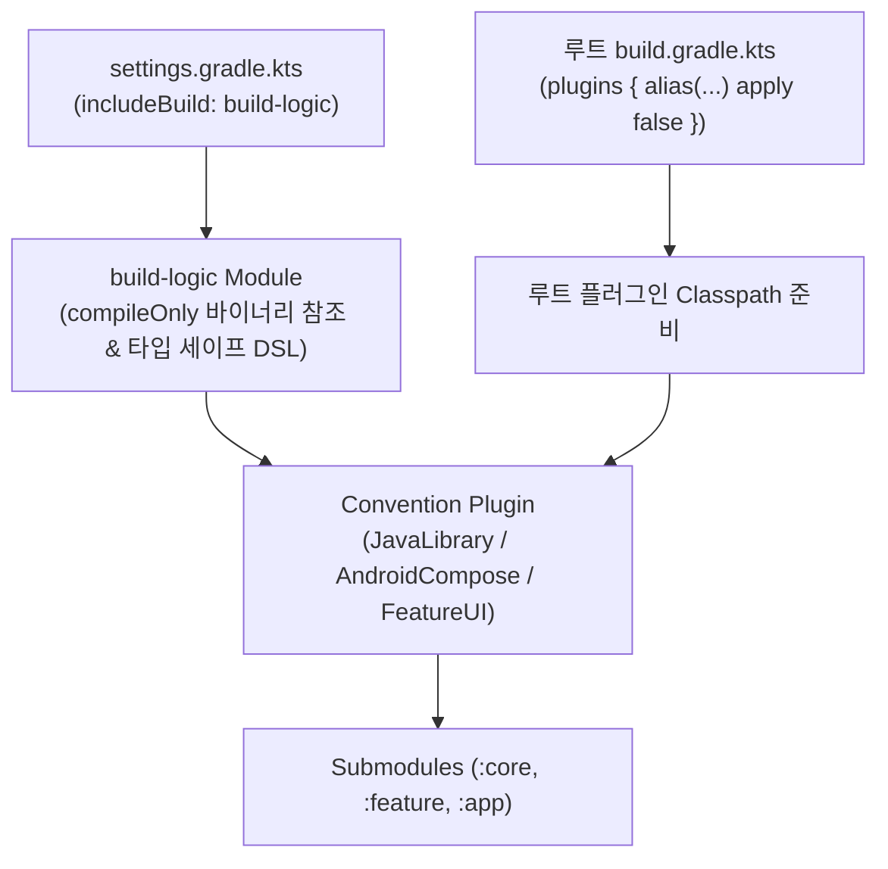

## Gradle 플러그인 및 모듈화 아키텍처 (Plugins & Modularity)

### 개요

대규모 멀티프로젝트 환경에서 수십, 수백 개의 서브모듈마다 중복된 빌드 스크립트를 복사 - 붙여넣기하는 것은 유지보수성을 극도로 저하시킨다. 과거의 `allprojects {}`, `subprojects {}` 방식은 모듈 간 결합도를 높이고 병렬 구성 및 캐싱을 방해한다.

현대 Gradle 은 **Binary Plugin (`Plugin<Project>`)**, **Composite Build 기반의 `build-logic`**, **Convention Plugin 패턴**을 결합하여 타입 세이프하고 독립적으로 테스트 가능한 빌드 로직 모듈화를 실현한다.



---

### 1. Script Plugin vs Binary Plugin

| 비교 항목 | Script Plugin (`apply(from = "common.gradle.kts")`) | Binary Plugin (`class MyPlugin : Plugin<Project>`) |
|---|---|---|
| **구현 방식** | 단순 스크립트 파일 참조 | 독립 Kotlin/Java 클래스 및 패키징 |
| **타입 안정성** | 동적 평가로 인해 IDE 자동완성 및 컴파일 검증 취약 | 완전한 정적 타입 검증 및 IDE 리팩토링 지원 |
| **재사용성 및 테스트** | 단위 테스트 불가, 다른 빌드 간 공유 어려움 | JUnit/TestKit 을 통한 빌드 로직 단위 테스트 및 배포 가능 |
| **권장 여부** | **지양 (Legacy)** | **표준 권장 (Modern)** |

---

### 2. 루트 `build.gradle.kts`와 `apply false` 의 클래스패스 메커니즘

루트 `build.gradle.kts`에서 선언하는 `apply false` 는 메인 빌드 전체에 플러그인 바이너리 클래스패스를 제공하는 핵심 게이트웨이다.

```kotlin
// 루트 build.gradle.kts
plugins {
    alias(libs.plugins.android.application) apply false
    alias(libs.plugins.android.library) apply false
    alias(libs.plugins.kotlin.compose) apply false
    alias(libs.plugins.detekt) apply false
}
```

- **`apply false` 의 본질**:
  - 플러그인의 버전과 구현 바이너리를 빌드 런타임 클래스패스에 준비하되, **루트 프로젝트 자체에는 적용하지 않는다**.
  - 덕분에 하위 모듈이나 Convention Plugin 내부에서 `pluginManager.apply("com.android.library")` 를 호출할 때 버전 명시 없이도 루트가 준비해 둔 검증된 플러그인을 즉시 로드할 수 있다.

---

### 3. `build-logic` 프로젝트 구조 및 `compileOnly` 플러그인 의존성

`build-logic` 은 메인 빌드와 독립된 Gradle Build(Included Build)로 동작한다.

#### `build-logic/convention/build.gradle.kts` 설정

```kotlin
// build-logic/convention/build.gradle.kts
plugins {
    `kotlin-dsl`
}

java {
    toolchain {
        languageVersion = JavaLanguageVersion.of(21)
    }
}

dependencies {
    // 💡 compileOnly 로 플러그인 API 타입을 참조 (런타임 JAR 중복 방지)
    compileOnly(libs.android.gradle.plugin)
    compileOnly(libs.kotlin.gradle.plugin)
    compileOnly(libs.kotlin.compose.gradle.plugin)
    compileOnly(libs.detekt.gradle.plugin)
}

tasks.validatePlugins {
    enableStricterValidation = true
    failOnWarning = true // 플러그인 디스크립터 검증 경고도 실패 처리
}
```

- **`compileOnly` 의 필요성**:
  - Convention Plugin Kotlin 코드에서 `LibraryExtension`, `ApplicationExtension`, `DetektExtension` 등의 **빌드 API 타입을 컴파일 시점에 참조**하기 위해 필요하다.
  - 실제 플러그인 구현 바이너리는 메인 빌드가 이미 로드하므로, Convention Plugin JAR 에 중복 포함되지 않도록 `compileOnly` 로 격리한다.

---

### 4. Convention Plugin 설계 시 "의도적으로 넣지 말아야 할 경계 (Boundary Principles)"

Convention Plugin 의 목적은 모듈 `build.gradle.kts` 를 완전히 빈 파일로 만드는 것이 아니라, **공통 규칙은 캡슐화하고 모듈의 고유한 정체성과 차이점만 투명하게 드러내는 것**이다.

```text
모든 모듈이 공통으로 따르는 표준 규칙
    ➔ Convention Plugin 에 캡슐화 (compileSdk, minSdk, Java 21, Compose Compiler, 공통 테스트 번들)

모듈의 고유한 정체성과 프로젝트 간 의존 관계
    ➔ 각 모듈의 build.gradle.kts 에 명시적으로 유지
```

#### 모듈 `build.gradle.kts` 에 명시적으로 남겨두어야 하는 항목들
1. **프로젝트 내부 모듈 간 의존성 (`implementation(project(":core:network"))`)**:
   - 내부 의존성을 Convention Plugin 안에 숨기면, 파일만 보고는 이 모듈이 시스템의 어느 부분과 결합되어 있는지 알 수 없게 된다 (의존성 불투명성 방지).
2. **`namespace` 및 `applicationId`**:
   - 모듈 고유의 식별자이므로 각 모듈 파일에 명시.
3. **`api` vs `implementation` 선택**:
   - 인터페이스 노출 여부는 모듈 설계자의 명시적 판단이 필요함.
4. **서명(Signing Config), Flavor(Staging/Production), Base URL**:
   - 배포 환경 및 변형별 고유 설정.

---

### 상위 및 연관 문서

- [Gradle 코어 엔진 및 아키텍처](gradle-core.md)
- [Gradle 실행 생명주기](gradle-lifecycle.md)
- [Gradle Task 모델 및 Provider API](gradle-task-api.md)
- [Gradle 의존성 구성 및 클래스패스 격리](gradle-dependency-configurations.md)
- [Convention Plugin과 build-logic](convention-plugins-centralize-shared-gradle-configuration-in-build-logic.md)
