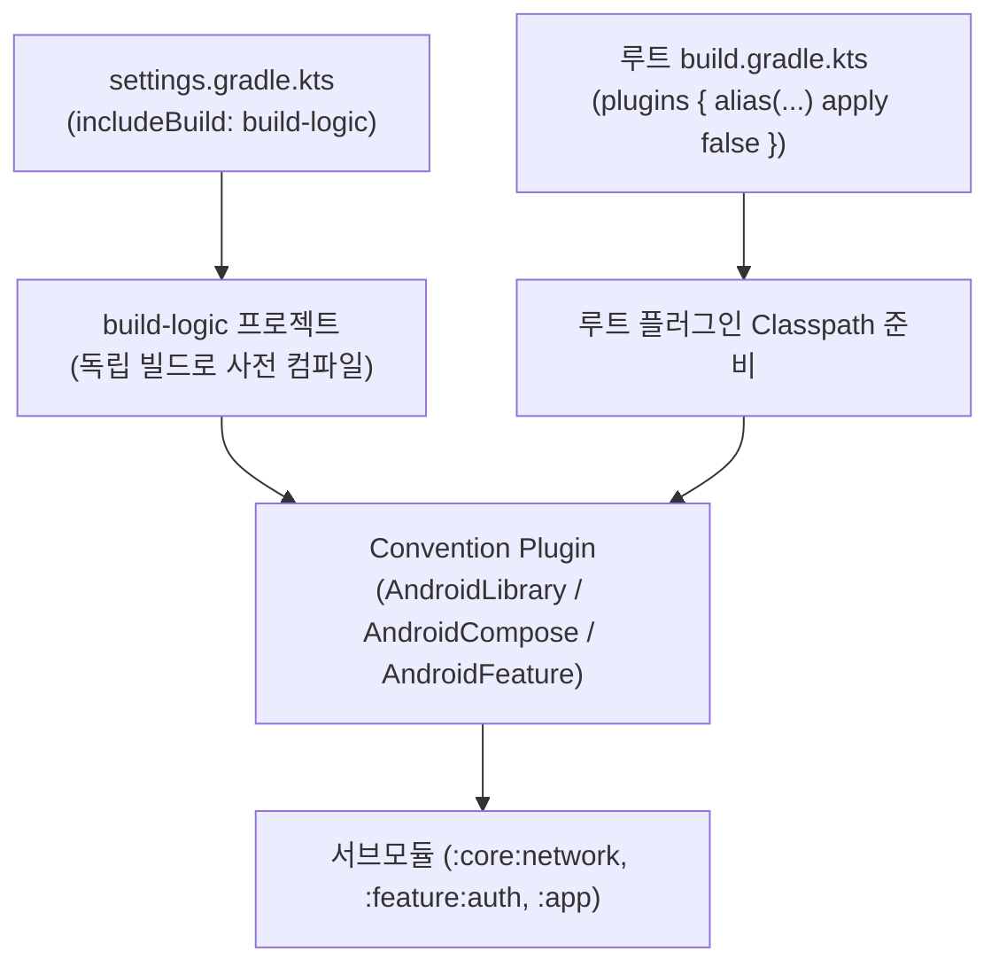
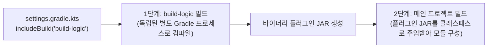
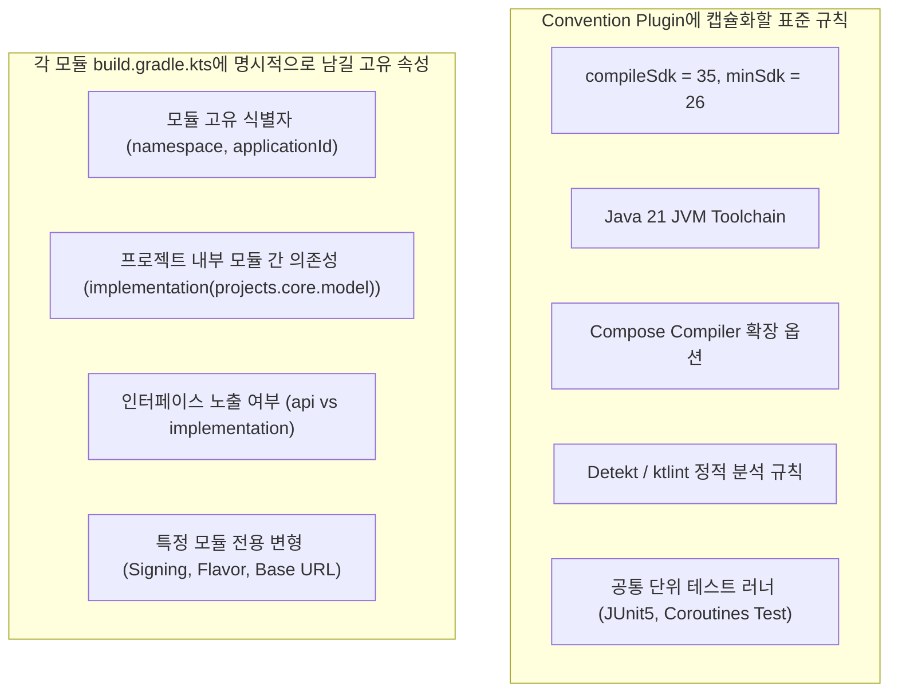

## Gradle 플러그인 및 모듈화 아키텍처 (Plugins & Modularity)

### 개요

현대 안드로이드 애플리케이션은 수십~수백 개의 모듈로 구성되는 멀티 모듈 아키텍처를 표준으로 채택한다. 이때 각 모듈마다 동일한 SDK 버전, Kotlin 컴파일러 옵션, 린트 설정, 테스트 프레임워크 의존성을 반복 복사 - 붙여넣기하면 심각한 유지보수 부채와 빌드 불일치가 발생한다.

과거에 사용되던 `allprojects {}`나 `subprojects {}` 방식은 루트 프로젝트가 모든 서브모듈의 내부 설정을 강제로 주입하여 모듈 간 결합도를 높이고, Gradle 의 병렬 구성(Parallel Configuration)과 [빌드 캐싱](gradle-caching-and-optimization.md) 을 무력화하는 치명적인 문제를 안고 있었다.

이를 해결하기 위해 Gradle 생태계는 **독립된 바이너리 플러그인(`Plugin<Project>`)**, **복합 빌드(Composite Build) 기반의 `build-logic` 관례**, 그리고 **Convention Plugin(컨벤션 플러그인) 패턴**을 결합하여 빌드 로직을 안전하고 타입 세이프하게 모듈화한다.



---

### 1. Gradle 플러그인의 본질과 `apply` 의 동작 원리

#### 1) 플러그인의 기술적 실체 (`Plugin<Project>`)

Gradle 에서 플러그인은 마법 같은 스크립트가 아니라, Gradle API 의 **`org.gradle.api.Plugin<Project>` 인터페이스를 구현한 순수 Java/Kotlin 클래스**이다.

```kotlin
package org.gradle.api

interface Plugin<T> {
    /**
     * 대상(Project)에 플러그인 로직을 적용할 때 실행되는 단일 진입점 메서드
     */
    fun apply(target: T)
}
```

#### 2) `apply` 의 의미 (적용과 활성화)

빌드 스크립트에서 플러그인을 적용(`apply`)한다는 것은, Gradle 이 해당 플러그인 클래스의 인스턴스를 생성하고 **`apply(target: Project)` 메서드를 호출**하는 것을 의미한다.

`apply()` 메서드가 실행되면서 플러그인은 다음과 같은 작업을 대상 프로젝트에 수행한다:

1. **DSL Extension 등록**: `android {}`, `kotlin {}` 같은 커스텀 DSL 블록을 프로젝트에 추가.
2. **Task 생성 및 DAG 바인딩**: `compileKotlin`, `assembleDebug` 같은 빌드 태스크들을 [Task 그래프](gradle-task-api.md) 에 등록.
3. **Configurations 및 의존성 주입**: `implementation`, `api` 등의 의존성 구성을 초기화.

#### 3) Script Plugin vs Binary Plugin

| 비교 항목 | Script Plugin (`apply(from = "common.gradle.kts")`) | Binary Plugin (`class MyPlugin : Plugin<Project>`) |
|---|---|---|
| **구현 형태** | 외부에 분리된 단순 `.gradle.kts` 파일 | 정식 Kotlin/Java 클래스로 컴파일 및 패키징 |
| **타입 안정성** | 런타임 동적 평가로 인해 IDE 자동완성 및 컴파일 시점 검증 불가 | 완전한 정적 타입 검증, IDE 심볼 탐색 및 리팩토링 지원 |
| **재사용 및 테스트** | 단위 테스트 불가, 프로젝트 간 공유 어려움 | TestKit/JUnit 을 통한 빌드 로직 독립 단위 테스트 가능 |
| **현재 위상** | **지양 (Legacy)** | **생태계 표준 (Modern)** |

---

### 2. 루트 `build.gradle.kts`와 `apply false` 의 클래스패스 메커니즘

루트 `build.gradle.kts`의 `plugins {}` 블록에 등장하는 `apply false` 는 멀티 모듈 빌드에서 매우 중요한 클래스패스 준비 게이트웨이 역할을 한다.

```kotlin
// 루트 build.gradle.kts
plugins {
    alias(libs.plugins.android.application) apply false
    alias(libs.plugins.android.library) apply false
    alias(libs.plugins.kotlin.compose) apply false
    alias(libs.plugins.detekt) apply false
}
```

#### `apply false` 의 동작 과정

1. **[클래스패스(Classpath)](../../../../../../computer-science/jvm-classpath.md) 로딩**: Gradle 은 Version Catalog(`libs.versions.toml`)에 정의된 AGP, Kotlin 등의 플러그인 바이너리 JAR 를 원격 저장소에서 다운로드하여 **전체 빌드의 루트 클래스패스에 적재**한다.
2. **`apply(target)` 실행 차단 (`false`)**: 플러그인 바이너리는 준비하되, **루트 프로젝트 자체에는 `apply(project)` 메서드를 호출하지 않는다**. 루트 프로젝트는 앱도 라이브러리도 아니므로 Android 빌드 태스크나 DSL 이 적용되면 안 되기 때문이다.
3. **버전 일관성 상속**: 루트가 플러그인의 버전을 이미 메모리에 로드해 두었으므로, 하위 서브모듈이나 Convention Plugin 내부에서는 `pluginManager.apply("com.android.library")` 처럼 **버전 번호를 생략하고 플러그인 ID 만으로 즉시 안전하게 적용**할 수 있다.

---

### 3. 빌드 로직 모듈화 아키텍처: `buildSrc`의 한계와 `build-logic` 관례

#### 1) `buildSrc` 의 역사와 한계 (Gradle 내장 예약 디렉터리)

과거 Gradle 은 프로젝트 루트에 `buildSrc/` 라는 이름의 디렉터리가 존재하면 이를 빌드 로직으로 자동 인식하여 컴파일하는 기능을 내장했다.

- **치명적 결함 (Full Cache Invalidation)**:
  - `buildSrc` 는 메인 빌드와 단일 클래스로더 생명주기로 강하게 결합되어 있다.
  - `buildSrc` 내부의 코드 한 줄이나 주석 하나만 변경되어도, Gradle 은 **프로젝트 전체의 모든 모듈에 대한 Configuration Cache 와 빌드 캐시를 100% 무효화**하여 전체 재빌드를 유발한다.

#### 2) `build-logic` 복합 빌드 (Composite Build)의 탄생

Gradle Inc.와 Android 공식 아키텍처 팀은 `buildSrc` 의 캐시 파괴 문제를 극복하기 위해 **Composite Build(`includeBuild`)** 방식을 표준으로 제안했다.

- **약속인가, 관례인가? (Convention vs Specification)**:
  - 기술적으로 Gradle 스펙 상 디렉터리 이름은 `includeBuild("my-custom-tools")` 처럼 어떤 이름을 써도 동작한다.
  - 하지만 Google 의 [Now in Android](https://github.com/android/nowinandroid)를 비롯한 글로벌 Android/Gradle 생태계 전체가 **빌드 로직 전용 Included Build 의 디렉터리 이름으로 `build-logic` 을 사용하는 사실상의 표준 관례(De facto Standard Convention)**를 확립했다.



---

### 4. `build-logic` 내부 구현 메커니즘과 `compileOnly` 의존성 격리

#### `build-logic` 프로젝트 구조

```text
build-logic/
├── settings.gradle.kts          # Version Catalog(libs.versions.toml) 참조 설정
└── convention/
    ├── build.gradle.kts         # kotlin-dsl 플러그인 및 플러그인 API 의존성
    └── src/main/kotlin/
        ├── AndroidLibraryConventionPlugin.kt
        ├── AndroidComposeConventionPlugin.kt
        └── AndroidFeatureConventionPlugin.kt
```

#### `build-logic/convention/build.gradle.kts` 의존성 설정

```kotlin
// build-logic/convention/build.gradle.kts
plugins {
    `kotlin-dsl` // Gradle 플러그인 개발을 위한 내장 Kotlin DSL 플러그인
}

java {
    toolchain {
        languageVersion = JavaLanguageVersion.of(21)
    }
}

dependencies {
    // 💡 compileOnly 로 플러그인 API 타입을 컴파일 시점에만 참조
    compileOnly(libs.android.gradle.plugin)
    compileOnly(libs.kotlin.gradle.plugin)
    compileOnly(libs.kotlin.compose.gradle.plugin)
    compileOnly(libs.detekt.gradle.plugin)
}

tasks.validatePlugins {
    enableStricterValidation = true
    failOnWarning = true // 플러그인 디스크립터 검증 경고도 빌드 실패로 엄격 처리
}
```

#### `compileOnly` 를 사용하는 이유 (의존성 중복 및 충돌 방지)
- Convention Plugin 소스 코드(`AndroidLibraryConventionPlugin.kt`)를 작성할 때, `com.android.build.api.dsl.LibraryExtension` 같은 **AGP 의 공개 API 클래스 타입을 컴파일 시점에 참조**할 수 있어야 한다.
- 하지만 실제 플러그인의 런타임 구현 바이너리는 메인 빌드의 루트 `build.gradle.kts`(`apply false`)가 이미 클래스패스에 적재하고 있다.
- 만약 여기서 `implementation(…)`으로 의존성을 추가하면, AGP 바이너리가 Convention Plugin JAR 내부에도 중복 패키징되어 런타임 클래스로더 충돌(`Jar Hell`)과 심각한 빌드 속도 저하가 발생하므로 반드시 **`compileOnly` 로 컴파일 타입만 참조**해야 한다.

---

### 5. Convention Plugin 설계의 논리적 경계 (Boundary Principles)

Convention Plugin 을 도입할 때 가장 흔히 빠지는 안티패턴은 **"모든 설정을 플러그인에 밀어 넣어 모듈의 `build.gradle.kts` 를 완전히 빈 파일로 만들려는 과도한 중앙화(Over-Centralization Trap)"**이다.

모듈의 고유한 정체성과 의존 관계까지 플러그인 내부로 숨겨버리면, 개발자가 모듈의 `build.gradle.kts` 를 열어보았을 때 이 모듈이 시스템의 어느 부분과 연결되어 있는지 전혀 알 수 없는 불투명성(Opacity)이 발생한다.



#### 1) Convention Plugin 에 캡슐화해야 하는 것 (조직 공통 표준)

- **표준 SDK 레벨**: `compileSdk`, `minSdk`
- **컴파일러 옵션**: Java 21 Toolchain, Kotlin 컴파일러 경고 플래그
- **공통 플러그인 번들**: Compose 컴파일러, Detekt 룰셋 설정, 공통 테스트 라이브러리 세트

#### 2) 각 모듈 `build.gradle.kts` 에 명시적으로 유지해야 하는 것 (모듈 고유 경계)

1. **프로젝트 내부 모듈 의존성 (`implementation(projects.core.database)`)**:
   - 모듈 간 아키텍처 결합도와 의존성 그래프를 한눈에 파악할 수 있도록 모듈 파일에 투명하게 드러나야 한다.
2. **`namespace` 및 `applicationId`**:
   - 모듈과 앱의 고유한 패키지 식별자이므로 각 파일에 독립 선언한다.
3. **`api` vs `implementation` 선택**:
   - 다른 모듈로의 [ABI(Application Binary Interface)](../../../../../../computer-science/api-vs-abi.md) 노출 여부는 모듈 설계자의 명시적 아키텍처 결정이어야 한다.
4. **서명 및 환경 설정 (`signingConfigs`, Flavor 별 Base URL)**:
   - 특정 빌드 변형에 종속된 고유 속성.

---

### 상위 및 연관 문서

- [Gradle 코어 엔진 및 아키텍처](gradle-core.md)
- [Gradle Settings DSL 및 API (settings.gradle.kts)](gradle-settings-dsl.md)
- [Gradle Project DSL 및 빌드 스크립트 API (build.gradle.kts)](gradle-project-dsl.md)
- [Gradle 실행 생명주기](gradle-lifecycle.md)
- [Gradle Task 모델 및 Provider API](gradle-task-api.md)
- [Gradle 의존성 구성 및 클래스패스 격리](gradle-dependency-configurations.md)
- [Android Gradle Plugin (AGP) 아키텍처 및 확장 모델](android-gradle-plugin.md)
- [JVM 클래스패스 (Classpath)](../../../../../../computer-science/jvm-classpath.md)
