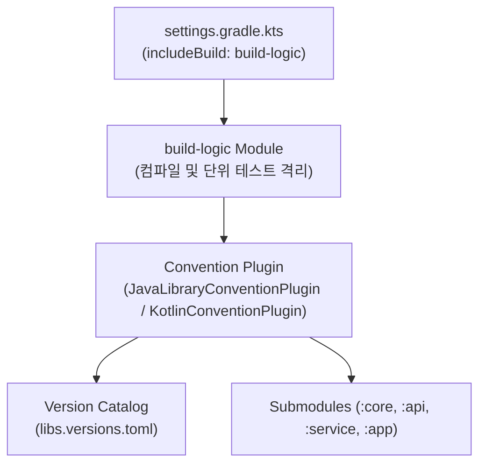

## Gradle 플러그인 및 모듈화 아키텍처 (Plugins & Modularity)

### 개요

대규모 멀티프로젝트 환경에서 수십, 수백 개의 서브모듈마다 중복된 빌드 스크립트를 복사-붙여넣기하는 것은 유지보수성을 극도로 저하시킨다. 과거의 `allprojects {}`, `subprojects {}` 방식은 모듈 간 결합도를 높이고 병렬 구성 및 캐싱을 방해한다.

현대 Gradle 은 **Binary Plugin (`Plugin<Project>`)**, **Composite Build 기반의 `build-logic`**, **Convention Plugin 패턴**을 결합하여 타입 세이프하고 독립적으로 테스트 가능한 빌드 로직 모듈화를 실현한다.



---

### 1. Script Plugin vs Binary Plugin

| 비교 항목 | Script Plugin (`apply(from = "common.gradle.kts")`) | Binary Plugin (`class MyPlugin : Plugin<Project>`) |
|---|---|---|
| **구현 방식** | 단순 스크립트 파일 참조 | 독립 Kotlin/Java 클래스 및 패키징 |
| **타입 안정성** | 동적 평가로 인해 IDE 자동완성 및 컴파일 검증 취약 | 완전한 정적 타입 검증 및 IDE 리팩토링 지원 |
| **재사용성 및 테스트** | 단위 테스트 불가, 다른 빌드 간 공유 어려움 | JUnit/TestKit 을 통한 빌드 로직 단위 테스트 및 배포 가능 |
| **권장 여부** | **지양 (Legacy)** | **표준 권장 (Modern)** |

---

### 2. Convention Plugin 패턴 및 `build-logic` 구조

**Convention Plugin(컨벤션 플러그인)**은 프로젝트 고유의 빌드 규칙(컴파일러 옵션, 린트, 테스트 설정 등)을 캡슐화한 커스텀 플러그인이다.

#### `build-logic` 프로젝트 디렉토리 계층

```text
my-project/
├── build-logic/
│   ├── settings.gradle.kts        # Version Catalog 명시 임포트
│   ├── convention/
│   │   ├── build.gradle.kts       # kotlin-dsl 플러그인 적용
│   │   └── src/main/kotlin/
│   │       ├── JvmLibraryConventionPlugin.kt
│   │       └── SpringBootConventionPlugin.kt
├── gradle/
│   └── libs.versions.toml         # 라이브러리 및 플러그인 의존성 SSOT
└── settings.gradle.kts            # includeBuild("build-logic") 선언
```

#### `build-logic/settings.gradle.kts` 설정

```kotlin
// build-logic/settings.gradle.kts
dependencyResolutionManagement {
    repositories {
        gradlePluginPortal()
        mavenCentral()
    }
    versionCatalogs {
        create("libs") {
            from(files("../gradle/libs.versions.toml"))
        }
    }
}
```

---

### 3. Binary Plugin 작성 및 Extension DSL 설계

플러그인은 `Extension` 객체를 등록하여 빌드 스크립트 사용자에게 타입 세이프한 커스텀 DSL 블록을 제공할 수 있다.

```kotlin
// build-logic/convention/src/main/kotlin/JvmLibraryConventionPlugin.kt
import org.gradle.api.Plugin
import org.gradle.api.Project
import org.gradle.api.plugins.JavaPluginExtension
import org.gradle.jvm.toolchain.JavaLanguageVersion
import org.gradle.kotlin.dsl.configure

class JvmLibraryConventionPlugin : Plugin<Project> {
    override fun apply(target: Project) {
        with(target) {
            // 1. 공통 플러그인 적용
            pluginManager.apply("java-library")
            pluginManager.apply("org.jetbrains.kotlin.jvm")

            // 2. 공통 자바 툴체인 설정
            extensions.configure<JavaPluginExtension> {
                toolchain {
                    languageVersion.set(JavaLanguageVersion.of(21))
                }
            }
        }
    }
}
```

```kotlin
// subproject/build.gradle.kts 에서의 사용
plugins {
    id("myproject.jvm.library") // Convention Plugin 단 한 줄로 공통 설정 적용
}
```

---

### 4. 프로젝트 격리 (Project Isolation)와 멀티모듈 설계 원칙

1. **상호 프로젝트 직접 참조 금지 (Decoupling)**:
   - `project(":other").tasks...` 형태로 다른 모듈의 내부 상태를 직접 수정하지 않는다.
   - 모듈 간의 통신은 오직 `dependencies { implementation(project(":other")) }`와 Artifact 선언을 통해서만 수행한다.
2. **Version Catalog (`libs.versions.toml`) 연동**:
   - 하드코딩된 버전 문자열 대신 Version Catalog 를 통해 전역 의존성 버전을 동기화한다.

---

### 상위 및 연관 문서

- [Gradle 코어 엔진 및 아키텍처](gradle-core.md)
- [Gradle 실행 생명주기](gradle-lifecycle.md)
- [Gradle Task 모델 및 Provider API](gradle-task-api.md)
- [Gradle 캐싱 및 최적화](gradle-caching-and-optimization.md)
- [Convention Plugin과 build-logic](convention-plugins-centralize-shared-gradle-configuration-in-build-logic.md)
