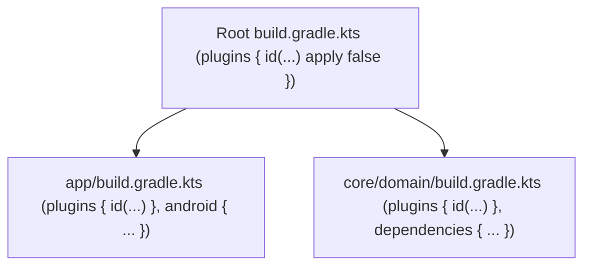

## Gradle 프로젝트와 모듈 DSL은 서로 다른 책임을 가진다

상위 문서: [Gradle 빌드 계약](gradle-build.md)

### 개념 및 필요성 (What & Why)
Gradle 기반 안드로이드 프로젝트는 **루트 프로젝트 DSL(Root Project DSL)** 과 **개별 서브모듈 DSL(Submodule DSL)** 의 책임을 엄격히 구분하여 설계된다.
- **루트 `build.gradle.kts`**: 멀티 모듈 전체에 적용되는 플러그인의 클래스패스 관리(`apply false`), 전역 린트/청소 태스크, 외부 레포지토리 정의 등 **전역 빌드 컨텍스트**를 설정한다.
- **모듈 `build.gradle.kts`**: 특정 모듈(예: `:app`, `:core:database`)의 실제 빌드 플러그인 적용(`apply true`), 안드로이드 SDK 레벨 설정(`android {}`), 하위 의존성 선언(`dependencies {}`) 등 **독립 모듈 구현**을 담당한다.

### 내부 메커니즘 (Internal Mechanism)
1. **`plugins { id(...) apply false }` 패턴**: 루트 프로젝트에 플러그인을 미리 클래스패스 로딩만 시켜두고, 필요한 모듈에서만 `apply true`로 개별 활성화하여 컴파일 및 의존성 격리를 도모한다.
2. **Buildscript Classpath Scope**: 루트에서 로딩된 플러그인 버전은 모든 서브모듈에서 동일한 버전을 공유하게 만들어 버전 파편화(Version Mismatch) 문제를 방지한다.



### 코드 예시 (build.gradle.kts)
```kotlin
// 루트 build.gradle.kts (Project Level)
plugins {
    alias(libs.plugins.android.application) apply false
    alias(libs.plugins.android.library) apply false
    alias(libs.plugins.kotlin.android) apply false
}

// app/build.gradle.kts (Module Level)
plugins {
    alias(libs.plugins.android.application)
    alias(libs.plugins.kotlin.android)
}

android {
    namespace = "com.example.myapp"
    compileSdk = 34
}
```

### 관측 가능 증거 (Observable Evidence)
프로젝트 내 모듈 간 의존성 구조 및 플러그인 로딩 상태를 확인할 수 있다:
```bash
./gradlew projects
```

관련 노트: [Convention plugin은 build-logic 모듈에서 공통 Gradle 설정을 한 곳에서 관리한다](convention-plugins-centralize-shared-gradle-configuration-in-build-logic.md), [Gradle 빌드 계약](gradle-build.md)
