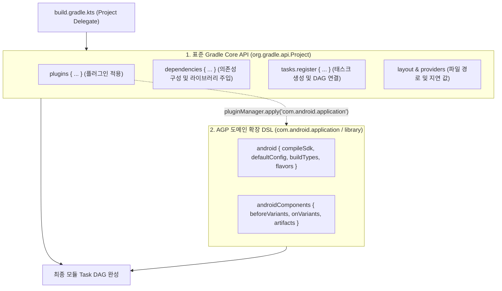
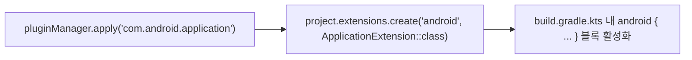
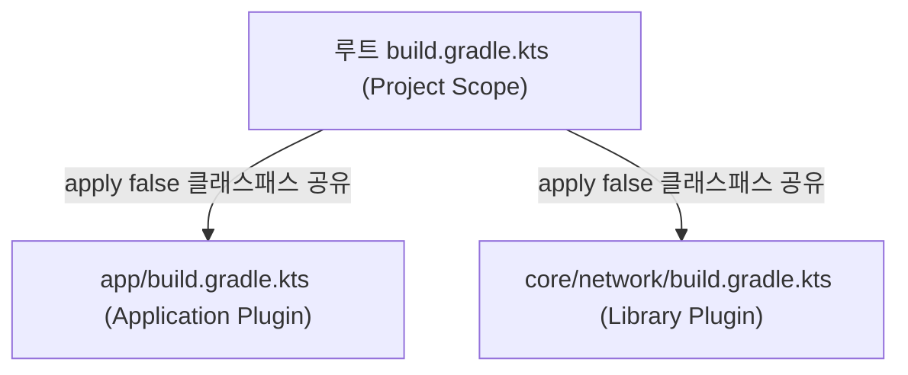

## Gradle Project DSL 및 빌드 스크립트 API (build.gradle.kts)

### 개요

**`build.gradle.kts`**는 Gradle 의 [구성 단계(Configuration Phase)](gradle-lifecycle.md) 에서 각 서브모듈(및 루트 프로젝트)마다 개별적으로 평가되는 빌드 스크립트 파일이다.

이 스크립트는 **`org.gradle.api.Project`** 인터페이스를 위임 객체(Delegate Object)로 삼아 동작한다. 안드로이드 프로젝트의 `build.gradle.kts` 는 **순수 Gradle 코어 API(`Project`)**와 플러그인이 주입한 **[AGP 확장 DSL(`android {}`)](android-gradle-plugin.md)**의 2 개 층위가 결합된 구조로 동작한다.



---

### 1. 표준 Gradle 코어 `Project` API

어떤 플러그인을 적용하지 않더라도 순수 Gradle 이 기본으로 제공하는 핵심 빌드 API 이다.

| 블록 / 프로퍼티 | 수신 인터페이스 | 주요 역할 및 용도 |
|---|---|---|
| **`plugins { … }`** | `PluginDependenciesSpec` | 이 모듈에 적용할 바이너리 플러그인(`com.android.library`, `kotlin-android`) 선언 |
| **`dependencies { … }`** | `DependencyHandler` | `implementation`, `api`, `testImplementation` 등 [의존성 구성](gradle-dependency-configurations.md) 에 라이브러리 추가 |
| **`tasks { … }`** | `TaskContainer` | `tasks.register<T>("name")` 을 통한 [지연 태스크 생성 및 스케줄링](gradle-task-api.md) |
| **`layout`** | `ProjectLayout` | `layout.projectDirectory`, `layout.buildDirectory` 기반 상대 파일/폴더 경로 참조 |
| **`providers`** | `ProviderFactory` | 환경변수, 시스템 프로퍼티, CLI 인자를 지연 평가(`Provider<T>`)로 조회 |
| **`extensions`** | `ExtensionContainer` | 플러그인이 등록한 확장 객체(`project.extensions.getByType(…)`) 접근 |

#### 표준 Gradle Core 코드 예시
```kotlin
// 모듈 build.gradle.kts (순수 Gradle Core 영역)
plugins {
    `java-library`
}

dependencies {
    implementation("org.jetbrains.kotlinx:kotlinx-coroutines-core:1.8.0")
    testImplementation("org.junit.jupiter:junit-jupiter:5.10.2")
}

tasks.register<Copy>("backupDocs") {
    from(layout.projectDirectory.dir("docs"))
    into(layout.buildDirectory.dir("backup"))
}
```

---

### 2. AGP(Android Gradle Plugin) 확장 DSL (`android {}`)

모듈에 `com.android.application` 또는 `com.android.library` 플러그인을 적용하면, AGP 는 Gradle `Project`의 `ExtensionContainer`에 `android` 라는 이름으로 **`ApplicationExtension`** 또는 **`LibraryExtension`** 객체를 등록한다.

이 확장 객체가 바로 우리가 사용하는 `android { … }` 블록의 기술적 실체이다.



#### AGP `android {}` 블록의 주요 하위 명세

```kotlin
// app/build.gradle.kts
plugins {
    alias(libs.plugins.android.application)
    alias(libs.plugins.kotlin.compose)
}

android {
    // 1. 소스 네임스페이스 및 컴파일 타깃 SDK
    namespace = "com.example.myapp"
    compileSdk = 35

    // 2. [기본 식별자 및 앱 버전 명세](agp-default-config.md)
    defaultConfig {
        applicationId = "com.example.myapp"
        minSdk = 26
        targetSdk = 35
        versionCode = 10001
        versionName = "1.0.1"
    }

    // 3. [빌드 환경(BuildType)과 제품 변종(ProductFlavor)](agp-build-variants.md)
    buildTypes {
        release {
            isMinifyEnabled = true
            proguardFiles(getDefaultProguardFile("proguard-android-optimize.txt"), "proguard-rules.pro")
        }
        debug {
            applicationIdSuffix = ".debug"
        }
    }

    // 4. 컴파일러 툴체인 및 Java 호환성
    compileOptions {
        sourceCompatibility = JavaVersion.VERSION_21
        targetCompatibility = JavaVersion.VERSION_21
    }

    // 5. 기능 플래그 (Build Features)
    buildFeatures {
        compose = true
        buildConfig = true
    }
}

// 6. [차세대 Variant & Artifacts 확장 API](android-gradle-plugin.md)
androidComponents {
    onVariants(selector().all()) { variant ->
        println("활성화된 Variant: ${variant.name}")
    }
}
```

---

### 3. 루트 `build.gradle.kts` vs 서브모듈 `build.gradle.kts`

Gradle 멀티 프로젝트에서는 파일의 위치에 따라 서로 다른 책임을 갖는다:



| 구분 | 루트 `build.gradle.kts` | 서브모듈 `build.gradle.kts` |
|---|---|---|
| **적용 대상** | 전체 프로젝트 루트 | 개별 기능/계층 서브모듈 |
| **주요 역할** | 플러그인 바이너리 [클래스패스 로딩(`apply false`)](gradle-plugins.md), 전역 clean 태스크 | 모듈별 플러그인 활성화(`apply`), AGP 설정(`android {}`), 모듈 고유 의존성 선언 |
| **`android {}` 포함 여부** | ❌ **절대 포함하지 않음** (루트는 Android 모듈이 아님) | ⭕ **반드시 포함** (앱 또는 라이브러리 모듈 명세) |

---

### 상위 및 연관 문서

- [Gradle 코어 엔진 및 아키텍처](gradle-core.md)
- [Gradle Settings DSL 및 API (settings.gradle.kts)](gradle-settings-dsl.md)
- [Gradle 실행 생명주기](gradle-lifecycle.md)
- [Gradle 의존성 구성 및 클래스패스 격리](gradle-dependency-configurations.md)
- [Android Gradle Plugin (AGP) 아키텍처 및 확장 모델](android-gradle-plugin.md)
- [Gradle Task 모델 및 Provider API](gradle-task-api.md)
- [Gradle 플러그인 및 모듈화 아키텍처](gradle-plugins.md)
