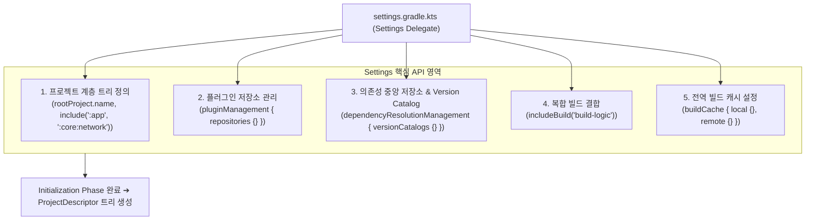

## Gradle Settings DSL 및 API (settings.gradle.kts)

### 개요

**`settings.gradle.kts`**는 Gradle 빌드의 [초기화 단계(Initialization Phase)](gradle-lifecycle.md)에서 가장 먼저 단 1회 실행되는 핵심 설정 파일이다.

이 스크립트는 **`org.gradle.api.initialization.Settings`** 인터페이스를 위임 객체(Delegate Object)로 삼아 동작하며, **어떤 프로젝트 모듈들이 이번 빌드에 참여하는지(`include`)**, **플러그인과 라이브러리를 어디서 다운로드할 것인지(`pluginManagement`, `dependencyResolutionManagement`)**, 그리고 **어떤 외부 빌드를 복합 빌드로 결합할 것인지(`includeBuild`)**를 선언하는 빌드 전체의 진입점이자 중앙 통제소이다.



---

### 1. `Settings` 위임 객체의 5대 핵심 API

#### 1) 프로젝트 계층 트리 정의 (`rootProject` & `include`)
- **`rootProject.name`**: 전체 루트 프로젝트의 이름을 지정한다.
- **`include(...)`**: 멀티 모듈 빌드에 참여할 서브모듈 경로를 선언한다. 콜론(`:`)은 디렉터리 구분자(`/`)에 대응된다.
- **`project(":path").projectDir`**: 디렉터리 구조와 모듈 경로가 일치하지 않을 때 물리 폴더 위치를 재매핑한다.

```kotlin
rootProject.name = "my-application"

include(":app")
include(":core:model")
include(":core:network")
include(":feature:auth:api")
include(":feature:auth:impl")

// 물리 디렉터리 위치 커스텀 매핑 예시
project(":core:network").projectDir = file("libraries/network")
```

---

#### 2) 플러그인 관리 명세 (`pluginManagement`)
빌드 스크립트(`build.gradle.kts`)의 `plugins {}` 블록에서 플러그인을 다운로드할 저장소(Repository)와 플러그인 버전 해석 전략을 정의한다.

```kotlin
pluginManagement {
    repositories {
        gradlePluginPortal() // Gradle 공식 플러그인 포털
        google()             // Android Gradle Plugin (AGP) 저장소
        mavenCentral()       // Kotlin 및 일반 오픈소스 플러그인 저장소
    }
}
```

---

#### 3) 중앙집중식 의존성 관리 (`dependencyResolutionManagement`)
과거에는 서브모듈마다 `repositories {}`를 반복 선언했으나, 현대 Gradle은 `settings.gradle.kts`에서 전체 프로젝트의 저장소를 단일 진실 공급원(SSOT)으로 강제한다.

```kotlin
dependencyResolutionManagement {
    // 💡 서브모듈 build.gradle.kts 에서 개별 repositories 선언 시 빌드 실패 유발 (중앙 집중 강제)
    repositoriesMode.set(RepositoriesMode.FAIL_ON_PROJECT_REPOS)
    
    repositories {
        google()
        mavenCentral()
    }

    // 💡 Version Catalog 명시적 등록 (기본값: gradle/libs.versions.toml)
    versionCatalogs {
        create("libs") {
            from(files("gradle/libs.versions.toml"))
        }
    }
}
```

---

#### 4) 복합 빌드 연결 (`includeBuild`)
독립된 별도의 Gradle 빌드를 현재 메인 빌드의 일부분으로 결합(Composite Build)한다. 주로 [Convention Plugin](gradle-plugins.md)이 위치하는 `build-logic` 모듈을 결합할 때 사용된다.

```kotlin
// build-logic 프로젝트를 메인 빌드에 인클루드
includeBuild("build-logic")
```

---

#### 5) 전역 빌드 캐시 설정 (`buildCache`)
로컬 머신 디스크 캐시 및 CI/원격 공유 캐시(HTTP/S3)의 엔드포인트와 인증 정보를 구성한다.

```kotlin
buildCache {
    local {
        isEnabled = true
        directory = File(rootDir, ".build-cache")
    }
    remote<HttpBuildCache> {
        url = uri("https://gradle-cache.company.com/cache/")
        isPush = System.getenv("CI") != null // CI 환경에서만 캐시 업로드
    }
}
```

---

### 2. `settings.gradle.kts`의 동작 시점과 제약사항

1. **실행 시점**:
   - `build.gradle.kts`가 평가되기 전인 **[초기화 단계(Initialization Phase)](gradle-lifecycle.md)**에서 단 한 번만 실행된다.
2. **`Project` 객체 접근 불가**:
   - 이 시점에는 아직 서브모듈의 `Project` 인스턴스나 태스크가 존재하지 않으므로, `dependencies {}`, `tasks {}`, `android {}` 등의 Project API를 호출할 수 없다.
3. **Configuration Cache 대상**:
   - `settings.gradle.kts`에 선언된 입력값(환경변수, 시스템 프로퍼티) 역시 Configuration Cache의 입력으로 추적된다.

---

### 상위 및 연관 문서

- [Gradle 코어 엔진 및 아키텍처](gradle-core.md)
- [Gradle 실행 생명주기](gradle-lifecycle.md)
- [Gradle Project DSL 및 빌드 스크립트 API](gradle-project-dsl.md)
- [Gradle 플러그인 및 모듈화 아키텍처](gradle-plugins.md)
- [Gradle Task 모델 및 Provider API](gradle-task-api.md)
- [Gradle 캐싱 및 빌드 최적화](gradle-caching-and-optimization.md)
