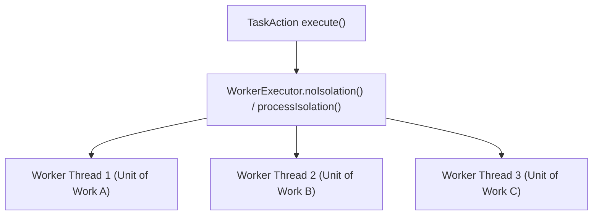

## Gradle Task 모델 및 Provider API

### 개요

Gradle 빌드 시스템에서 실행 가능한 최소 단위는 **Task**이다. 현대 Gradle (Gradle 6+)은 대규모 멀티모듈 빌드 성능 최적화를 위해 **Task 지연 생성(Lazy Configuration), Property/Provider API 기반 지연 바인딩, Worker API 격리 실행**을 표준 아키텍처로 채택하고 있다.

---

### 1. Task 등록 및 지연 생성 메커니즘

Gradle 은 Task 등록을 위한 두 가지 API 를 제공하며, 성능 관점에서 명확한 차이가 존재한다.

| 비교 항목 | `tasks.register("myTask")` (권장) | `tasks.create("myTask")` (지양) |
|---|---|---|
| **생성 시점** | **지연 생성 (Lazy)** — 실제 실행 대상일 때 인스턴스화 | **즉시 생성 (Eager)** — Configuration 단계에서 무조건 인스턴스화 |
| **반환 타입** | `TaskProvider<T>` (지연 핸들러) | `Task` (실제 인스턴스) |
| **빌드 성능** | 수백 개의 태스크가 있어도 요청된 것만 구성하므로 빠름 | 요청하지 않은 태스크까지 메모리에 올려 구성 오버헤드 유발 |

```kotlin
// Lazy Task Registration 예시
val generateVersionInfo = tasks.register<GenerateVersionInfoTask>("generateVersionInfo") {
    // 이 람다는 ./gradlew generateVersionInfo 또는 의존 태스크가 실행될 때만 호출된다.
    versionName.set("1.0.0")
    outputFile.set(layout.buildDirectory.file("generated/version.txt"))
}
```

---

### 2. Property & Provider API (지연 값 바인딩)

Gradle 의 `Property<T>`와 `Provider<T>`는 태스크 간의 입출력 데이터를 결합할 때, **실제 값이 결정되는 시점(Execution Phase)까지 평가를 지연(Lazy Evaluation)**시키는 함수형 컨테이너이다.

- **`Property<T>`**: 읽기/쓰기가 가능한 컨테이너 (`set()`, `convention()`).
- **`Provider<T>`**: 읽기 전용 지연 값 공급자 (`get()`, `map()`, `flatMap()`).
- **태스크 간 자동 의존성 전파(Implicit Dependency)**:
  - Task B의 `@InputFile`에 Task A의 `TaskProvider<T>.flatMap { it.outputFile }`을 대입하면, Gradle 은 명시적인 `dependsOn` 선언 없이도 **자동으로 Task A ➔ Task B 의 DAG 의존관계를 수립**한다.

```kotlin
// Task A의 출력을 Task B의 입력으로 암시적 바인딩
val taskB = tasks.register<ProcessFileTask>("taskB") {
    inputFile.set(taskA.flatMap { it.outputFile }) // 자동으로 taskA 에 대한 의존성 주입
}
```

---

### 3. 입력/출력 상태 어노테이션 모델 (Incremental Build Contract)

Gradle 은 Task 클래스의 프로퍼티에 선언된 어노테이션을 기반으로 빌드 캐시 키를 계산하고 증분 실행(`UP-TO-DATE`) 여부를 판별한다.

```kotlin
import org.gradle.api.DefaultTask
import org.gradle.api.file.RegularFileProperty
import org.gradle.api.provider.Property
import org.gradle.api.tasks.*
import org.gradle.work.Incremental
import org.gradle.work.InputChanges

@CacheableTask
abstract class TransformDataTask : DefaultTask() {

    @get:Input
    abstract val enableCompression: Property<Boolean>

    @get:Incremental
    @get:PathSensitive(PathSensitivity.RELATIVE)
    @get:InputFile
    abstract val sourceFile: RegularFileProperty

    @get:OutputFile
    abstract val targetFile: RegularFileProperty

    @TaskAction
    fun execute(inputChanges: InputChanges) {
        if (inputChanges.isIncremental) {
            println("증분 변경 파일만 처리: ${inputChanges.getFileChanges(sourceFile)}")
        } else {
            println("전체 재처리 수행 (Full Build)")
        }
        // 변환 로직
    }
}
```

- **`@CacheableTask`**: 원격/로컬 빌드 캐시 대상 태스크로 지정.
- **`@PathSensitive`**: 절대 경로가 아닌 상대 경로/파일명만 해시에 반영하여 다른 머신이나 디렉토리에서도 캐시 히트를 보장.
- **`InputChanges`**: 전체 파일을 다시 처리하지 않고 이전 빌드 대비 추가/수정/삭제된 파일 델타만 전달받아 초고속 증분 연산 수행.

---

### 4. Worker API 기반 병렬 및 프로세스 격리 실행

무거운 작업(컴파일러 호출, 바이트코드 가공, 이미지 압축 등)을 태스크 메인 스레드에서 직접 돌리지 않고 `WorkerExecutor`를 통해 비동기/병렬 프로세스로 격리 실행한다.



- **`noIsolation()`**: 동일 JVM 데몬 스레드 풀에서 경량 병렬 실행.
- **`classLoaderIsolation()`**: 라이브러리 클래스패스 충돌을 방지하는 격리 클래스로더 실행.
- **`processIsolation()`**: 별도의 독립 자식 JVM 프로세스를 포크하여 대용량 메모리/네이티브 툴체인 실행.

---

### 상위 및 연관 문서

- [유향 비순환 그래프 (DAG)](../../../../../../computer-science/directed-acyclic-graph.md)
- [Gradle 코어 엔진 및 아키텍처](gradle-core.md)
- [Gradle 실행 생명주기](gradle-lifecycle.md)
